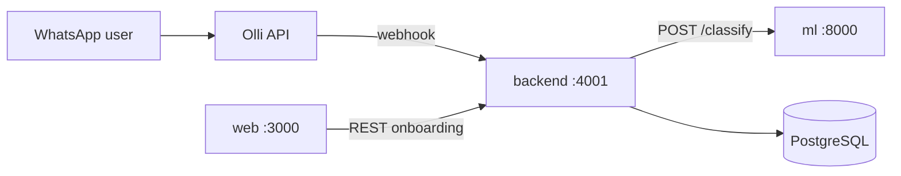

# Munshi

Monorepo for **Munshi** — a WhatsApp-first factory operations platform. Owners and managers run attendance, tasks, procurement, inventory, and onboarding from chat; the web app handles factory signup and (later) admin UI.

**Repository:** [github.com/ShantanuGarg2004/Munshi_Updated](https://github.com/ShantanuGarg2004/Munshi_Updated)

---

## Packages

Each package has its own README with setup, architecture, and current progress.

| Package | README | Stack | Default port |
|---------|--------|-------|----------------|
| **Backend** | [backend/README.md](backend/README.md) | NestJS, PostgreSQL (Supabase) | `4001` |
| **ML** | [ml/README.md](ml/README.md) | FastAPI, OpenAI (intent + parsers) | `8000` |
| **Web** | [web/README.md](web/README.md) | Next.js (munshi.app onboarding) | `3000` |

---

## What’s in this monorepo (progress snapshot)

This layout replaces three standalone repos (backend, `munshi_intent_classifier`, `munshi-web`) under one tree on branch **`feat/monorepo-unified`**.

| Area | Status |
|------|--------|
| **Monorepo structure** | `backend/`, `ml/`, `web/` at repo root; CI `working-directory: backend` |
| **WhatsApp (Olli)** | Inbound webhook, ML routing, interactive reply buttons for empty-team setup |
| **Assign clarify** | Hindi/Hinglish vague tasks (e.g. “Aaj 4 website banegi”) → `/assign_clarify` workflow + ML pre-classifier |
| **Business discovery** | Multi-step factory onboarding via WhatsApp + REST (`/business-discovery/*`) |
| **Workflows** | Vendor/worker onboard, inventory create, purchase request, suggestion approval, business discovery, assign clarify |
| **Contracts** | Shared intent/workflow schemas in `backend/contracts/`; ML copies under `ml/contracts/` |
| **Web onboarding** | OTP → register → WhatsApp handoff at [munshi.app](https://munshi.app) |

**After merge to `main`:** update EC2/Docker deploy paths to `backend/` and set `ML_URL` to the co-located ML service (see [docker-compose.example.yml](docker-compose.example.yml)).

---

## Architecture (local dev)



---

## Quick start

1. **Environment**
   - `cp backend/.env.example backend/.env` — Postgres, Olli, `ML_URL=http://localhost:8000`
   - `cp ml/.env.example ml/.env` — `OPENAI_API_KEY`
   - `cp web/.env.example web/.env.local` — API URL, WhatsApp number

2. **Database** — Supabase or local Postgres; then:

   ```bash
   cd backend
   yarn install
   yarn migrate
   ```

3. **Run services** (three terminals):

   ```bash
   cd ml && pip install -r requirements.txt && python -m uvicorn main:app --reload --port 8000
   cd backend && yarn start
   cd web && npm install && npm run dev
   ```

4. **WhatsApp testing** — Point Olli webhook to your tunnel → `http://localhost:4001/webhook`. Use **`ML_URL=http://localhost:8000`** in `backend/.env` (not a remote EC2 ML host during local dev).

---

## Contracts and drift

Intent and workflow contracts live in **`backend/contracts/`**. When you add or change ML intents, update `ml/contracts/` and run backend contract tests:

```bash
cd backend && yarn test -- contract-drift
```

See [backend/contracts/README.md](backend/contracts/README.md).

---

## Migrations

```bash
cd backend
yarn migrate
yarn migrate:status
```

SQL files: `backend/migrations/` (see [backend/migrations/README.md](backend/migrations/README.md)).

---

## Docker (backend + ML + Postgres)

```bash
cp docker-compose.example.yml docker-compose.yml
# Fill backend/.env and ml/.env
docker compose up --build
```

Backend image context: `./backend`. ML: `./ml`.

---

## CI/CD

On push to **`main`**, [.github/workflows/cicd.yml](.github/workflows/cicd.yml) validates migrations and deploys the **backend** Docker image. ML and web deploy separately today (ML on EC2/DockerHub historically; web on Vercel).

---

## Former standalone repos

| Former repo | Now |
|-------------|-----|
| `ShantanuGarg2004/Munshi_Updated` (backend at root) | `backend/` in this monorepo |
| `ShantanuGarg2004/munshi_intent_classifier` | `ml/` |
| `munshi-web` | `web/` |

---

## Contributing

1. Branch from `main` (or the active feature branch).
2. Keep `backend/contracts/` and `ml/contracts/` in sync.
3. Do **not** commit `.env` files with secrets.

For package-specific commands, tests, and feature lists, use the linked READMEs above.
