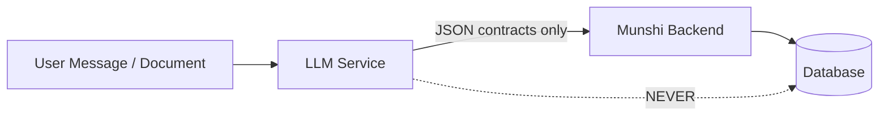

# Backend ↔ LLM Contract

**Status:** Source of truth for cross-repository integration  
**Date:** 2026-05-30  
**Rule:** LLM produces structured output only. Backend executes all business actions.

---

## Architecture boundary



---

## 1. Intent classification contract

### Transport

```
POST {ML_URL}/classify?message={url_encoded_text}
Content-Type: application/json (body empty)
```

Backend caller: `WhatsAppService.handleIncomingMessage`  
Default `ML_URL`: `http://localhost:8000`

### Response (LLM publishes)

```json
{
  "intent": "/assign",
  "id": 12,
  "worker_slug": "@rahul",
  "depart_slug": null,
  "deadline": "2026-05-31T17:00:00",
  "message": null
}
```

### Response (backend normalizes via `parseMlClassifyResponse`)

Backend accepts root object **or** nested `{ data: { ... } }`.

| Field | Type | Backend usage |
|-------|------|---------------|
| `intent` | string | Command routing (`/assign`, `general_chat`, workflow starts) |
| `id` | number \| string \| null | Task/issue id for `/complete`, `/mgr*`, etc. |
| `worker_slug` | string \| null | Assignee for `/assign`, `/mgrassign` |
| `depart_slug` | string \| null | Department for `/depart_assign`, `/mgrtransfer` |
| `reject_reason` | string \| null | **Expected** for `/mgrreject` — see gap note |
| `deadline` | ISO string \| null | Task deadline |
| `date` | string | Report date for `/report` |
| `datetime` | string | Alternative deadline field |
| `time` | string | Time component |
| `message` | string \| null | Shown directly if `general_chat` |

**Aliases accepted by backend:**

- `intent` ← `command`
- `depart_slug` ← `department_slug`, `department`
- `reject_reason` ← `reason`

### Workflow start intents

If ML returns these intents, backend starts workflow **before** `processCommand`:

| Intent | Workflow |
|--------|----------|
| `/onboard_vendor` | `ONBOARD_VENDOR` |
| `/onboard_worker` | `ONBOARD_WORKER` |
| `/inventory_create` | `INVENTORY_CREATE` |
| `/suggestion_approve` | Not started from free-text ML path |

### Example: vendor onboarding intent

**User message:** `"Add vendor ABC Traders"`

**LLM should return:**

```json
{
  "intent": "/onboard_vendor",
  "id": null,
  "worker_slug": null,
  "depart_slug": null,
  "deadline": null,
  "message": null
}
```

**Backend action:** Start vendor workflow — **does not create vendor**.

### Example: natural language assign

**User message:** `"@rahul invoice bhejdo kal tak"`

```json
{
  "intent": "/assign",
  "id": null,
  "worker_slug": "@rahul",
  "depart_slug": null,
  "deadline": "2026-05-31",
  "message": null
}
```

**Backend action:** `TasksService.assignToUser`

### Example: general chat

```json
{
  "intent": "general_chat",
  "id": null,
  "worker_slug": null,
  "depart_slug": null,
  "deadline": null,
  "message": "Main tasks aur attendance mein help kar sakta hoon. /help type karo."
}
```

**Backend action:** Send `message` field to user (no CRUD).

### Example: manager reject

```json
{
  "intent": "/mgrreject",
  "id": 12,
  "worker_slug": null,
  "depart_slug": null,
  "deadline": null,
  "reject_reason": "not our department",
  "message": null
}
```

**Gap:** LLM FastAPI schema currently **drops** `reject_reason` — backend expects it.

---

## 2. WhatsApp message conversion contract

### Transport

```
POST {ML_URL}/convert?message={url_encoded_wa_text}
```

### Response

```json
{
  "message": "Task assigned: Clean warehouse. It has been assigned to Anil and is due today."
}
```

**Usage today:** Optional — not wired in main WhatsApp inbound path. Available for future UX improvements.

---

## 3. Document parsing contract

### Boundary

| LLM responsibility | Backend responsibility |
|------------------|------------------------|
| Parse file → JSON | Store metadata, validate, suggest, approve, execute |
| Detect document type | `DocumentRegistry` contracts |
| Extract fields | `DocumentExtractionContractService` validation |

### Transport (LLM → Backend)

LLM **does not** write to DB. It POSTs to backend REST:

```
POST /documents/{document_id}/extractions
```

### Request body (backend expects)

```json
{
  "factory_id": 1,
  "document_type_detected": "INVENTORY_IMPORT",
  "extraction_version": "v1",
  "payload": {
    "document_type": "INVENTORY_IMPORT",
    "items": [
      { "name": "Cement", "quantity": 500, "sku": "CEM001", "unit": "bags" },
      { "name": "Steel Rod", "quantity": 200 }
    ]
  }
}
```

### Response (backend returns)

```json
{
  "id": 5,
  "document_id": 1,
  "factory_id": 1,
  "extraction_version": "v1",
  "document_type_detected": "INVENTORY_IMPORT",
  "payload": { "...normalized..." },
  "created_at": "2026-05-30T12:00:00.000Z"
}
```

### Document type: PURCHASE_INVOICE (future)

**LLM extraction output:**

```json
{
  "document_type": "PURCHASE_INVOICE",
  "vendor_name": "ABC Steel",
  "invoice_number": "INV-2026-001",
  "invoice_date": "2026-05-15",
  "items": [
    {
      "item_name": "Steel Rod",
      "name": "Steel Rod",
      "quantity": 100,
      "unit_price": 50,
      "total": 5000
    }
  ]
}
```

**Backend suggested actions (not yet fully executable):** `STOCK_IN`, `CREATE_VENDOR`

### Document type: GOODS_RECEIPT (future)

```json
{
  "document_type": "GOODS_RECEIPT",
  "vendor_name": "ABC Steel",
  "items": [
    { "name": "Steel Rod", "quantity": 100 }
  ]
}
```

### Document type: STOCK_REGISTER

```json
{
  "document_type": "STOCK_REGISTER",
  "items": [
    { "name": "Cement", "quantity": 450 },
    { "name": "Aluminium Sheet", "quantity": 25 }
  ]
}
```

---

## 4. Workflow contracts

### LLM → Backend (intent triggers workflow)

LLM returns slash intent; backend creates `workflow_sessions` row.

**LLM must NOT:**

- Collect workflow step answers on behalf of backend
- Submit vendor/inventory fields directly

### Backend → User (workflow prompts)

Backend sends WhatsApp prompts; user replies; backend handler validates.

**LLM role in active workflow:** None (messages bypass ML).

### Suggestion approval workflow

**Backend REST starts session:**

```json
POST /documents/suggestions/7/approve-workflow
{
  "factory_id": 1,
  "phone_number": "919876543210"
}
```

**Response:**

```json
{
  "message": "We detected the following inventory:\n\n• Cement — 500\n\nIs this your inventory? Reply YES or NO.",
  "workflow_session_id": 42
}
```

**User replies:** `YES` or `NO` — backend executes; LLM not involved.

---

## 5. Suggestion contracts

### Backend generates (from extraction)

```json
{
  "id": 7,
  "document_id": 1,
  "factory_id": 1,
  "extraction_id": 5,
  "suggestion_type": "INITIAL_INVENTORY_IMPORT",
  "status": "PENDING",
  "payload": {
    "summary": "We detected the following inventory:\n\n• Cement — 500\n\nIs this your inventory? Reply YES or NO.",
    "items": [{ "name": "Cement", "quantity": 500 }],
    "document_id": 1,
    "extraction_id": 5
  }
}
```

### Suggestion types

| Type | LLM involvement | Backend on YES |
|------|-----------------|----------------|
| `INITIAL_INVENTORY_IMPORT` | Extraction only | Create items + STOCK_IN |
| `NEW_INVENTORY_ITEM` | Extraction only | Create item (+ optional stock-in) |
| `STOCK_IN` | Extraction only | `recordStockIn` |
| `CREATE_VENDOR` | Future extraction | Not executable |
| `CREATE_LEDGER_ENTRY` | Future extraction | Not executable |

---

## 6. Inventory contracts

### LLM must NOT call

- `POST /inventory/items`
- `POST /inventory/transactions/stock-in`

### LLM provides (via document extraction)

Item lines only:

```json
{ "name": "Cement", "quantity": 500, "sku": "CEM001", "unit": "bags" }
```

### Backend executes

After user approval → `InventoryService` + `InventoryTransactionService`

---

## 7. Vendor contracts

### Workflow path

LLM intent: `/onboard_vendor` → backend collects fields step-by-step

### Document path (future)

LLM extraction:

```json
{
  "document_type": "PURCHASE_INVOICE",
  "vendor_name": "ABC Steel"
}
```

Backend suggestion: `CREATE_VENDOR` (future) → approval → `VendorService.createVendor`

---

## 8. Future procurement contracts

### Purchase request extraction (not implemented)

```json
{
  "document_type": "PURCHASE_INVOICE",
  "vendor_name": "ABC Steel",
  "items": [{ "item_name": "Steel Rod", "quantity": 100, "unit_price": 50 }]
}
```

**Expected backend suggestions:**

- `CREATE_VENDOR` (if vendor unknown)
- `STOCK_IN` (on goods receipt)
- Future: `CREATE_PURCHASE_REQUEST`

### Backend REST (skeleton exists)

```
POST /purchase-requests
POST /approvals
```

LLM must POST extractions only — not these endpoints directly.

---

## 9. Future ledger contracts

### LEDGER_EXPORT extraction (registered, not executable)

```json
{
  "document_type": "LEDGER_EXPORT",
  "entries": [
    { "description": "Rent payment", "amount": -15000, "date": "2026-05-01" }
  ]
}
```

**Expected suggestion:** `CREATE_LEDGER_ENTRY` (future module)

### BANK_STATEMENT extraction

```json
{
  "document_type": "BANK_STATEMENT",
  "transactions": [
    { "date": "2026-05-10", "description": "NEFT ABC Steel", "amount": -50000 }
  ]
}
```

---

## 10. Future account aggregator contracts

**Not implemented.** Proposed pattern:

```json
{
  "document_type": "BANK_STATEMENT",
  "source": "ACCOUNT_AGGREGATOR",
  "account_id": "xxxx",
  "transactions": []
}
```

Backend would suggest reconciliation entries — LLM extracts only.

---

## 11. Procurement foundation contracts (Prompt 10)

### Purchase request intent

```json
{
  "intent": "/purchase_request_create",
  "worker_slug": null,
  "depart_slug": null,
  "reject_reason": null
}
```

Natural language examples: "need cement", "create purchase request", "procurement request banao", "order packaging material".

### Purchase request workflow

| Field | Value |
|-------|--------|
| `workflow_type` | `PURCHASE_REQUEST_CREATE` |
| `start_command` | `/purchase_request_create` |
| Steps | `REQUEST_CREATION` → `APPROVAL` → `VENDOR_ASSIGNMENT` → `CLOSE` |

Backend creates `PurchaseRequest` + line items via `PurchaseRequestService`; status transitions enforced in business layer.

### Low-stock suggestion contract

```json
{
  "suggestion_key": "low-stock:{factory_id}:{inventory_item_id}",
  "inventory_item_id": 5,
  "item_name": "Cement",
  "suggested_quantity": "20",
  "unit": "bags",
  "reason": "Low stock: Cement (2 bags, reorder at 10)"
}
```

Accepted via `POST /purchase-requests/from-suggestion` → creates PR in `PENDING_APPROVAL`.

**Not in scope (Prompt 10):** quotations, vendor invoices, goods receipt, ledger, account aggregator.

---

## 12. Business discovery contracts (Prompt 11)

Progressive, non-blocking business discovery — **not** a mandatory onboarding wizard.

### Business discovery intent

```json
{
  "intent": "/business_discovery",
  "worker_slug": null,
  "depart_slug": null,
  "reject_reason": null
}
```

Resume intent:

```json
{
  "intent": "/continue_discovery",
  "worker_slug": null,
  "depart_slug": null,
  "reject_reason": null
}
```

Natural language examples (EN / HI / Hinglish): "tell you about my business", "setup my business", "register my company", "continue setup", "import inventory list", "mera business setup karna hai".

Both intents route to workflow type `BUSINESS_DISCOVERY` (`/continue_discovery` is a registry alias).

### Business discovery workflow

| Field | Value |
|-------|--------|
| `workflow_type` | `BUSINESS_DISCOVERY` |
| `start_command` | `/business_discovery` |
| Steps | `MENU` → `COLLECT` (per bucket field) |

Session state only — persisted in `workflow_sessions`; no in-memory sessions. Owner can pause (`pause` / API) and resume days or months later.

### Discovery bucket contract

Shared file: `contracts/discovery-types.json`

| Bucket | Examples |
|--------|----------|
| `BUSINESS_IDENTITY` | name, address, industry, business type |
| `ORGANIZATION` | departments, managers, workers |
| `INVENTORY` | categories, locations, items |
| `VENDORS` | vendor list, categories, contacts |
| `BOOKKEEPING`, `LEDGER`, `BANKING` | reserved (future) |

Documents contribute via existing parsers — no duplicate ML extraction:

| Document type | Bucket |
|---------------|--------|
| `INVENTORY_IMPORT`, `STOCK_REGISTER` | `INVENTORY_DISCOVERY` (alias `INVENTORY`) |
| `PURCHASE_INVOICE`, `GOODS_RECEIPT` | `VENDOR_DISCOVERY` (alias `VENDORS`) |

### Readiness score contract

```json
{
  "factory_id": 3,
  "readiness": {
    "identity": 100,
    "organization": 50,
    "inventory": 20,
    "vendors": 0,
    "overall": 43,
    "status": "ACTIVE"
  },
  "buckets": [
    { "bucket": "BUSINESS_IDENTITY", "label": "Business Identity", "completion": 100 }
  ],
  "resumable": true
}
```

Exposed via `GET /business-discovery/progress` (factory-scoped).

### Reminder contract

Scheduled lookup (hourly cron), not per-session timers:

| Stage | Timing | Action |
|-------|--------|--------|
| First | 24h after last activity | Send reminder, schedule final |
| Final | 7d after first | Send final reminder |
| Paused | After final | `status=PAUSED`, no more reminders; workflow remains resumable |

Manual ops: `POST /business-discovery/reminder?factory_id=`.

**Not in scope (Prompt 11):** mandatory onboarding wizard, owner/workspace provisioning, quotations, invoices, GRN, ledger, account aggregator.

---

## 13. Progressive onboarding expansion (Prompt 13)

Extends §12 into Munshi's **complete progressive onboarding system** — still non-blocking, still workflow-session persisted, still owner/manager WhatsApp entry.

Shared contract: `contracts/discovery-types.json` **v2** (six active buckets).

### Active discovery buckets

| Bucket | Purpose | Repeatable |
|--------|---------|------------|
| `BUSINESS_IDENTITY` | name, address, industry, business_type | No |
| `ORGANIZATION_STRUCTURE` | departments, locations, hierarchy, ownership | No |
| `MANAGER_DISCOVERY` | manager name, phone, department, reporting_role | Yes (`entry_N.*`) |
| `WORKFORCE_DISCOVERY` | worker name, phone, department, role | Yes (`entry_N.*`) |
| `INVENTORY_DISCOVERY` | categories, locations, items, units, types | No |
| `VENDOR_DISCOVERY` | vendor name, phone, category, location, relationship | No |

Legacy aliases (`ORGANIZATION`, `INVENTORY`, `VENDORS`) remain readable in `bucket_data`.

### Organization discovery contract

NL examples: "organization structure batana hai", "departments share karni hain", "reporting structure".

Backend stores under `ORGANIZATION_STRUCTURE.*`; department module consumes via `BusinessDiscoveryIntegrationService.getDiscoveredDepartments()`.

### Manager / workforce discovery contracts

NL examples: "manager add karna hai", "team setup", "naya worker jod do" (when in discovery workflow context).

Repeatable entities use session fields `entity_index`, `field_index`, `awaiting_more`. Resume continues at exact entity (e.g. Workforce #4 = `entity_index: 3`).

Manager data integrates with existing `/assign`, `/mgrassign` via discovered names — **no duplicate user schema**.

### Inventory / vendor discovery contracts

Same intents as Prompt 11 (`/inventory_create`, `/onboard_vendor`) remain **operational workflows**; discovery buckets capture **profile hints** only.

Document-assisted architecture (no parsing this sprint):

```json
{
  "field": "MANAGER_DISCOVERY.entry_0.name",
  "value": "Ravi",
  "source_type": "CHAT"
}
```

`source_type` values: `CHAT` | `DOCUMENT`. Stored as `{field}__source` in `bucket_data`.

### Completion score contract (dynamic)

```json
{
  "readiness": {
    "identity": 100,
    "organization_structure": 75,
    "managers": 40,
    "workforce": 20,
    "inventory": 10,
    "vendors": 0,
    "overall": 41,
    "organization": 75
  }
}
```

`overall` = **average of six active bucket percentages** (not hardcoded weights).

APIs (factory-scoped):

| Method | Route |
|--------|-------|
| GET | `/business-discovery` |
| GET | `/business-discovery/progress` |
| GET | `/business-discovery/buckets` |
| GET | `/business-discovery/readiness` |
| POST | `/business-discovery/pause` |
| POST | `/business-discovery/resume` |
| POST | `/business-discovery/reminder` |

### Resume contract

| Intent | Routes to |
|--------|-----------|
| `/business_discovery` | New or resumed `BUSINESS_DISCOVERY` session |
| `/continue_discovery` | Same handler (registry alias) |

Session state in `workflow_sessions.session_data`:

```json
{
  "current_bucket": "WORKFORCE_DISCOVERY",
  "field_index": 1,
  "entity_index": 3,
  "awaiting_more": false
}
```

Pause: user sends `pause` or `POST /business-discovery/pause`. Profile `status=PAUSED`; session `COMPLETED`. Resume restores from persisted indices.

### Data hygiene contract (LLM ↔ backend)

**LLM responsibility:** classify intents only (`/business_discovery`, `/continue_discovery`, operational intents).

**Backend responsibility:** reject operational phrases during discovery `COLLECT` step; sanitize polluted `bucket_data` on read/write.

Operational phrases (examples blocked from bucket writes): `inventory status batao`, `purchase request bana do`, `/assign`, task commands.

### LLM requirements (Prompt 13)

No new ML models required. Existing classify endpoint must continue routing:

- Setup phrases → `/business_discovery` or `/continue_discovery`
- Daily ops → operational intents (must **not** start discovery COLLECT)

Training data: add Hinglish org/manager/workforce discovery phrases to golden set; do **not** train ML to write `bucket_data`.

**Not in scope (Prompt 13):** OCR, document parsing, ledger, bookkeeping, Tally, quotations, GRN, auto procurement.

---

## Contract versioning

| Contract | Version | Location |
|----------|---------|----------|
| Extraction payload | `v1` | `EXTRACTION_CONTRACT_VERSION` |
| ML classify | implicit 9.0.0 | ML `main.py` version string |
| Document registry | extensible enums | `documents.constants.ts` |

**Breaking changes** require coordinated backend + LLM updates and contract version bump.

---

*Related: [backend-llm-gap-analysis.md](./backend-llm-gap-analysis.md) · [document-parsing-strategy.md](./document-parsing-strategy.md)*
