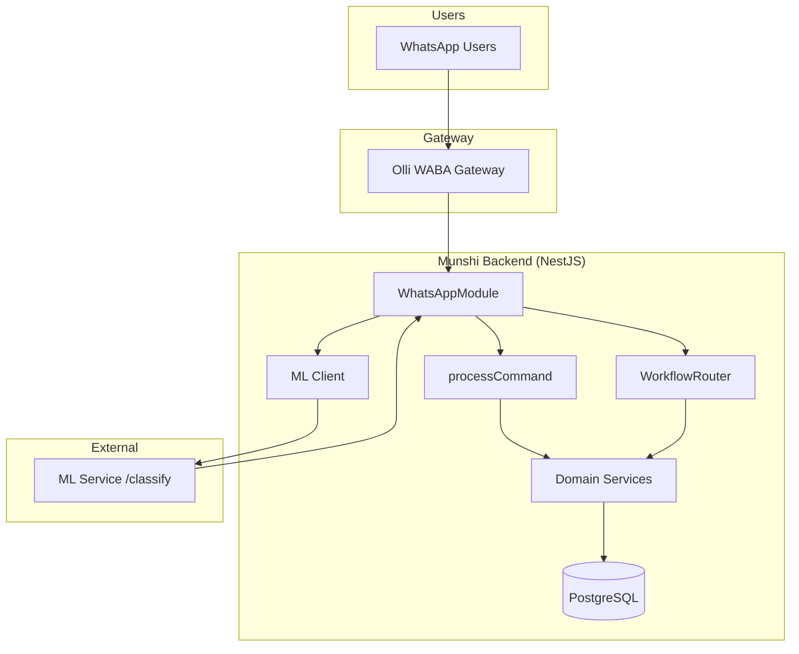
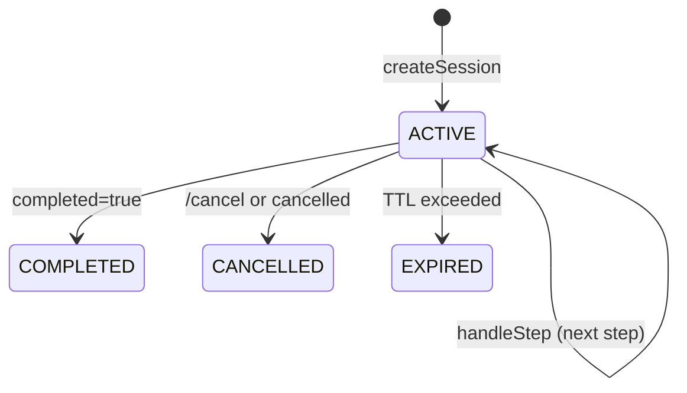
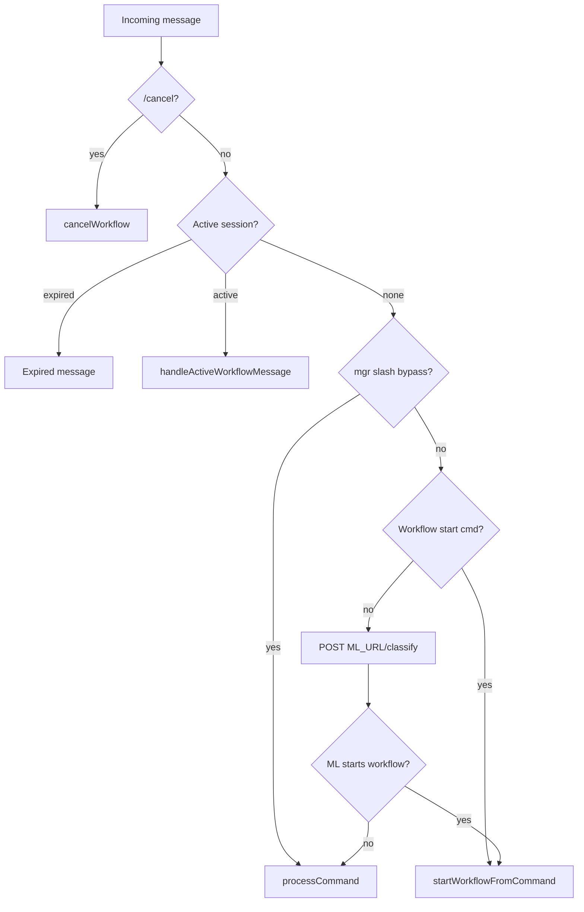
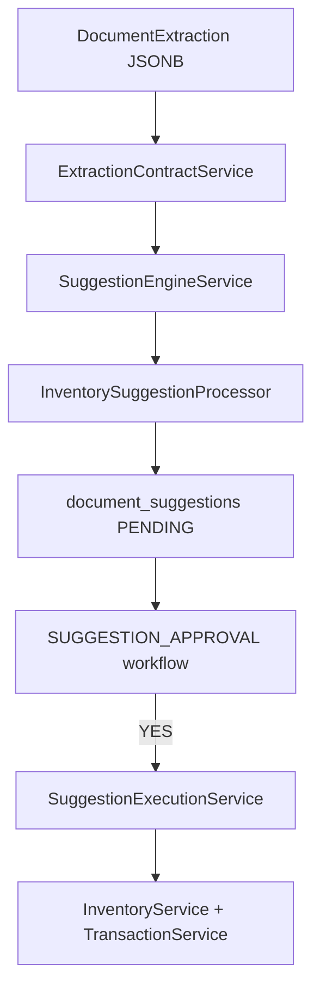

# Backend System Map

**Repository:** `munshi-dada-AS-sructure`  
**Stack:** NestJS 11 · TypeScript · Sequelize · PostgreSQL · WhatsApp-first  
**Date:** 2026-05-30  
**Scope:** Analysis only — no implementation changes

---

## 1. High-level architecture

Munshi is a **WhatsApp-first Business Operations Orchestration Layer** for factories. Users interact primarily via WhatsApp; REST APIs support administration and TraderOS extensions.



**Architectural rule:** LLM classifies intent and parses documents only. All CRUD, workflows, approvals, and business logic execute in the backend.

---

## 2. Module structure

| Layer | Path | Purpose |
|-------|------|---------|
| Bootstrap | `src/main.ts` | HTTP, CORS, ValidationPipe, Swagger |
| App root | `src/app/api/app.module.ts` | Module imports |
| Core | `src/core/` | DB, logger, health, guards, messaging, interceptors |
| WhatsApp | `src/modules/whatsapp/` | Webhook, routing, command dispatch |
| Domain | `src/services/*/` | Business modules |
| Workflow | `src/services/workflow/` | Multi-step session engine |

### Nest modules (feature)

| Module | Domain |
|--------|--------|
| `WhatsAppModule` | Inbound/outbound messaging |
| `WorkflowModule` | Session engine + handlers |
| `VendorModule` | Vendor CRUD |
| `InventoryModule` | Inventory + transactions |
| `DocumentModule` | Document foundation + suggestions |
| `TasksModule` | Task lifecycle + routing |
| `DepartmentsModule` | Departments + workers |
| `AttendanceModule` | Attendance |
| `IssuesModule` | Issue tracking |
| `ReportsModule` | Factory reports |
| `UserModule` / `FactoryModule` | Tenancy + users |
| `PurchaseRequestModule` | Skeleton REST |
| `ApprovalModule` | Skeleton REST |

---

## 3. Entity structure

**Tenancy anchor:** `factory_id` on nearly all business tables.

| Domain | Entities |
|--------|----------|
| Core | `User`, `Factory`, `FactoryUser` |
| Operations | `Task`, `TaskUpdate`, `Issue`, `Attendance` |
| Org | `Department`, `DepartmentWorker` |
| TraderOS | `Vendor`, `InventoryCategory`, `InventoryLocation`, `InventoryItem`, `InventoryTransaction` |
| Procurement (skeleton) | `PurchaseRequest`, `ApprovalRequest` |
| Workflow | `WorkflowSession` |
| Documents | `Document`, `DocumentProcessingJob`, `DocumentExtraction`, `DocumentSuggestion` |

---

## 4. Database tables (21 Sequelize models)

### Legacy (pre-TraderOS)

`users`, `factories`, `factory_users`, `tasks`, `task_updates`, `issues`, `departments`, `department_workers`, `attendance`

### Migration-added

| Migration | Tables |
|-----------|--------|
| 001 | `vendors`, `inventory_*`, `purchase_requests`, `approval_requests` |
| 002 | Vendor phone constraints |
| 003 | `workflow_sessions` |
| 004 | Inventory NOT NULL constraints |
| 005 | `documents`, `document_processing_jobs`, `document_extractions`, `document_suggestions` |

**Note:** Migrations omit DB-level FKs; scoping enforced in application layer.

---

## 5. Repository layer

| Repository | Module | Role |
|------------|--------|------|
| `InventoryRepository` | inventory | Categories, locations, items, transactions |
| `VendorRepository` | vendors | Vendor CRUD |
| `DocumentRepository` | documents | Documents, jobs, extractions, suggestions |
| `WorkflowSessionRepository` | workflow | Active session persistence |

Most legacy domains use Sequelize models directly in services (no separate repository class).

---

## 6. Service layer

| Service | Responsibility |
|---------|----------------|
| `WhatsAppService` | Message routing, ML call, `processCommand` |
| `WorkflowEngineService` | Session lifecycle, step execution |
| `WorkflowRouterService` | User context, role guards, cancel |
| `TasksService` | Assign, complete, manager routing |
| `InventoryService` | Item CRUD |
| `InventoryTransactionService` | **Sole quantity write path** |
| `VendorService` | Vendor CRUD |
| `DocumentService` | Document registry, extraction storage |
| `SuggestionEngineService` | Generate suggestions (no execution) |
| `SuggestionExecutionService` | Execute approved suggestions |
| `MessagingService` | Olli WABA send |

---

## 7. Controller / API layer

Swagger: **`/api/docs`** · Port: `PORT` env (default 3000; `.env.local` uses 4001)

| Controller | Base path |
|------------|-----------|
| `HealthController` | `/health` |
| `WhatsAppController` | `/webhook` |
| `VendorsController` | `/vendors` |
| `InventoryController` | `/inventory` |
| `DocumentController` | `/documents` |
| `TasksController` | `/tasks` |
| `FactoriesController` | `/factories` |
| `DepartmentsController` | `/departments` |
| `UsersController` | `/users` |
| `IssuesController` | `/issues` |
| `AttendanceController` | `/attendance` |
| `ReportsController` | `/reports` |
| `PurchaseRequestsController` | `/purchase-requests` |
| `ApprovalsController` | `/approvals` |

**Auth:** `InternalCallGuard` exists (`X_SECRET` header) but is **not applied** to REST routes today.

---

## 8. Workflow Engine architecture



| Component | File |
|-----------|------|
| Session CRUD | `workflow-session.service.ts` |
| Step orchestration | `workflow-engine.service.ts` |
| User/role resolution | `workflow-router.service.ts` |
| Handler registry | `workflow.registry.ts` |
| Expiry cron | `workflow-expiry.cron.ts` (hourly) |

**TTL:** `WORKFLOW_SESSION_TTL_HOURS` (default 24h)  
**Constraint:** One ACTIVE session per phone number

---

## 9. Workflow Registry

| Type | Command | Handler |
|------|---------|---------|
| `ONBOARD_VENDOR` | `/onboard_vendor` | `VendorOnboardingWorkflowHandler` |
| `ONBOARD_WORKER` | `/onboard_worker` | `WorkerOnboardingWorkflowHandler` |
| `INVENTORY_CREATE` | `/inventory_create` | `InventoryCreateWorkflowHandler` |
| `SUGGESTION_APPROVAL` | `/suggestion_approve` | `SuggestionApprovalWorkflowHandler` |

Registry maps command → handler and type → handler. Handlers implement `IWorkflowHandler`.

---

## 10. Command architecture

Commands defined in `src/modules/whatsapp/whatsapp.constants.ts` (`COMMANDS`).

**Two entry paths:**

1. **Slash / ML intent** → `processCommand(body)` with normalized intent + slots
2. **Workflow start commands** → `WorkflowRouter.startWorkflowFromCommand`

**Manager slash bypass** (runs even during active workflow):  
`/mgrself`, `/mgrassign`, `/mgrtransfer`, `/mgrreject`

See `backend-command-registry.md` for full inventory.

---

## 11. WhatsApp routing architecture



**Outbound:** All sends via `MessagingService` → Olli (`OLLI_URL/external/waba/send`).

---

## 12. Inventory architecture

```mermaid
flowchart LR
  REST[REST /inventory] --> IS[InventoryService]
  WF[/inventory_create workflow] --> IS
  DOC[SuggestionExecution] --> IS
  IS --> IR[InventoryRepository]
  ITS[InventoryTransactionService] --> IR
  ITS -->|STOCK_IN OUT ADJ| TX[inventory_transactions]
  TX -->|updates cache| IQ[current_quantity]
```

**Quantity strategy (Option B):** `current_quantity` updated atomically with transactions — never direct quantity PATCH.

**Suggestion path:** Document extraction → suggestions → approval → `InventoryTransactionService.recordStockIn`

---

## 13. Vendor architecture

| Path | Mechanism |
|------|-----------|
| REST | `VendorService` — full CRUD, factory-scoped |
| WhatsApp workflow | `/onboard_vendor` — multi-step, creates vendor at end |
| Documents (future) | `CREATE_VENDOR` suggestion type registered, not executable |

---

## 14. Worker onboarding architecture

| Step | Field |
|------|-------|
| `WORKER_NAME` | Name |
| `WORKER_PHONE` | Phone |
| `WORKER_DEPARTMENT` | Department selection |
| `WORKER_DOJ` | Date of joining |

Uses `FactoryService.assignMember` + `DepartmentsService.addWorker`. Managers/owners only.

---

## 15. Suggestion Engine architecture



**Rule:** Suggestions never auto-execute. LLM does not create suggestions — backend generates them from stored extractions.

---

## 16. Document Foundation architecture

| Entity | Purpose |
|--------|---------|
| `Document` | Metadata (type, status, storage_ref) |
| `DocumentProcessingJob` | Job tracking for future parsers |
| `DocumentExtraction` | Structured JSON from future LLM |
| `DocumentSuggestion` | Pending actions awaiting approval |

**DocumentRegistry:** Type contracts only — no parser implementation.  
**REST pipeline:** create → store extraction → generate suggestions → approve/reject

---

## 17. External dependencies

| Dependency | Variable | Usage |
|------------|----------|-------|
| PostgreSQL | `POSTGRES_CONNECTION_STRING` | All persistence |
| ML service | `ML_URL` | Intent classification |
| Olli WABA | `OLLI_URL`, `OLLI_KEY` | WhatsApp send |
| OpenAI (via ML repo) | Not in backend | Indirect via ML |

---

## 18. Third-party integrations

| Integration | Endpoint | Direction |
|-------------|----------|-----------|
| Olli WABA | `/external/waba/send` | Outbound WhatsApp |
| WhatsApp webhook | `POST /webhook` | Inbound messages |
| ML classifier | `POST {ML_URL}/classify` | Intent + slots |
| Swagger | `/api/docs` | API documentation |

`WHATSAPP_TOKEN` / `WHATSAPP_PHONE_NUMBER_ID` declared but **not used** in send path (Olli handles delivery).

---

## 19. Environment variables

| Variable | Purpose |
|----------|---------|
| `PORT` | HTTP port |
| `CORS_ORIGIN` | Allowed origins |
| `POSTGRES_CONNECTION_STRING` | Database |
| `ML_URL` | Intent classifier base URL |
| `OLLI_URL` | Olli gateway |
| `OLLI_KEY` | Olli API key |
| `WHATSAPP_VERIFY_TOKEN` | Webhook verification |
| `WHATSAPP_ONBOARDING_TEMPLATE` | New user welcome template |
| `WORKFLOW_SESSION_TTL_HOURS` | Session expiry |
| `X_SECRET` | Internal guard (unused on routes) |

---

## 20. Current system execution flow

### WhatsApp message (typical NL)

1. User sends text → Olli webhook → `WhatsAppService.handleIncomingMessage`
2. Check `/cancel` → active session → slash bypass → workflow start → **ML classify**
3. ML returns `{ intent, id, worker_slug, depart_slug, deadline, ... }`
4. If workflow command → start session; else → `processCommand`
5. Domain service executes business logic
6. Response sent via Olli

### Document bootstrap (REST-driven)

1. `POST /documents` → metadata
2. Future LLM posts `POST /documents/:id/extractions`
3. `POST .../suggestions` → backend generates suggestions
4. `POST .../approve-workflow` → WhatsApp YES/NO
5. On YES → `SuggestionExecutionService` → inventory CRUD + stock-in

---

*Related: [llm-system-map.md](./llm-system-map.md) · [backend-llm-contract.md](./backend-llm-contract.md)*
