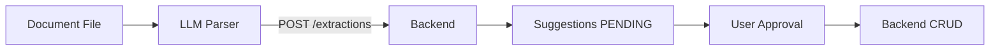

# Document Parsing Strategy Analysis

**Date:** 2026-05-30  
**Scope:** Future requirements — analysis only, no implementation

---

## Design principles

1. **LLM parses → JSON only** — no CRUD, no approvals
2. **Backend validates** — `DocumentExtractionContractService`
3. **Backend suggests** — `SuggestionEngineService` (never auto-executes)
4. **User approves** — workflow YES/NO or REST reject
5. **Backend executes** — domain services after approval



---

## Document type catalog

| Type | Backend registry | Parser | Suggestion engine | Execution |
|------|------------------|--------|-------------------|-----------|
| `INVENTORY_IMPORT` | Yes | Future LLM | Yes | Yes |
| `STOCK_REGISTER` | Yes | Future LLM | Yes | Partial |
| `PURCHASE_INVOICE` | Yes | Future LLM | Future | Partial |
| `GOODS_RECEIPT` | Yes | Future LLM | Future | Partial |
| `LEDGER_EXPORT` | Yes | Future LLM | No | No |
| `BANK_STATEMENT` | Yes | Future LLM | No | No |
| `UNKNOWN` | Yes | Fallback | Minimal | No |

---

## 1. Inventory documents

### INVENTORY_IMPORT

**Sources:** Opening stock sheet, Excel export, CSV, manual list photo (future OCR)

**Expected fields:**

| Field | Type | Required |
|-------|------|----------|
| `document_type` | string | Yes |
| `items[].name` | string | Yes |
| `items[].quantity` | number | No |
| `items[].sku` | string | No |
| `items[].unit` | string | No |

**Expected extraction output:**

```json
{
  "document_type": "INVENTORY_IMPORT",
  "items": [
    { "name": "Cement", "quantity": 500, "unit": "bags" },
    { "name": "Steel Rod", "quantity": 200, "unit": "pcs" }
  ]
}
```

**Expected suggestions:**

| Condition | Suggestion type |
|-----------|-----------------|
| Factory inventory empty | `INITIAL_INVENTORY_IMPORT` |
| Unknown item | `NEW_INVENTORY_ITEM` |
| Known item + qty | `STOCK_IN` |

**Expected backend actions (after YES):**

- `InventoryService.createItem`
- `InventoryTransactionService.recordStockIn`

---

## 2. Purchase invoices

### PURCHASE_INVOICE

**Sources:** PDF invoice, scanned image, email attachment

**Expected fields:**

| Field | Type |
|-------|------|
| `vendor_name` | string |
| `invoice_number` | string |
| `invoice_date` | ISO date |
| `items[].item_name` | string |
| `items[].quantity` | number |
| `items[].unit_price` | number |
| `items[].total` | number |
| `grand_total` | number |

**Expected extraction output:**

```json
{
  "document_type": "PURCHASE_INVOICE",
  "vendor_name": "ABC Steel Suppliers",
  "invoice_number": "INV-2026-0042",
  "invoice_date": "2026-05-15",
  "items": [
    {
      "item_name": "Steel Rod 12mm",
      "quantity": 100,
      "unit_price": 650,
      "total": 65000
    }
  ],
  "grand_total": 65000
}
```

**Expected suggestions:**

| Condition | Suggestion |
|-----------|------------|
| Vendor not in factory | `CREATE_VENDOR` |
| Item known + qty | `STOCK_IN` |
| Item unknown | `NEW_INVENTORY_ITEM` |
| Future | Link to `CREATE_PURCHASE_REQUEST` |

**Expected backend actions:**

- Approve vendor suggestion → `VendorService.createVendor`
- Approve stock-in → `recordStockIn` with `reference_type: DOCUMENT_SUGGESTION`
- Future: create purchase request + approval chain

---

## 3. Goods receipts

### GOODS_RECEIPT

**Sources:** GRN PDF, delivery challan, warehouse receipt

**Expected fields:**

| Field | Type |
|-------|------|
| `vendor_name` | string |
| `purchase_order_ref` | string |
| `receipt_date` | ISO date |
| `items[].name` | string |
| `items[].quantity` | number |

**Expected extraction output:**

```json
{
  "document_type": "GOODS_RECEIPT",
  "vendor_name": "ABC Steel",
  "purchase_order_ref": "PO-2026-001",
  "receipt_date": "2026-05-20",
  "items": [
    { "name": "Steel Rod", "quantity": 100 }
  ]
}
```

**Expected suggestions:** `STOCK_IN` per line (primary)

**Expected backend actions:** Stock-in only — procurement matching is future work

---

## 4. Stock registers

### STOCK_REGISTER

**Sources:** Periodic physical count sheet, warehouse log

**Expected fields:** `items[].name`, `items[].quantity` (snapshot or delta TBD)

**Expected extraction output:**

```json
{
  "document_type": "STOCK_REGISTER",
  "as_of_date": "2026-05-30",
  "items": [
    { "name": "Cement", "quantity": 450 },
    { "name": "Steel Rod", "quantity": 180 },
    { "name": "Aluminium Sheet", "quantity": 25 }
  ]
}
```

**Expected suggestions:**

| Condition | Suggestion |
|-----------|------------|
| Empty factory | `INITIAL_INVENTORY_IMPORT` |
| New item | `NEW_INVENTORY_ITEM` |
| Qty > system qty | `STOCK_IN` |
| Qty < system qty | `STOCK_OUT` (future) |
| Reconciliation delta | `INVENTORY_ADJUSTMENT` (future) |

**Strategy note:** Register may imply **absolute** quantities vs **movements** — contract must specify `quantity_mode: ABSOLUTE | DELTA` in future schema version.

---

## 5. CSV imports

**Not parsed in backend.** LLM responsibility:

1. Read CSV structure
2. Map columns → canonical `items[]` schema
3. Set `document_type: INVENTORY_IMPORT` or `STOCK_REGISTER`

**Example LLM output from CSV:**

```json
{
  "document_type": "INVENTORY_IMPORT",
  "source_format": "CSV",
  "column_mapping": {
    "name": "Item Name",
    "quantity": "Qty",
    "sku": "SKU Code"
  },
  "items": [
    { "name": "Cement", "sku": "CEM001", "quantity": 500 }
  ]
}
```

**Backend:** Same extraction contract as inventory import.

---

## 6. Excel imports

Same pattern as CSV with additional sheet metadata:

```json
{
  "document_type": "INVENTORY_IMPORT",
  "source_format": "XLSX",
  "sheet_name": "Stock May 2026",
  "items": []
}
```

LLM handles multi-sheet workbooks; backend receives normalized JSON only.

---

## 7. Ledger documents

### LEDGER_EXPORT

**Expected fields:**

| Field | Type |
|-------|------|
| `entries[].date` | ISO date |
| `entries[].description` | string |
| `entries[].debit` | number |
| `entries[].credit` | number |
| `entries[].account` | string |

**Expected extraction output:**

```json
{
  "document_type": "LEDGER_EXPORT",
  "period": "2026-05",
  "entries": [
    {
      "date": "2026-05-01",
      "description": "Office rent",
      "debit": 15000,
      "credit": 0,
      "account": "Rent Expense"
    }
  ]
}
```

**Expected suggestions:** `CREATE_LEDGER_ENTRY` (future — not executable today)

**Expected backend actions:** Future ledger module — double-entry validation, period locking

---

## 8. Bank statements

### BANK_STATEMENT

**Expected fields:**

| Field | Type |
|-------|------|
| `account_number` | string (masked) |
| `bank_name` | string |
| `transactions[].date` | ISO date |
| `transactions[].description` | string |
| `transactions[].amount` | number (signed) |
| `transactions[].balance` | number |

**Expected extraction output:**

```json
{
  "document_type": "BANK_STATEMENT",
  "bank_name": "HDFC",
  "account_number": "XXXX1234",
  "transactions": [
    {
      "date": "2026-05-10",
      "description": "NEFT ABC STEEL",
      "amount": -65000,
      "balance": 120000
    }
  ]
}
```

**Expected suggestions:**

- `CREATE_LEDGER_ENTRY` (reconciliation)
- Future: match to `PURCHASE_INVOICE` / vendor payments

**Account aggregator path:** Same JSON schema with `"source": "ACCOUNT_AGGREGATOR"`

---

## Parsing pipeline recommendation (future)

| Stage | Owner | Action |
|-------|-------|--------|
| 1. Upload | Backend | `POST /documents` → storage_ref |
| 2. Detect type | LLM | Classify document type |
| 3. Extract | LLM | Field extraction per registry contract |
| 4. Submit | LLM | `POST /documents/:id/extractions` |
| 5. Suggest | Backend | `POST .../suggestions` |
| 6. Notify | Backend | WhatsApp summary |
| 7. Approve | User | YES/NO workflow |
| 8. Execute | Backend | Domain services |

---

## Validation rules (backend today)

- `items[]` required non-empty for inventory paths
- `items[].name` required per line
- `quantity` must be non-negative if present
- Unknown document types → validation error unless `UNKNOWN`

---

*Related: [backend-llm-contract.md](./backend-llm-contract.md) · [intent-classification-strategy.md](./intent-classification-strategy.md)*
