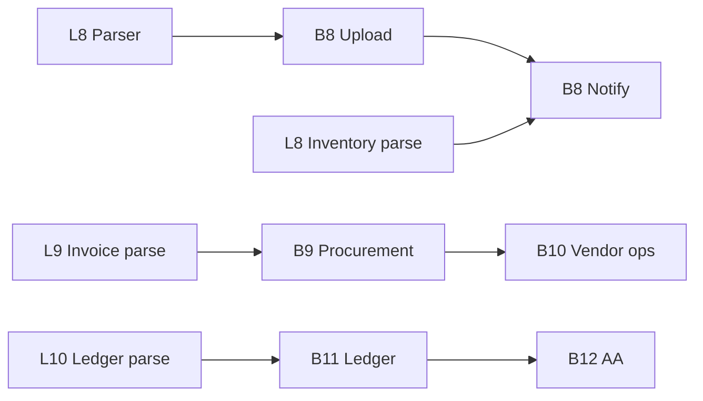

# Implementation Roadmap V2

**Date:** 2026-05-30  
**Based on:** Backend repo (through Prompt 7) + LLM repo (Phase-1)  
**Scope:** Planning only — no implementation

---

## Target architecture

```mermaid
flowchart TB
  subgraph Client
    WA[WhatsApp]
    REST[REST Admin]
  end

  subgraph LLM["LLM Service"]
    IC[/classify]
    DP[/parse - future]
  end

  subgraph BE["Munshi Backend"]
    WH[WhatsApp Router]
    WF[Workflow Engine]
    DOC[Document Pipeline]
    DOM[Domain Services]
  end

  subgraph Future
    PROC[Procurement]
    APPR[Approval Engine]
    LED[Ledger]
    AA[Account Aggregator]
  end

  WA --> WH
  REST --> DOC
  WH --> IC
  IC --> WH
  DOC --> DP
  DP -->|extractions REST| DOC
  WH --> WF --> DOM
  DOC --> WF
  DOM --> PROC
  DOM --> APPR
  DOM --> LED
  AA -->|bank feeds| DOC
```

---

## Phase overview

| Phase | Focus | Backend | LLM |
|-------|-------|---------|-----|
| **8** | Contract hardening + document ingestion | Upload, notify, queue | Parser v1, schema fix |
| **9** | Procurement foundation | Purchase requests, approvals | Invoice/GRN parsing |
| **10** | Vendor operations | PO linking, vendor stock-in | Vendor match extraction |
| **11** | Ledger foundation | Ledger entities, suggestions | Ledger/bank parsing |
| **12** | Account aggregator | Bank feed ingestion | Transaction classification |
| **13** | Platform hardening | Auth, observability, eval | Model eval harness |

---

## Backend milestones

### B8 — Document ingestion (next)

| # | Deliverable | Depends on |
|---|-------------|------------|
| B8.1 | File upload endpoint + storage adapter | — |
| B8.2 | Auto-notify uploader on WhatsApp when suggestions ready | B8.1 |
| B8.3 | Suggestion queue (sequential approvals) | Workflow |
| B8.4 | `ProcurementSuggestionProcessor` stub | Document registry |
| B8.5 | REST auth guards (factory-scoped) | — |

### B9 — Procurement

| # | Deliverable |
|---|-------------|
| B9.1 | Purchase request CRUD (replace skeleton) |
| B9.2 | Link vendor_id on purchase requests |
| B9.3 | Approval approve/reject business logic |
| B9.4 | Stock-in with procurement reference |
| B9.5 | `/purchase_request_create` workflow |

### B10 — Vendor operations

| # | Deliverable |
|---|-------------|
| B10.1 | Execute `CREATE_VENDOR` suggestion |
| B10.2 | Vendor-invoice matching |
| B10.3 | Vendor payment status (no finance ledger yet) |

### B11 — Ledger

| # | Deliverable |
|---|-------------|
| B11.1 | Ledger account + entry entities |
| B11.2 | Execute `CREATE_LEDGER_ENTRY` suggestion |
| B11.3 | Period close rules |

### B12 — Account aggregator

| # | Deliverable |
|---|-------------|
| B12.1 | Bank feed ingestion adapter |
| B12.2 | Reconciliation suggestions |
| B12.3 | Match bank tx → ledger entries |

---

## LLM milestones

### L8 — Contract + parser foundation (next)

| # | Deliverable | Depends on |
|---|-------------|------------|
| L8.1 | Fix `ClassifyResponse` — add `reject_reason` | — |
| L8.2 | Add workflow intents to few-shot (`/onboard_vendor`, etc.) | — |
| L8.3 | JSON body support on `/classify` | — |
| L8.4 | New router `POST /parse` — document → extraction JSON | B8.1 upload |
| L8.5 | INVENTORY_IMPORT + STOCK_REGISTER parser | L8.4 |
| L8.6 | Slim Docker requirements (remove unused torch) | — |
| L8.7 | Basic eval script + 50-example test set | — |

### L9 — Procurement parsing

| # | Deliverable |
|---|-------------|
| L9.1 | PURCHASE_INVOICE extractor |
| L9.2 | GOODS_RECEIPT extractor |
| L9.3 | Vendor name normalization hints |

### L10 — Ledger parsing

| # | Deliverable |
|---|-------------|
| L10.1 | LEDGER_EXPORT extractor |
| L10.2 | BANK_STATEMENT extractor |

### L11 — Account aggregator

| # | Deliverable |
|---|-------------|
| L11.1 | AA JSON feed normalizer |
| L11.2 | Transaction category hints (suggestion-only) |

---

## Shared contracts (must stay synchronized)

| Contract | Owner doc | Version |
|----------|-----------|---------|
| `/classify` response schema | `backend-llm-contract.md` | v1.1 (add reject_reason) |
| Document extraction payload | `backend-llm-contract.md` | v1 |
| Document type enum | Both repos | extensible |
| Suggestion type enum | Backend registry | extensible |
| Intent catalog | `backend-command-registry.md` | living doc |

**Process:** Contract change → update doc → implement backend → implement LLM → eval.

---

## Dependencies



**Critical path:** L8 contract fix → L8 parser → B8 upload → end-to-end document bootstrap via LLM.

---

## Execution order (recommended)

| Order | Work item | Repo |
|-------|-----------|------|
| 1 | Fix `reject_reason` in ML API | LLM |
| 2 | Add workflow intent few-shot examples | LLM |
| 3 | File upload + storage | Backend |
| 4 | `POST /parse` inventory extractor | LLM |
| 5 | Wire: upload → parse → extract → suggest → notify | Both |
| 6 | Suggestion queue | Backend |
| 7 | Eval harness for intents | LLM |
| 8 | Purchase request CRUD | Backend |
| 9 | Invoice parser | LLM |
| 10 | Procurement suggestion processor | Backend |

---

## Risk analysis

| Risk | Phase | Mitigation |
|------|-------|------------|
| Contract drift | All | Shared contract doc + CI schema test |
| LLM auto-CRUD temptation | All | Architecture reviews; backend-only execution |
| Parser accuracy | L8+ | Human approval workflow (existing) |
| Open ML endpoint | L8 | API key or private network |
| Procurement scope creep | B9 | Suggestions only; no auto-ordering |
| Ledger complexity | B11 | Start with suggestion + manual approve |

---

## Expected deliverables by phase

### Prompt 8 (recommended next)

**Backend:**
- Document upload
- WhatsApp notification on suggestions
- Suggestion queue

**LLM:**
- `reject_reason` fix
- Workflow intent coverage
- `/parse` for INVENTORY_IMPORT

**Shared:**
- Updated `backend-llm-contract.md` v1.1

### Prompt 9

- Purchase request module live
- Invoice/GRN parsers
- `CREATE_VENDOR` + procurement suggestions executable

### Prompt 10+

- Ledger module
- Account aggregator ingestion
- Full TraderOS procurement cycle

---

## Target: Procurement

| Capability | Backend | LLM |
|------------|---------|-----|
| Create PR from invoice | Workflow + CRUD | Parse invoice |
| Approve PR | Approval engine | — |
| GRN stock-in | Transaction service | Parse GRN |
| Vendor create from doc | Suggestion execution | Extract vendor_name |

---

## Target: Approval engine

Replace skeleton `approval_requests` with workflow-integrated approve/reject for purchase requests and future finance actions. LLM does not approve — users do via WhatsApp or REST.

---

## Target: Document processing

End-state pipeline:

```
Upload → Parse (LLM) → Extract (REST) → Suggest (backend) → Approve (workflow) → Execute (backend)
```

---

*Related: [project-state-summary.md](./project-state-summary.md) · [backend-llm-gap-analysis.md](./backend-llm-gap-analysis.md)*
