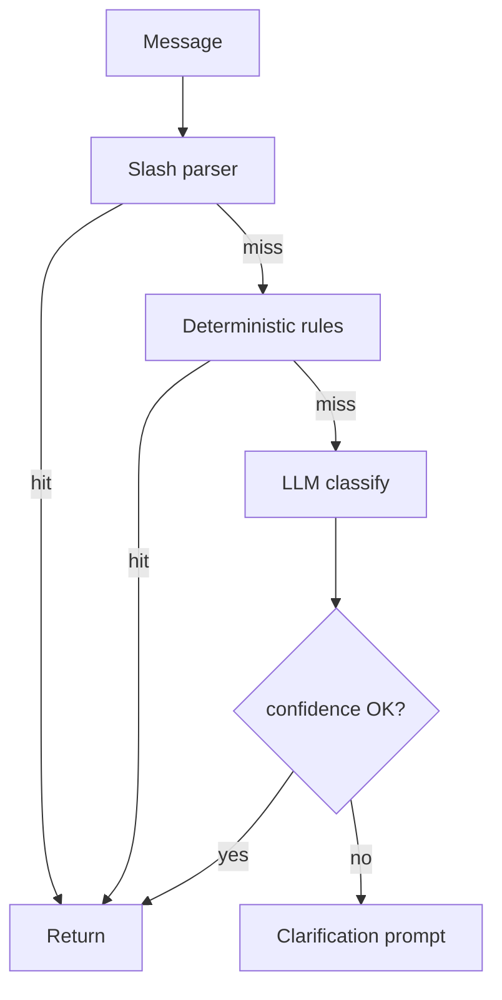

# Intent Classification Strategy Analysis

**Date:** 2026-05-30  
**Scope:** Analysis only — no implementation

---

## Current state

| Component | Location | Role |
|-----------|----------|------|
| Slash parser | LLM `CommandParser` | Fast-path for 12 commands |
| Deterministic rules | LLM `deterministic_pre_classify` | `/complete`, `@mention` assign |
| LLM classifier | LLM `IntentClassifier` | All other NL |
| Backend router | `WhatsAppService` | ML → workflow or `processCommand` |

---

## Current commands (full inventory)

### Slash-fast-path (LLM CommandParser)

`/tasks`, `/present`, `/absent`, `/help`, `/report`, `/members`, `/issues`, `/issue`, `/resolve`, `/complete`, `/update`, `/mgrtransfer`, `/mgrreject`

### LLM-only (no slash parser)

`/assign`, `/depart_assign`, `/mgrassign`, `/mgrself`

### Workflow starts (backend registry)

`/onboard_vendor`, `/onboard_worker`, `/inventory_create`, `/suggestion_approve`

### Backend-only (not ML classified)

`/inventory_status`, `/cancel`, `/depart_assign` (as ML intent)

---

## Future commands (recommended)

| Command | Purpose | Priority |
|---------|---------|----------|
| `/purchase_request_create` | Start procurement workflow | P1 |
| `/inventory_stock_in` | Manual stock-in via workflow | P2 |
| `/inventory_stock_out` | Manual stock-out | P2 |
| `/vendor_list` | List vendors via WhatsApp | P2 |
| `/upload_document` | Trigger document upload flow | P1 |
| `/onboard_vendor` | Already exists — needs ML few-shot | P0 |
| `/onboard_worker` | Already exists — needs ML few-shot | P0 |
| `/inventory_create` | Already exists — needs ML few-shot | P0 |

---

## Intent naming convention

| Rule | Example |
|------|---------|
| Slash-prefixed | `/assign`, `/complete` |
| Lowercase | `/mgrassign` not `/mgrAssign` |
| Verb-noun or action | `/onboard_vendor`, `/inventory_create` |
| Department slug separate field | intent=`/depart_assign`, `depart_slug=sales` |
| General fallback | `general_chat` (no slash) |

**Workflow intents** must exactly match backend `WORKFLOW_START_COMMANDS`.

---

## Command naming convention

| Pattern | Usage |
|---------|-------|
| `/mgr*` | Manager actions on existing tasks |
| `/onboard_*` | Multi-step onboarding workflows |
| `/inventory_*` | Inventory operations |
| Bare verbs | `/present`, `/absent`, `/help` |

---

## Training data requirements (future)

### Per-intent dataset structure

```json
{
  "message": "ajay ko invoice bhejdo",
  "intent": "/assign",
  "worker_slug": "ajay",
  "depart_slug": null,
  "id": null,
  "language": "hinglish"
}
```

### Minimum coverage targets

| Category | Min examples/intent |
|----------|---------------------|
| Core ops (tasks, attendance) | 50 |
| Manager routing | 75 |
| Instruction vs completion | 100 (critical) |
| Workflow triggers | 30 each |
| general_chat vs command | 50 |
| Hindi / English / Hinglish | 33% each |

### High-confusion pairs (priority eval)

| Pair | Why |
|------|-----|
| `/assign` vs `/complete` | Instruction vs confirmation |
| `/assign` vs `/depart_assign` | Person vs department |
| `/assign` vs `/mgrassign` | New task vs existing task id |
| `/depart_assign` vs `/mgrtransfer` | New dept task vs transfer |

---

## Expected inputs

### LLM receives

| Input | Required |
|-------|----------|
| `message` string | Yes |
| User phone | No (backend resolves) |
| Factory context | No |
| Conversation history | No |

### Optional future inputs

```json
{
  "message": "add vendor",
  "locale": "hi-IN",
  "user_role": "OWNER"
}
```

---

## Expected outputs

### Standard classify response

```json
{
  "intent": "/onboard_vendor",
  "id": null,
  "worker_slug": null,
  "depart_slug": null,
  "deadline": null,
  "reject_reason": null,
  "message": null,
  "confidence": 0.92
}
```

`confidence` — **recommended future field**, not implemented.

### general_chat response

```json
{
  "intent": "general_chat",
  "message": "Main tasks aur attendance mein help kar sakta hoon. /help type karo."
}
```

---

## Confidence handling (recommended)

| Confidence | Action |
|------------|--------|
| ≥ 0.85 | Route to intent |
| 0.60 – 0.84 | Route + log for review |
| < 0.60 | Return clarifying `general_chat` or ask disambiguation |

**Current:** No confidence — all LLM outputs treated equally.

---

## Fallback handling

### LLM layer (today)

| Failure | Fallback |
|---------|----------|
| OpenAI error on classify | `general_chat` intent |
| OpenAI error on general_chat | Static Hinglish message |
| OpenAI error on convert | Rule-based `_fallback_convert` |
| Unknown intent | Coerced to `general_chat` |

### Backend layer

| Failure | Fallback |
|---------|----------|
| ML HTTP error | Error message to user |
| Unknown command | `waUnknownCommand()` |
| Unregistered user | Unauthorized |
| Worker on manager command | Forbidden message |

### Recommended cascade



---

## Workflow intent training examples (needed in LLM)

| Intent | Training examples |
|--------|-------------------|
| `/onboard_vendor` | "add vendor", "register supplier", "new vendor ABC Traders" |
| `/onboard_worker` | "add worker", "onboard Rahul", "register employee" |
| `/inventory_create` | "add inventory item", "create new SKU", "add cement to stock" |
| `/inventory_status` | "check stock", "low stock items", "SKU CEM001 status" |

---

## Document-related intents (future)

| Intent | Behavior |
|--------|----------|
| `upload_document` | Backend returns upload instructions / REST link |
| `confirm_suggestion` | Should **NOT** be LLM CRUD — handled by active workflow YES/NO |
| `reject_suggestion` | Same — workflow handles |

**Critical:** Confirm/reject must remain workflow replies, not LLM-executed intents.

---

*Related: [backend-command-registry.md](./backend-command-registry.md) · [backend-llm-contract.md](./backend-llm-contract.md)*
