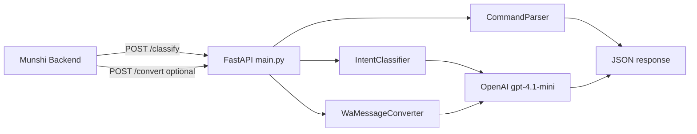
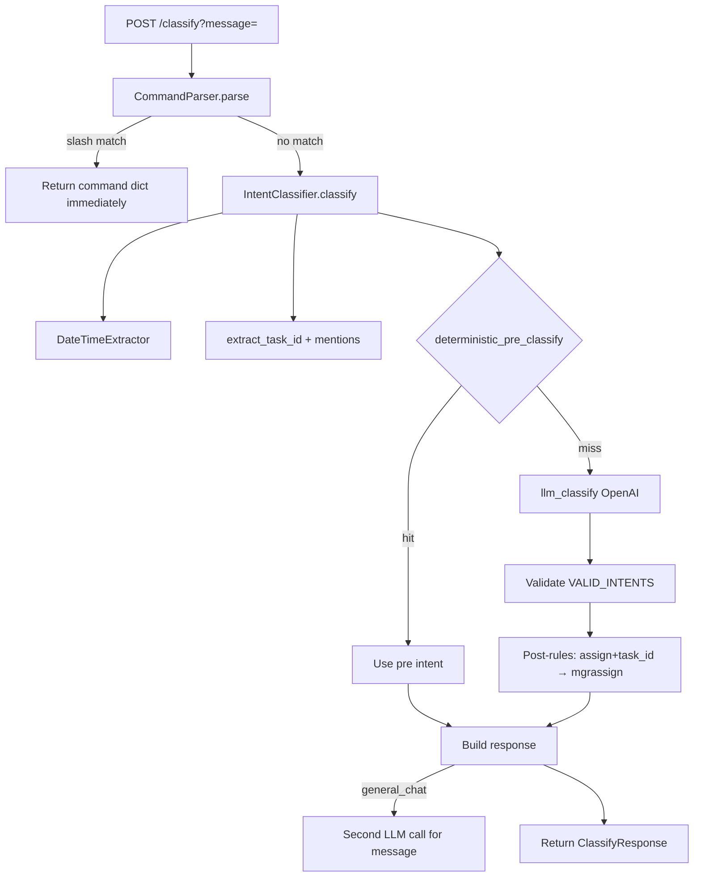

# LLM System Map

**Repository:** `Munshi-Dada-Phase-1-main`  
**Stack:** Python 3.12 · FastAPI · OpenAI API  
**Date:** 2026-05-30  
**Scope:** Analysis only — no implementation changes

---

## 1. Overall architecture

The LLM repository is a **standalone FastAPI microservice** that provides:

1. **Intent classification** for WhatsApp natural language
2. **WhatsApp message conversion** (bot templates → plain English)

It does **not** perform CRUD, store business data, or parse documents.



**"Hybrid" naming:** Slash parser + regex pre-rules + OpenAI — **no local ML model** in active code despite heavy `requirements.txt` deps.

---

## 2. Model architecture

| Aspect | Current state |
|--------|---------------|
| Primary model | `gpt-4.1-mini` (hardcoded `CHAT_MODEL`) |
| Local models | **Not used** (torch, sentence-transformers listed but unused) |
| Embeddings | **None** |
| Fine-tuning | **None** |
| JSON mode | Used for `/classify` LLM path |
| Seed | `seed=42` for reproducibility |

Three OpenAI call sites:

| Call | Temperature | Output |
|------|-------------|--------|
| Intent classification | 0 | JSON `{intent, worker_slug, depart_slug, reject_reason}` |
| General chat | 0.2 | Plain Hinglish text |
| WA convert | 0 | Plain English text |

---

## 3. Prompt architecture

| Prompt | Builder | Purpose |
|--------|---------|---------|
| Intent system | `IntentClassifier._build_system_prompt()` | Multilingual intent JSON + few-shot examples |
| General chat | `_build_general_chat_system_prompt()` | Off-topic redirect, Munshi scope |
| WA convert | `WaMessageConverter._build_system_prompt()` | Rewrite bot templates to natural English |

**Few-shot examples** are embedded in the intent system prompt (~200 lines). This is the primary "training" mechanism — no external dataset files.

---

## 4. Intent classification pipeline



### Deterministic pre-classification

| Rule | Result |
|------|--------|
| Completion regex + no instruction signal | `/complete` |
| `@mention` + task id pattern | `/mgrassign` |
| `@mention` without task id | `/assign` |

**Not used:** `_detect_department()` helper (defined but dead code).

---

## 5. Document parsing pipeline

**Does not exist.**

- No PDF, OCR, CSV, Excel, or image endpoints
- No document upload
- No structured extraction output for backend `DocumentExtraction`

Document parsing is a **future LLM responsibility** per Munshi architecture; backend stores extractions via REST.

---

## 6. Training architecture

**Does not exist.**

| Component | Status |
|-----------|--------|
| Training scripts | None |
| Dataset files | None |
| Eval harness | None |
| Model weights | None (API-only) |
| Intent confusion matrix | None |

Learning = prompt engineering + few-shot examples in code.

---

## 7. Dataset architecture

**None.** No `data/` directory, no labeled examples file, no versioning.

Recommended future structure (not implemented):

```
data/
  intents/
    train.jsonl
    eval.jsonl
  documents/
    purchase_invoice/
    inventory_import/
```

---

## 8. Inference flow

### `/classify`

```
Request:  POST /classify?message=<url-encoded string>
Response: ClassifyResponse JSON
Latency:  1–2 OpenAI round-trips (2 if general_chat)
Auth:     None
```

### `/convert`

```
Request:  POST /convert?message=<wa-formatted string>
Response: { "message": "<plain english>" }
Fallback: Rule-based _fallback_convert if OpenAI fails
```

---

## 9. Input contracts

### `/classify`

| Field | Location | Type | Required |
|-------|----------|------|----------|
| `message` | Query param | string | Yes |

No JSON body. No user context (phone, factory_id, role).

### `/convert`

| Field | Location | Type | Required |
|-------|----------|------|----------|
| `message` | Query param | string | Yes |

---

## 10. Output contracts

### `/classify` response (`ClassifyResponse`)

```json
{
  "intent": "/assign",
  "id": 12,
  "worker_slug": "@rahul",
  "depart_slug": null,
  "deadline": "2026-05-31T17:00:00",
  "message": null
}
```

| Field | Notes |
|-------|-------|
| `intent` | Slash command or `general_chat` |
| `id` | Task/issue id when extractable |
| `worker_slug` | `@name` or plain name |
| `depart_slug` | `operations` \| `sales` \| `purchase` \| `it` |
| `deadline` | ISO datetime or date from DateTimeExtractor |
| `message` | Populated only for `general_chat` |

**Known gap:** Engine produces `reject_reason` for `/mgrreject` but **`ClassifyResponse` omits it** — dropped by FastAPI response model.

### `/convert` response

```json
{
  "message": "Your message format was not valid. For /mgrreject, include a task number and a reason."
}
```

---

## 11. External services

| Service | Usage |
|---------|-------|
| OpenAI API | All LLM inference |
| Docker Hub | CI/CD image publish |
| AWS EC2 | Deployment target |

No database, no Redis, no vector store.

---

## 12. Environment variables

| Variable | Required | Read by code |
|----------|----------|--------------|
| `OPENAI_API_KEY` | **Yes** | Yes |

Hardcoded (not env-configurable):

- `CHAT_MODEL=gpt-4.1-mini`
- Host `0.0.0.0`, port `8000`

See `.env.example` in LLM repo.

---

## 13. APIs exposed

| Method | Path | Purpose |
|--------|------|---------|
| GET | `/` | Service metadata |
| GET | `/health` | Health check |
| POST | `/classify` | Intent + entity extraction |
| POST | `/convert` | WA template → plain English |

FastAPI auto-docs: `{ML_URL}/docs`

---

## 14. Model dependencies

**Actually imported at runtime:**

- `fastapi`, `uvicorn`, `pydantic`
- `openai`, `python-dotenv`
- `python-dateutil` (used but **missing from requirements.txt**)

**Listed but unused:**

- `torch`, `sentence-transformers`, `transformers`, `tokenizers`, `huggingface-hub`, `numpy`
- `streamlit`, `pandas`, `watchdog`

---

## 15. Current limitations

| Limitation | Impact |
|------------|--------|
| No auth on API | Open endpoint if exposed |
| Query-string POST only | Awkward for long messages |
| `reject_reason` dropped | Backend may miss rejection text from ML |
| No confidence score | Backend cannot threshold low-confidence |
| No `/onboard_vendor` etc. in slash parser | Relies on LLM returning workflow intents |
| ~50% commented duplicate code in bot_engine.py | Maintenance noise |
| Heavy unused Docker deps | Slow builds, misleading architecture |
| No tests | No regression safety |
| Empty README | No runbook |

---

## 16. Current capabilities

| Capability | Status |
|------------|--------|
| English / Hindi / Hinglish intent classification | Yes |
| Slash command fast-path | Partial (12 commands) |
| Date/time extraction | Yes (relative + explicit) |
| Task id extraction | Regex-based |
| @mention extraction | Yes |
| Department slug inference | LLM prompt (4 departments) |
| General chat replies | Yes (scoped to Munshi) |
| WA message humanization | Yes (`/convert`) |
| Workflow intent routing | Returns intents backend recognizes |

---

## 17. Current accuracy assumptions

| Assumption | Basis |
|------------|-------|
| Instruction vs completion disambiguation | Few-shot + deterministic `/complete` rules |
| `/assign` vs `/mgrassign` | Task id presence + post-processing |
| Department routing | LLM keyword map in prompt — **no eval metrics** |
| Reproducibility | `temperature=0`, `seed=42` — not guaranteed across model updates |
| No measured accuracy | No eval dataset or production logging in repo |

---

## 18. Missing functionality

| Missing | Priority for Munshi roadmap |
|---------|----------------------------|
| Document parsing endpoints | P0 |
| Structured extraction JSON per document type | P0 |
| Intent for document upload | P1 |
| `/onboard_vendor`, `/inventory_create` in training/prompt | P1 |
| `reject_reason` in API schema | P0 (contract fix) |
| Confidence / fallback metadata | P1 |
| Auth / rate limiting | P1 |
| Eval harness + dataset | P1 |
| Slim Docker image | P2 |
| Local/fine-tuned model option | P3 |

---

*Related: [backend-llm-contract.md](./backend-llm-contract.md) · [backend-llm-gap-analysis.md](./backend-llm-gap-analysis.md)*
