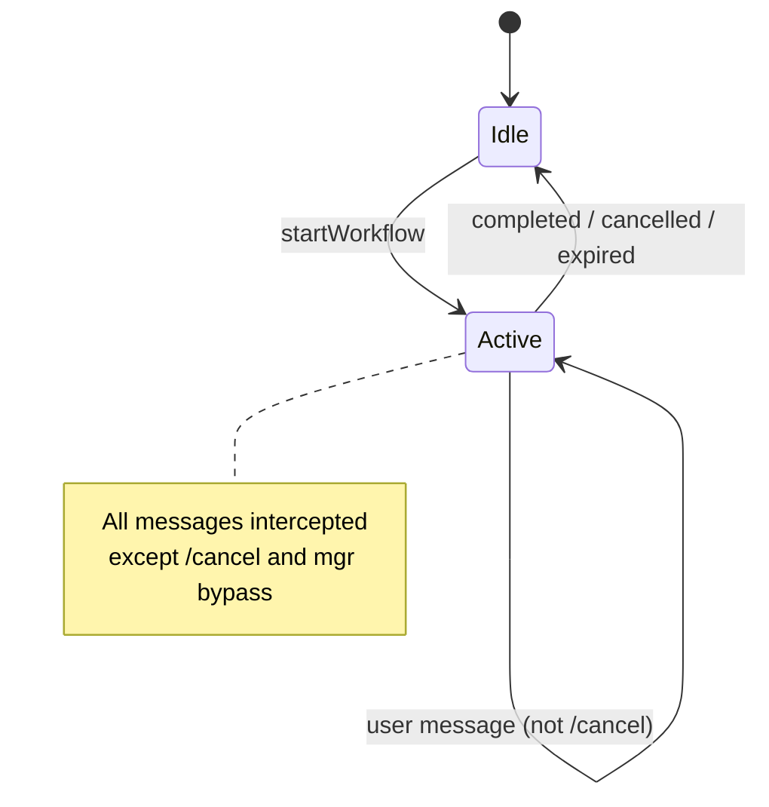

# Workflow Inventory

**Repository:** Munshi Backend  
**Date:** 2026-05-30  
**Engine:** `src/services/workflow/`

---

## Overview

| Workflow | Type | Start command | Status |
|----------|------|---------------|--------|
| Vendor Onboarding | `ONBOARD_VENDOR` | `/onboard_vendor` | **Live** |
| Worker Onboarding | `ONBOARD_WORKER` | `/onboard_worker` | **Live** |
| Inventory Create | `INVENTORY_CREATE` | `/inventory_create` | **Live** |
| Suggestion Approval | `SUGGESTION_APPROVAL` | `/suggestion_approve` | **Live** (REST-initiated) |

**Session TTL:** `WORKFLOW_SESSION_TTL_HOURS` (default 24)  
**Expiry cron:** Hourly (`WorkflowExpiryCronService`)  
**Constraint:** One ACTIVE session per phone

---

## 1. Vendor Onboarding

| Field | Detail |
|-------|--------|
| **Trigger** | `/onboard_vendor` (WhatsApp slash or ML intent → workflow start) |
| **Handler** | `VendorOnboardingWorkflowHandler` |
| **Role** | Manager, Owner |

### Steps

| Step | Prompt | Validation |
|------|--------|------------|
| `VENDOR_NAME` | Vendor name? | `normalizeVendorName` — required |
| `VENDOR_PHONE` | Phone number? | `normalizeVendorPhone` |
| `VENDOR_GST` | GST? (SKIP allowed) | `normalizeVendorGst` or skip |
| `VENDOR_ADDRESS` | Address? (SKIP allowed) | `normalizeVendorAddress` or skip |

### Completion action

- `VendorService.createVendor({ factory_id, name, phone_number, gst_number, address })`
- WhatsApp success message with vendor id

### Validation rules

- Duplicate name/phone → step-specific retry prompts
- SKIP keywords: `skip`, `none`, `na`, `n/a`

---

## 2. Worker Onboarding

| Field | Detail |
|-------|--------|
| **Trigger** | `/onboard_worker` |
| **Handler** | `WorkerOnboardingWorkflowHandler` |
| **Role** | Manager, Owner |

### Steps

| Step | Prompt | Validation |
|------|--------|------------|
| `WORKER_NAME` | Worker name? | Name normalization |
| `WORKER_PHONE` | Phone? | Phone validation |
| `WORKER_DEPARTMENT` | Department selection | Must match factory department |
| `WORKER_DOJ` | Date of joining? | Date parsing (SKIP allowed) |

### Completion action

- Create/link user via `FactoryService.assignMember`
- Add to department via `DepartmentsService.addWorker`
- Welcome message

### Business services

- `WorkerOnboardingService`
- `UserService`, `FactoryService`, `DepartmentsService`

---

## 3. Inventory Create

| Field | Detail |
|-------|--------|
| **Trigger** | `/inventory_create` |
| **Handler** | `InventoryCreateWorkflowHandler` |
| **Role** | Manager, Owner |

### Steps

| Step | Field collected |
|------|-----------------|
| `ITEM_NAME` | Item name |
| `ITEM_SKU` | SKU (auto-normalized uppercase) |
| `ITEM_CATEGORY` | Category (select from list or name) |
| `ITEM_LOCATION` | Location (select from list or name) |
| `ITEM_UNIT` | Unit of measure |
| `ITEM_REORDER_THRESHOLD` | Reorder threshold (SKIP allowed) |

### Completion action

- `InventoryService.createItem` with `current_quantity: 0`
- Stock must be added separately via transactions or document suggestions

### Validation rules

- Category and location must exist or be creatable in workflow
- Duplicate SKU → retry SKU step

---

## 4. Suggestion Approval

| Field | Detail |
|-------|--------|
| **Trigger** | REST `POST /documents/suggestions/:id/approve-workflow` with `phone_number` |
| **Handler** | `SuggestionApprovalWorkflowHandler` |
| **Role** | Manager, Owner |

### Steps

| Step | Behavior |
|------|----------|
| `CONFIRM` | Show `payload.summary`; wait for YES/NO |

### YES keywords

`yes`, `y`, `confirm`, `approve`

### NO keywords

`no`, `n`, `reject`, `cancel`

### Completion actions

| Reply | Action |
|-------|--------|
| YES | `SuggestionExecutionService.executeApprovedSuggestion` |
| NO | `SuggestionExecutionService.rejectSuggestion` |

### Executable suggestion types today

- `INITIAL_INVENTORY_IMPORT`
- `NEW_INVENTORY_ITEM`
- `STOCK_IN`

### Session data

```json
{
  "suggestion_id": 7,
  "document_id": 1,
  "summary": "We detected the following inventory..."
}
```

---

## Workflow interaction with WhatsApp routing



**During ACTIVE workflow:**

- User messages go to workflow handler only
- ML classification is **skipped**
- Exception: `/mgrself`, `/mgrassign`, `/mgrtransfer`, `/mgrreject` bypass to `processCommand`

---

## Planned workflows (not implemented)

| Workflow | Trigger (proposed) | Status |
|----------|-------------------|--------|
| Purchase request create | `/purchase_request_create` | Not built |
| Vendor order | TBD | Not built |
| Document upload confirm | ML intent + REST | Partial (approval only) |

---

*Related: [backend-command-registry.md](./backend-command-registry.md) · [backend-system-map.md](./backend-system-map.md)*
