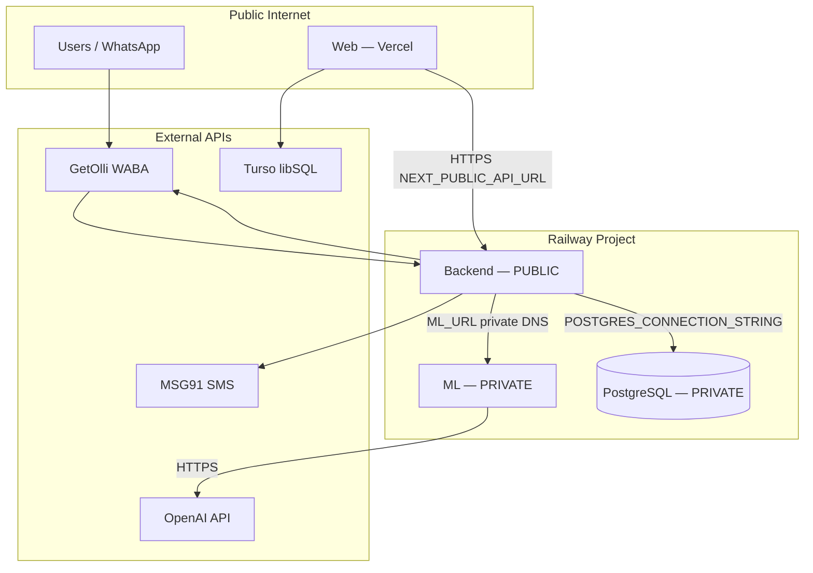

# Networking Plan

**Status:** Plan only  
**Date:** 2026-06-07

---

## Architecture overview

---

## Backend ↔ ML

| Aspect | Detail |
|--------|--------|
| **Direction** | Backend → ML (outbound only from app logic) |
| **Protocol** | HTTP (private Railway network) |
| **Env var** | `ML_URL=http://${{ML.RAILWAY_PRIVATE_DOMAIN}}:${{ML.PORT}}` |
| **Endpoints used** | `/classify`, `/convert`, `/extract/task-inventory`, `/parse` |
| **ML public URL** | **Not required** — disable public networking on ML service |

### Code references

- `whatsapp.service.ts` — classifies inbound WhatsApp text via `ML_URL/classify`
- `ml-task-inventory.client.ts` — `ML_URL/extract/task-inventory`
- `ml-parser.adapter.ts` — `ML_URL/parse`

### Recommendations

- Set ML service networking to **Private** in Railway.
- Use Railway **service references** for `ML_URL` — avoids hardcoded hostnames.
- Do not expose ML to the public internet; no API gateway auth on ML endpoints today.
- Backend is the security boundary (`InternalCallGuard` on `/resolve/*`).

---

## Backend ↔ PostgreSQL

| Aspect | Detail |
|--------|--------|
| **Direction** | Backend → Postgres |
| **Protocol** | PostgreSQL (TCP, SSL) |
| **Env var** | `POSTGRES_CONNECTION_STRING=${{Postgres.DATABASE_URL}}` |
| **Consumers** | Sequelize via `DbService` |
| **Health** | `GET /health` checks Postgres connectivity |

### Recommendations

- Keep Postgres **private** (Railway default for plugin).
- Only Backend service receives `POSTGRES_CONNECTION_STRING`.
- ML and Web never connect to Railway Postgres.

---

## Web ↔ Backend

| Aspect | Detail |
|--------|--------|
| **Direction** | Browser / Next.js server → Backend |
| **Protocol** | HTTPS (public) |
| **Env var (Web)** | `NEXT_PUBLIC_API_URL=https://<backend>.up.railway.app` |
| **Env var (Backend)** | `CORS_ORIGIN=https://www.munshidada.com,...` |
| **Auth** | Route-specific (`x-admin-key` on web admin APIs; `x-secret` on internal backend routes) |

### Recommendations

- Assign a stable Railway public domain or custom domain (`api.www.munshidada.com`) before updating Vercel.
- Set `CORS_ORIGIN` to exact Vercel production + preview origins as needed.
- Set `MUNSHI_WEB_URL` to Vercel canonical URL for Zoho OAuth redirects.

---

## WhatsApp / Olli ↔ Backend

| Aspect | Detail |
|--------|--------|
| **Direction** | Olli → Backend (webhook), Backend → Olli (outbound messages) |
| **Webhook URL** | `https://<backend-public>/whatsapp/webhook` (verify path in controller) |
| **Verify token** | `WHATSAPP_VERIFY_TOKEN` |
| **Outbound** | `OLLI_URL` + `OLLI_KEY` |

**Manual step:** Register Backend public URL in GetOlli / Meta webhook configuration after Backend deploy.

---

## ML ↔ OpenAI

| Aspect | Detail |
|--------|--------|
| **Direction** | ML → OpenAI (outbound HTTPS) |
| **Auth** | `OPENAI_API_KEY` |
| **Egress** | Public internet from Railway ML service |

No private networking option — standard OpenAI API access.

---

## Web ↔ Turso

| Aspect | Detail |
|--------|--------|
| **Direction** | Vercel → Turso (leads admin only) |
| **Not related to Railway Postgres** | Separate database for marketing leads |

---

## Public vs private summary

| Service | Public endpoint | Private endpoint |
|---------|-----------------|------------------|
| **PostgreSQL** | No | Yes — Backend only |
| **ML** | **No** (recommended) | Yes — Backend only |
| **Backend** | **Yes** — Vercel, Olli, Zoho callbacks | Also reachable privately within Railway |
| **Web (Vercel)** | Yes | N/A |

---

## DNS / domain recommendations

| Host | Suggested target |
|------|------------------|
| `www.munshidada.com` | Vercel (Web) |
| `api.www.munshidada.com` | Railway Backend (custom domain) |
| ML | No custom public domain |

---

## Firewall / exposure checklist

- [ ] ML public networking disabled
- [ ] Postgres not publicly exposed
- [ ] `ENABLE_WEBHOOK_TEST_ROUTE` unset on Backend
- [ ] `POST /resolve/task-inventory` requires `x-secret` (verified in release audit)
- [ ] OpenAI key only on ML service (not Backend)
