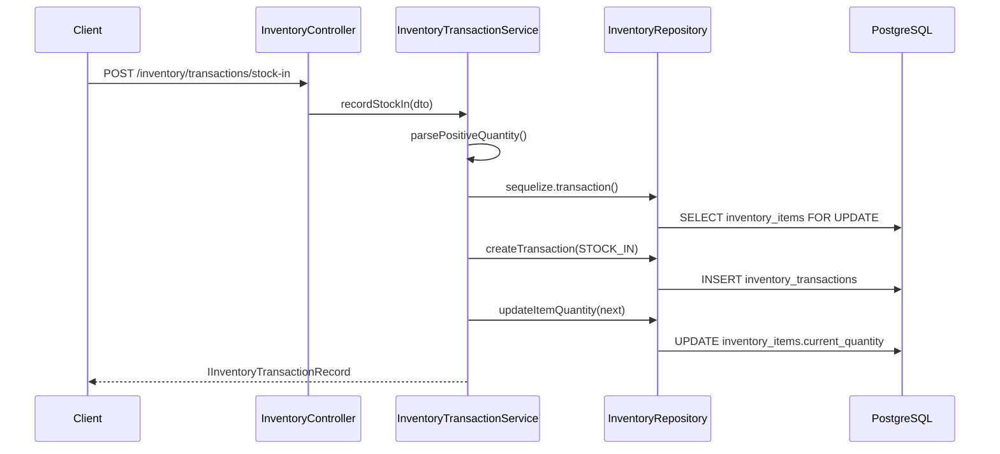
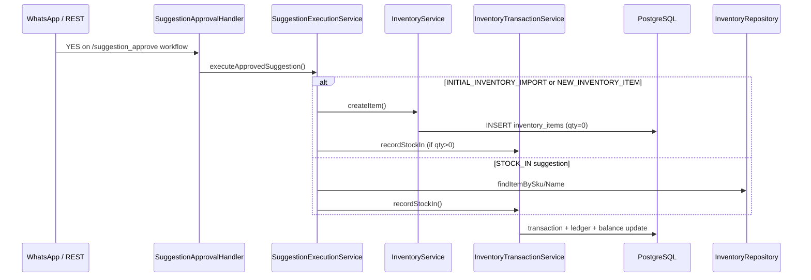
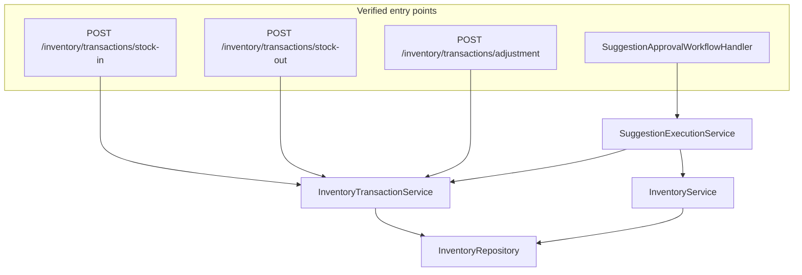

# Inventory Transaction Architecture Analysis

**Generated:** documentation-only analysis of the Munshi monorepo codebase.  
**Primary scope:** `backend/src/services/inventory/`  
**Rules:** Facts observed in code only; unknowns marked `NOT VERIFIED IN CODEBASE`.

---

## 1. Executive Summary

Munshi inventory quantity changes are implemented as **append-only ledger rows** in `inventory_transactions`, coupled with a **stored balance** on `inventory_items.current_quantity`. All three movement types (`STOCK_IN`, `STOCK_OUT`, `ADJUSTMENT`) funnel through a single private method `InventoryTransactionService.applyMovement()`, which runs inside a **Sequelize database transaction** (row lock on item, insert transaction, update quantity).

**Verified entry points for stock movements:**

| Movement | REST | Programmatic callers |
|----------|------|----------------------|
| `STOCK_IN` | `POST /inventory/transactions/stock-in` | `SuggestionExecutionService` (document approval path) |
| `STOCK_OUT` | `POST /inventory/transactions/stock-out` | None beyond controller (no indirect service callers found) |
| `ADJUSTMENT` | `POST /inventory/transactions/adjustment` | None beyond controller |

**Task service:** `backend/src/services/tasks/` has **no imports or calls** to inventory transaction methods. Task completion updates `tasks.is_completed` and sends WhatsApp notifications only.

**Reference tracking:** `reference_type` / `reference_id` are optional columns on `inventory_transactions`. The only **verified production write value** for `reference_type` is the string `'DOCUMENT_SUGGESTION'`. No enum or constant defines allowed reference types in inventory code.

**Consistency model:** Quantity is **stored** on the item row and **incrementally updated** on each movement. A reconciliation helper `calculateQuantityFromTransactions()` exists but is **only invoked in unit tests**, not in the production write path.

---

## 2. Inventory Architecture

### 2.1 Module layout

| File | Class / export | Purpose |
|------|----------------|---------|
| `inventory.module.ts` | `InventoryModule` | Registers controller, `InventoryService`, `InventoryRepository`, `InventoryTransactionService`; exports all three services + repository |
| `inventory.controller.ts` | `InventoryController` | REST API under `/inventory` |
| `inventory.service.ts` | `InventoryService` | Categories, locations, items, status, transaction **listing** (not recording) |
| `inventory-transaction.service.ts` | `InventoryTransactionService` | Stock movement recording and ledger sum helper |
| `inventory.repository.ts` | `InventoryRepository` | Sequelize data access for categories, locations, items, transactions |
| `inventory.schema.ts` | `InventoryCategory`, `InventoryLocation`, `InventoryItem`, `InventoryTransaction` | Sequelize models |
| `inventory.dto.ts` | DTO classes | Request validation for REST |
| `inventory.interfaces.ts` | `IInventory*` interfaces | Typed records returned by services |
| `inventory.constants.ts` | `INVENTORY_TRANSACTION_TYPE`, pagination, field limits | Transaction type strings and limits |
| `inventory.validation.ts` | Pure functions | Quantity parsing, name/SKU normalization, factory ID checks |

### 2.2 Sequelize models (schemas)

#### `InventoryItem` — `inventory.schema.ts` → table `inventory_items`

| Field | Type (Sequelize) | Purpose |
|-------|------------------|---------|
| `current_quantity` | `DECIMAL(18,4)`, default `0` | Stored on-hand quantity |
| `sku`, `name`, `unit` | strings | Item identity |
| `category_id`, `location_id` | integers, required (migration `004`) | Classification |
| `reorder_threshold` | `DECIMAL(18,4)`, nullable | Low-stock detection |
| `is_active` | boolean | Blocks transactions when false |

**DB origin:** `backend/migrations/001_traderos_foundation.sql` (table creation); `004_inventory_master.sql` (NOT NULL on category/location).

#### `InventoryTransaction` — `inventory.schema.ts` → table `inventory_transactions`

| Field | Type | Purpose |
|-------|------|---------|
| `transaction_type` | `STRING`, required | `STOCK_IN`, `STOCK_OUT`, or `ADJUSTMENT` (comment in migration `004`) |
| `quantity` | `DECIMAL(18,4)`, required | Magnitude or signed delta (see §3) |
| `reference_type` | `STRING`, nullable | Opaque reference label |
| `reference_id` | `INTEGER`, nullable | Opaque reference ID |
| `notes` | `TEXT`, nullable | Free text |
| `created_by` | `INTEGER`, nullable | User FK (associates to `User`) |
| `created_at` | timestamp | Append-only; `updatedAt: false` on model |

**Indexes:** `factory_id`, `inventory_item_id`, composite `(reference_type, reference_id)`.

**Repository:** No dedicated `InventoryTransactionRepository` class — transaction CRUD lives on `InventoryRepository` (`createTransaction`, `listTransactions`, `sumTransactionQuantities`).

### 2.3 Constants and enums

**`inventory.constants.ts` — `INVENTORY_TRANSACTION_TYPE`:**

```typescript
STOCK_IN: 'STOCK_IN'
STOCK_OUT: 'STOCK_OUT'
ADJUSTMENT: 'ADJUSTMENT'
```

**Related contract types (not used directly by transaction service):**

- `backend/contracts/suggestion-types.json` — includes `STOCK_IN`, `STOCK_OUT`, `INVENTORY_ADJUSTMENT` as **document suggestion** types.
- `backend/src/services/documents/documents.constants.ts` — `SUGGESTION_TYPE` mirrors those strings.

There is **no** `reference_type` enum in the inventory package.

### 2.4 DTOs

| DTO | File | Used by |
|-----|------|---------|
| `RecordInventoryTransactionDto` | `inventory.dto.ts` | `POST .../stock-in`, `stock-out`, `adjustment` |
| `CreateInventoryItemDto`, etc. | `inventory.dto.ts` | Item/category/location CRUD |

**`RecordInventoryTransactionDto` fields:** `factory_id`, `inventory_item_id`, `quantity` (string), optional `notes`, `reference_type`, `reference_id`, `created_by`.

**`RecordStockMovementInput`** (interface in `inventory-transaction.service.ts`) — internal service input; same optional reference fields.

### 2.5 Validators (`inventory.validation.ts`)

| Function | Used for |
|----------|----------|
| `parsePositiveQuantity()` | `recordStockIn`, `recordStockOut` |
| `parseSignedQuantity()` | `recordAdjustment` (non-zero signed) |
| `roundQuantity()` / `formatQuantity()` | 4 decimal places (`INVENTORY_QUANTITY_SCALE = 4`) |
| `assertFactoryId()` | `InventoryService` factory-scoped reads/writes |

Class-validator on REST DTOs only checks types (`@IsNumber`, `@IsString`); quantity sign rules are enforced in `InventoryTransactionService`.

### 2.6 `InventoryTransactionService` — public methods

| Method | Purpose |
|--------|---------|
| `recordStockIn(input)` | Positive qty → increases `current_quantity` |
| `recordStockOut(input)` | Positive qty → decreases `current_quantity` |
| `recordAdjustment(input)` | Signed non-zero qty → applies delta |
| `calculateQuantityFromTransactions(itemId, factoryId)` | Sums ledger rows for audit verification |

**Dependencies:** `InventoryRepository` only.

**Private:** `applyMovement()`, `toTransactionRecord()`.

### 2.7 `InventoryService` and transaction service

`InventoryService` **injects** `InventoryTransactionService` in its constructor (`inventory.service.ts` line 40) but **does not call** any method on it in the service body. Transaction listing uses `InventoryRepository.listTransactions()` directly.

`InventoryService.createItem()` sets `current_quantity: formatQuantity(0)` with **no** accompanying `STOCK_IN` transaction row.

### 2.8 `InventoryRepository` — transaction-related methods

| Method | Purpose |
|--------|---------|
| `findItemById(id, factoryId?, transaction?)` | Loads item; `LOCK.UPDATE` when inside Sequelize transaction |
| `createTransaction(data, transaction)` | Inserts `inventory_transactions` row |
| `updateItemQuantity(id, factoryId, qty, transaction)` | Updates `inventory_items.current_quantity` |
| `listTransactions(factoryId, itemId?)` | Read ledger, `ORDER BY id DESC` |
| `sumTransactionQuantities(itemId, factoryId)` | Raw rows for `calculateQuantityFromTransactions` |

---

## 3. Stock Movement Lifecycle

### 3.1 Common pipeline (`applyMovement`)

All three types share this path in `InventoryTransactionService.applyMovement()`:

1. **Start DB transaction** — `repository.sequelize.transaction()`
2. **Load item** — `findItemById` with row lock
3. **Validate** — item exists, `is_active === true`
4. **Compute next qty** — `next = roundQuantity(current + delta)`; reject if `next < 0`
5. **Insert ledger** — `repository.createTransaction(...)`
6. **Update balance** — `repository.updateItemQuantity(..., formatQuantity(next))`
7. **Return** — `IInventoryTransactionRecord`

**Ledger write path:** single insert into `inventory_transactions`.  
**Quantity update path:** single update on `inventory_items.current_quantity`.  
**Separate finance ledger:** NOT VERIFIED IN CODEBASE — no call from inventory services to finance/ledger modules during movement.

### 3.2 Per-type behavior

| Type | Public method | `delta` | `quantity` stored in ledger row |
|------|---------------|---------|----------------------------------|
| `STOCK_IN` | `recordStockIn` | `+qty` | positive `formatQuantity(storedQuantity)` |
| `STOCK_OUT` | `recordStockOut` | `-qty` | positive `formatQuantity(storedQuantity)` |
| `ADJUSTMENT` | `recordAdjustment` | signed `delta` | `formatQuantity(delta)` (signed) |

For `STOCK_IN` / `STOCK_OUT`, the ledger stores **absolute magnitude**; direction is encoded in `transaction_type`. For `ADJUSTMENT`, the ledger stores the **signed delta** (verified in `inventory-transaction.service.spec.ts`).

### 3.3 Sequence diagram — REST stock-in



### 3.4 Sequence diagram — document suggestion stock-in (indirect)



### 3.5 Movement start points (verified)

| Type | Where movement starts |
|------|----------------------|
| `STOCK_IN` | `InventoryController.recordStockIn`; `SuggestionExecutionService.executeInitialImport`, `executeNewItem`, `executeStockIn` |
| `STOCK_OUT` | `InventoryController.recordStockOut` only |
| `ADJUSTMENT` | `InventoryController.recordAdjustment` only |

`SuggestionExecutionService.executeApprovedSuggestion()` **does not** handle `STOCK_OUT` or `INVENTORY_ADJUSTMENT` suggestion types — those fall through to `BadRequestException` (“not executable yet”).

---

## 4. Reference Tracking Analysis

### 4.1 Schema definitions

| Location | Definition |
|----------|------------|
| `backend/migrations/001_traderos_foundation.sql` | `reference_type VARCHAR(128)`, `reference_id INTEGER`, index on both |
| `inventory.schema.ts` | Sequelize fields on `InventoryTransaction` model |
| `inventory.interfaces.ts` | `IInventoryTransactionRecord.reference_type`, `reference_id` |
| `RecordStockMovementInput` / `RecordInventoryTransactionDto` | Optional pass-through fields |

No database CHECK constraint or application enum restricts `reference_type` values.

### 4.2 Supported values currently used (production code)

| `reference_type` | `reference_id` | Writer | Verified |
|------------------|----------------|--------|----------|
| `'DOCUMENT_SUGGESTION'` | `suggestion.id` | `SuggestionExecutionService` (3 `recordStockIn` call sites) | Yes |
| `null` | `null` | Default when REST caller omits fields; `applyMovement` coalesces to `null` | Yes |
| `'TASK'` | task id | Mentioned in `backend/README.md` only | **NOT VERIFIED IN CODEBASE** (no code writes this) |
| `'CSV_IMPORT'` | — | Mentioned in `docs/p2-inventory-task-integrations.md` only | **NOT VERIFIED IN CODEBASE** |

REST clients may pass arbitrary `reference_type` / `reference_id` via `RecordInventoryTransactionDto` — no inventory-layer validation beyond type checks.

### 4.3 Write locations

| File | Method | Fields written |
|------|--------|----------------|
| `inventory-transaction.service.ts` | `applyMovement` → `createTransaction` | `reference_type: params.reference_type ?? null`, `reference_id: params.reference_id ?? null` |
| `suggestion-execution.service.ts` | `executeInitialImport` | `reference_type: 'DOCUMENT_SUGGESTION'`, `reference_id: suggestion.id` |
| `suggestion-execution.service.ts` | `executeNewItem` | same |
| `suggestion-execution.service.ts` | `executeStockIn` | same |

### 4.4 Read locations

| File | Method | Usage |
|------|--------|-------|
| `inventory-transaction.service.ts` | `toTransactionRecord` | Maps DB row to `IInventoryTransactionRecord` |
| `inventory.service.ts` | `listTransactions` | Returns reference fields in API response |
| `inventory.repository.ts` | `listTransactions` | SELECT all columns (includes references) |

**NOT VERIFIED IN CODEBASE:** Any query that filters or joins on `reference_type` / `reference_id` (no `WHERE reference_type = ...` found in inventory or documents services).

### 4.5 Complete usage table

| Operation | `reference_type` | `reference_id` | Caller |
|-----------|------------------|----------------|--------|
| Initial import stock-in | `DOCUMENT_SUGGESTION` | suggestion id | `executeInitialImport` |
| New item stock-in | `DOCUMENT_SUGGESTION` | suggestion id | `executeNewItem` |
| Stock-in suggestion | `DOCUMENT_SUGGESTION` | suggestion id | `executeStockIn` |
| REST stock-in/out/adjustment | caller-provided or null | caller-provided or null | `InventoryController` |
| Workflow item create | — | — | No transaction; qty stays `0` |

---

## 5. Service Dependency Map

### 5.1 `recordStockIn()` callers

| # | File | Method / route | Purpose | Flow |
|---|------|----------------|---------|------|
| 1 | `inventory.controller.ts` | `POST /inventory/transactions/stock-in` → `recordStockIn` | Direct REST stock-in | DTO → `InventoryTransactionService.recordStockIn` |
| 2 | `suggestion-execution.service.ts` | `executeInitialImport` | After `createItem` per imported row with qty>0 | Document suggestion execution |
| 3 | `suggestion-execution.service.ts` | `executeNewItem` | After `createItem` if payload qty>0 | Document suggestion execution |
| 4 | `suggestion-execution.service.ts` | `executeStockIn` | Existing item stock-in from document | Document suggestion execution |

**Indirect callers of `executeApprovedSuggestion` (thus indirect `recordStockIn`):**

| File | Method | Trigger |
|------|--------|---------|
| `suggestion-approval.handler.ts` | `handleStep` (YES branch) | WhatsApp `/suggestion_approve` workflow |
| `documents.controller.ts` | `POST /documents/suggestions/:id/approve-workflow` | Starts workflow session via `documents.service.startSuggestionApproval` — execution happens when user confirms YES in workflow |

**Tests only:** `inventory-transaction.service.spec.ts`, `suggestion-execution.service.spec.ts`.

### 5.2 `recordStockOut()` callers

| # | File | Method / route | Purpose |
|---|------|----------------|---------|
| 1 | `inventory.controller.ts` | `POST /inventory/transactions/stock-out` → `recordStockOut` | Direct REST stock-out |

**Indirect callers:** None found outside controller and `inventory-transaction.service.spec.ts`.

### 5.3 `recordAdjustment()` callers

| # | File | Method / route |
|---|------|----------------|
| 1 | `inventory.controller.ts` | `POST /inventory/transactions/adjustment` |

### 5.4 Related services (no transaction calls)

| Service | Relationship |
|---------|--------------|
| `InventoryService` | Item CRUD, status, lists transactions; injects but does not call `InventoryTransactionService` |
| `InventoryCreateWorkflowHandler` | Calls `InventoryService.createItem` only; message tells user to use stock-in |
| `PurchaseRequestService` / `PurchaseRequestSuggestionService` | Reads low-stock via `InventoryService.listLowStockItems`; links `inventory_item_id` on PR line items — **no** `recordStockIn/Out` |
| `WhatsAppService` | `InventoryService` for `/inventory_status`; **no** transaction calls |
| `TasksService` | **No** inventory imports or calls |

### 5.5 Dependency diagram



---

## 6. Task Service Analysis

**Path:** `backend/src/services/tasks/tasks.service.ts`, `tasks.schema.ts`, `task-deadline.cron.ts`.

### 6.1 Task model fields (`tasks.schema.ts`)

Relevant fields: `factory_id`, `assigned_to`, `assigned_by`, `description`, `deadline`, `routing_status`, `owner_id`, `department_id`, `completed_by`, `is_completed`, `batch_id`, rejection fields.

**No** `inventory_item_id`, quantity, or SKU fields on the task model.

### 6.2 Task creation flow (verified)

| Entry | Method | Behavior |
|-------|--------|----------|
| WhatsApp assign | `assignToUser`, `assignToAll`, department routing helpers | `taskModel.create(...)`; optional `deadline`; sets `routing_status` / `owner_id` via `buildRoutingForNewTask` |
| REST admin | `adminCreate` | Same pattern with `CreateTaskDto` |
| Manager delegate | `applyManagerAssign` | Reassigns `assigned_to`, notifies worker |

**Notifications on create:**

- `notifyManagerRoutingPrompt` — when `routing_status === AWAITING_MANAGER_ACTION`
- `notifyWorkerTaskAssigned` — otherwise  
Both use `MessagingService.sendText` (WhatsApp).

### 6.3 Task completion flow (verified)

| Entry | Method | Updates | Notifications |
|-------|--------|---------|---------------|
| WhatsApp `/complete` | `completeTask(user_id, factory_id, task_id)` | `is_completed: true`, `completed_by: user_id` | `notifyTaskCompleted` via `fireAndForget` |
| REST `PATCH /tasks/:id/complete` | `adminComplete(id, true)` | `is_completed: true` | `notifyTaskCompleted` if completing |
| REST `PATCH /tasks/:id` | `adminUpdate` | May set `is_completed` | `notifyTaskCompleted` when transitioning to complete |

**`notifyTaskCompleted`:** Loads task, resolves completer designation, sends WhatsApp text to `owner_id ?? assigned_by` using `MessagingService.buildTaskCompletedText`.

**`addUpdate`:** Creates `task_updates` row; contains auto-complete logic for certain update patterns — **no** inventory side effects verified in grep of tasks module.

### 6.4 Deadline reminders

`TaskDeadlineCronService` → `TasksService.processMissedDeadlineReminders()` — WhatsApp reminders for overdue open tasks. **No** inventory interaction.

### 6.5 Inventory integration in tasks

**NOT VERIFIED IN CODEBASE** — no reference to `InventoryTransactionService`, `recordStockIn`, `recordStockOut`, or `inventory_item` in `backend/src/services/tasks/`.

---

## 7. Verified Extension Points

These are **existing** hooks/locations observable in code (not recommendations):

| Location | What exists |
|----------|-------------|
| `RecordStockMovementInput` / `RecordInventoryTransactionDto` | Optional `reference_type`, `reference_id`, `notes`, `created_by` on every movement |
| `InventoryModule` exports | `InventoryTransactionService` exported for injection by other modules (`DocumentModule` imports via `SuggestionExecutionService`) |
| `SuggestionExecutionService.executeApprovedSuggestion` | `switch` on `suggestion_type` — only three types executable today |
| `SuggestionApprovalWorkflowHandler` | Post-approval execution entry for document-driven stock-in |
| `calculateQuantityFromTransactions()` | Public method on `InventoryTransactionService` for ledger reconciliation (unused in prod paths) |
| `DomainEventsService.publish()` | Outbox pattern exists (`domain-events.service.ts`); `dispatch()` is **no-op**; **no** inventory service publishes events |
| `inventory_items.reorder_threshold` + `InventoryService.isLowStock` | Used by purchase-request low-stock suggestions (read-only link to procurement) |

---

## 8. Risks & Unknowns

| Item | Detail |
|------|--------|
| **Dual quantity model** | Balance is stored on `current_quantity` and updated arithmetically; ledger sum is not validated on write. Drift possible if rows changed outside `applyMovement`. |
| **`calculateQuantityFromTransactions` unused in prod** | Reconciliation helper exists only in tests — no cron or admin job calls it. |
| **`InventoryService` unused injection** | `transactionService` constructor dependency is never used — may indicate incomplete refactor. |
| **No `reference_type` validation** | Arbitrary strings from REST; only one production writer value verified. |
| **`STOCK_OUT` / `ADJUSTMENT` document paths** | Suggestion types exist in contracts but `executeApprovedSuggestion` rejects them. |
| **Item create without ledger** | New items start at `0` without an opening-balance transaction row. |
| **Task ↔ inventory** | No code linkage today; any task-driven stock movement would be new wiring. |
| **Finance ledger** | P0 finance tables exist (migration `007_p0_finance_foundation.sql`) but inventory movements do not write to them — NOT VERIFIED IN CODEBASE for inventory path. |

---

## 9. Open Questions

1. Is `current_quantity` ever updated outside `InventoryRepository.updateItemQuantity`? (Only one write site found in inventory code; direct SQL/manual DB edits would be outside codebase scope.)
2. Are there API gateway or external scripts calling stock endpoints with `reference_type` values not present in this repo? — NOT VERIFIED IN CODEBASE.
3. Is `created_by` populated for REST stock movements in production clients? Optional on DTO; document path passes `userId` when available.
4. Should `INVENTORY_ADJUSTMENT` suggestions eventually call `recordAdjustment`? Type exists in `documents.constants.ts` but execution switch does not include it.

---

## NEXT IMPLEMENTATION RECOMMENDATIONS

*This section lists areas requiring further investigation and code paths not fully verified — not implementation suggestions.*

| Area | Why further review is needed | Files / paths to review |
|------|------------------------------|-------------------------|
| Quantity drift detection | `calculateQuantityFromTransactions` is not wired to any runtime job | `inventory-transaction.service.ts`; any admin/ops scripts outside `backend/src` |
| All writers to `current_quantity` | Analysis found one update method in inventory repository | DB triggers, manual migrations, Sequelize hooks — search full repo and DB |
| REST stock movement usage | Callers may pass undocumented `reference_type` values | API logs, client apps, integration tests under `backend/test/` |
| Document `STOCK_OUT` / `INVENTORY_ADJUSTMENT` suggestions | Types declared but not in `executeApprovedSuggestion` switch | `suggestion-execution.service.ts`, `inventory-suggestion.processor.ts`, ML parse outputs |
| Purchase request fulfillment | PR links `inventory_item_id` but no stock-in on close/approve | `purchase-requests.service.ts`, approval handlers |
| Task completion side effects | Confirmed no inventory calls; task payload has no SKU/qty fields | `tasks.service.ts`, `tasks.schema.ts`, WhatsApp assign templates for material tasks |
| Domain event integration | Outbox exists with no-op dispatch; onboarding publishes events, inventory does not | `domain-events.service.ts`, `onboarding.service.ts` (for pattern reference only) |
| Finance module overlap | User had `finance.constants.ts` open; `ADJUSTMENT` string exists in finance constants separately from inventory | `backend/src/services/finance/` — verify no cross-calls to inventory (NOT VERIFIED IN CODEBASE in this analysis) |
| WhatsApp inventory workflows beyond create/status | `/inventory_create` workflow does not record transactions | `handlers/inventory-create.handler.ts`, `whatsapp.service.ts` |
| Indirect `recordStockOut` via future code | Grep found no service callers; re-verify after branch merges | Full-repo grep for `recordStockOut`, `transactions/stock-out` |

---

*End of report.*
