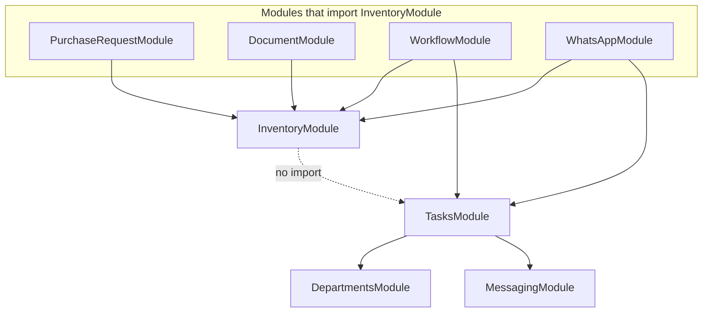

# Task-Inventory Architecture Mapping

**Generated:** documentation-only analysis of the Munshi monorepo codebase.  
**Prerequisite reads:** `docs/p2-inventory-task-integrations.md`, `docs/docs_local/inventory/01-inventory-transaction-analysis.md`  
**Objective:** Determine architectural placement for `task_inventory_lines` based on existing repository patterns only.  
**Rules:** Facts from code only; unknowns marked `NOT VERIFIED IN CODEBASE`.

---

## 1. Executive Summary

The codebase consistently places **child and junction tables with the parent domain module**, not with the referenced module. The strongest verified precedent for `task_inventory_lines` is **`purchase_request_items`** in `services/purchase-requests/`: a line table owned by the procurement module that optionally references `inventory_item_id`, while stock movements remain in `services/inventory/`.

`task_inventory_lines` links **tasks** (parent lifecycle) to **inventory items** (foreign reference). Task completion — where stock side effects would run per `docs/p2-inventory-task-integrations.md` — lives in **`TasksService.completeTask()`**, which today has **no** inventory dependency.

**Recommended placement:** **Option A — `backend/src/services/tasks/`** owns `task_inventory_lines` schema, access layer, and task-line lifecycle; **`TasksModule` imports `InventoryModule`** (one-way) to call `InventoryTransactionService` on completion — mirroring `PurchaseRequestModule` → `InventoryModule`.

**Option B** (`services/inventory/`) conflicts with the `purchase_request_items` precedent. **Option C** (`services/task-inventory/`) has **no verified precedent** as a standalone cross-domain module in this repository.

---

## 2. Task Module Analysis

**Path:** `backend/src/services/tasks/`

### 2.1 File inventory

| File | Type | Role |
|------|------|------|
| `tasks.module.ts` | Nest module | Imports `MessagingModule`, `DepartmentsModule`; exports `TasksService` |
| `tasks.service.ts` | Service + `TasksController` | All task business logic and REST controller (combined in one file) |
| `tasks.schema.ts` | Sequelize models | `Task`, `TaskUpdate` |
| `tasks.dto.ts` | DTOs | `CreateTaskDto`, `UpdateTaskDto`, `AddTaskUpdateDto` |
| `tasks.routing.constants.ts` | Constants | `TASK_ROUTING_STATUS` enum strings |
| `task-deadline.cron.ts` | Cron | `TaskDeadlineCronService` → `TasksService.processMissedDeadlineReminders()` |

**Absent in tasks module (verified):**

- Dedicated `tasks.repository.ts` — **NOT VERIFIED IN CODEBASE**
- Separate controller file — controller is embedded in `tasks.service.ts`
- Inventory imports or references — **none**

### 2.2 Task-owned data

| Table | Schema location | Migration |
|-------|-----------------|-----------|
| `tasks` | `Task` in `tasks.schema.ts` | `000_core_foundation.sql` |
| `task_updates` | `TaskUpdate` in `tasks.schema.ts` | `000_core_foundation.sql` |

**Task-owned fields (on `tasks`):** `factory_id`, `assigned_to`, `assigned_by`, `description`, `deadline`, `routing_status`, `owner_id`, `department_id`, `completed_by`, rejection fields, `is_completed`, `batch_id`.

**Child table pattern:** `TaskUpdate` is defined in the **same schema file** as `Task`, with `Task.hasMany(TaskUpdate)` and `onDelete: 'CASCADE'` on the association.

### 2.3 Data access pattern

`TasksService` injects `DbService` and binds models directly:

```typescript
this.taskModel = this.dbService.sqlService.Task;
this.taskUpdateModel = this.dbService.sqlService.TaskUpdate;
```

`task_updates` CRUD is performed inline in `TasksService` (`addUpdate`, `adminAddUpdate`, `adminGetUpdates`, `adminRemove`) — **not** via a repository class.

### 2.4 Existing relationships

| Related entity | Relationship | Where enforced |
|----------------|--------------|----------------|
| `User` | `assigned_to`, `assigned_by`, `owner_id`, `completed_by`, `rejected_by` | Sequelize `belongsTo` on `Task` |
| `Factory` | `factory_id` | `belongsTo` |
| `Department` | `department_id` | `belongsTo`; `TasksModule` imports `DepartmentsModule` for routing/assignment rules |
| `TaskUpdate` | `task_id` | Child rows in same module |

**No** `inventory_item_id` or stock fields on `Task` or `TaskUpdate`.

### 2.5 Cron and notifications

- **`TaskDeadlineCronService`** — hourly IST; calls `TasksService.processMissedDeadlineReminders()` (WhatsApp).
- **Completion notifications** — `notifyTaskCompleted()` in `TasksService`; uses `MessagingService` only.

### 2.6 Module exports and consumers

`TasksModule` exports `TasksService`. Verified importers:

- `WhatsAppModule` — assign, complete, manager routing commands
- `WorkflowModule` — `AssignClarifyWorkflowHandler` uses `TasksService`
- `AppModule` — root registration

---

## 3. Inventory Module Analysis

**Path:** `backend/src/services/inventory/`

### 3.1 File inventory

| File | Class / export | Role |
|------|----------------|------|
| `inventory.module.ts` | `InventoryModule` | No module imports; exports service, repository, transaction service |
| `inventory.controller.ts` | `InventoryController` | REST `/inventory` |
| `inventory.service.ts` | `InventoryService` | Master data + status + transaction listing |
| `inventory-transaction.service.ts` | `InventoryTransactionService` | `recordStockIn`, `recordStockOut`, `recordAdjustment` |
| `inventory.repository.ts` | `InventoryRepository` | All inventory tables including `inventory_transactions` |
| `inventory.schema.ts` | Four models | Category, Location, Item, Transaction |
| `inventory.dto.ts` | DTOs | Includes `RecordInventoryTransactionDto` |
| `inventory.interfaces.ts` | Record interfaces | |
| `inventory.constants.ts` | `INVENTORY_TRANSACTION_TYPE`, etc. | |
| `inventory.validation.ts` | Pure validators | Quantity parsing, SKU normalization |

### 3.2 Inventory-owned data

| Table | Model | Migration |
|-------|-------|-----------|
| `inventory_categories` | `InventoryCategory` | `001_traderos_foundation.sql` |
| `inventory_locations` | `InventoryLocation` | `001_traderos_foundation.sql` |
| `inventory_items` | `InventoryItem` | `001_traderos_foundation.sql`; constraints in `004_inventory_master.sql` |
| `inventory_transactions` | `InventoryTransaction` | `001_traderos_foundation.sql` |

### 3.3 Transaction ownership

Stock movements are **inventory-owned ledger rows**. `InventoryTransactionService.applyMovement()` writes to `inventory_transactions` and updates `inventory_items.current_quantity` in one DB transaction.

**Reference fields** (`reference_type`, `reference_id`) live on `inventory_transactions` — they **point to** external aggregates (e.g. document suggestions) but the **table and write logic** remain in the inventory module.

### 3.4 Inventory module dependencies

`InventoryModule` imports **no other domain modules** (standalone).

Verified consumers of `InventoryModule`:

| Consumer | Uses |
|----------|------|
| `PurchaseRequestModule` | `InventoryService` (low-stock suggestions) |
| `DocumentModule` | `InventoryService`, `InventoryTransactionService`, `InventoryRepository` |
| `WorkflowModule` | `InventoryService` (create workflow) |
| `WhatsAppModule` | `InventoryService` (status queries) |
| `AppModule` | Registration |

**NOT VERIFIED IN CODEBASE:** `InventoryModule` importing `TasksModule` or any task types.

---

## 4. Cross-Module Pattern Analysis

Verified examples of **Module A referencing Module B**:

### 4.1 Purchase requests ↔ inventory

| Aspect | Ownership / direction |
|--------|----------------------|
| **Table** | `purchase_request_items` in migration `006_procurement_foundation.sql` |
| **Schema** | `PurchaseRequestItem` in `purchase-requests.schema.ts` |
| **FK** | `purchase_request_id` (parent), `inventory_item_id` (optional, nullable) |
| **Repository** | `PurchaseRequestRepository.itemModel`; `replaceItems()`, `createWithItems()` |
| **Service** | `PurchaseRequestService`, `PurchaseRequestSuggestionService` |
| **Dependency** | `PurchaseRequestModule` **imports** `InventoryModule` |
| **Stock writes** | **None** from purchase-requests — reads low stock via `InventoryService.listLowStockItems()` |

**Pattern:** Parent domain (procurement) owns line table; inventory is referenced by ID; inventory module does not own procurement lines.

### 4.2 Documents ↔ inventory

| Aspect | Ownership / direction |
|--------|----------------------|
| **Tables** | `documents`, `document_suggestions`, etc. in `005_document_processing.sql` |
| **Schema** | `documents.schema.ts` |
| **Execution** | `SuggestionExecutionService` calls `InventoryTransactionService.recordStockIn()` |
| **Reference on ledger** | `reference_type: 'DOCUMENT_SUGGESTION'`, `reference_id: suggestion.id` |
| **Dependency** | `DocumentModule` **imports** `InventoryModule` |
| **Suggestion types** | `STOCK_IN`, `STOCK_OUT`, `INVENTORY_ADJUSTMENT` in `documents.constants.ts`; only STOCK_IN path executable today |

**Pattern:** Document module owns suggestions; inventory module owns ledger writes; caller passes `reference_*` into transaction service.

### 4.3 Onboarding ↔ users / factories / departments

| Aspect | Detail |
|--------|--------|
| **Location** | `backend/src/modules/onboarding/` (under `modules/`, not `services/`) |
| **Tables** | `onboarding_otp_challenges`, `onboarding_phone_verifications` in `007_p0_finance_foundation.sql` |
| **Schema** | `onboarding-otp.schema.ts` in `modules/onboarding/` |
| **Dependencies** | `FactoryModule`, `DomainEventsModule`, `DepartmentsModule` |

**Pattern:** Feature-specific tables can live beside their Nest module; OTP tables are not in `users/` service folder.

### 4.4 Departments ↔ tasks

| Aspect | Detail |
|--------|--------|
| **Tables** | `departments`, `department_workers` in `000_core_foundation.sql` |
| **Schema** | `departments.schema.ts` |
| **Task link** | `tasks.department_id` column; `TasksModule` imports `DepartmentsModule` |
| **Ownership** | Department membership in departments module; task stores `department_id` FK on task row |

**Pattern:** Task holds FK to department; department module does not own task rows.

### 4.5 Workflow ↔ tasks / inventory / documents

| Aspect | Detail |
|--------|--------|
| **Table** | `workflow_sessions` in `003_workflow_sessions.sql` |
| **Schema** | `workflow.schema.ts` in `services/workflow/` |
| **Role** | Orchestration only — handlers call `TasksService`, `InventoryService`, `SuggestionExecutionService` |
| **Join tables** | Workflow stores ephemeral state in `session_data` JSONB — **does not** own persistent entity junction tables |

**Pattern:** Workflow coordinates; persistent cross-entity data lives in domain modules.

### 4.6 Summary table

| Junction / child | Parent module owns table? | Referenced module |
|------------------|---------------------------|-------------------|
| `task_updates` | Yes (`tasks`) | `users` (via `user_id`) |
| `purchase_request_items` | Yes (`purchase-requests`) | `inventory` (`inventory_item_id`) |
| `document_suggestions` | Yes (`documents`) | inventory via execution only |
| `department_workers` | Yes (`departments`) | `users` |
| `inventory_transactions.reference_*` | Yes (`inventory`) | opaque external IDs |

---

## 5. Migration Pattern Analysis

### 5.1 Focused migrations (verified contents)

| Migration | What it introduces | Relationship-table placement |
|-----------|-------------------|------------------------------|
| `003_workflow_sessions.sql` | `workflow_sessions` | With workflow domain (standalone table) |
| `004_inventory_master.sql` | Alters `inventory_items` NOT NULL constraints | Inventory-only; **no** cross-module tables |
| `005_document_processing.sql` | `documents`, jobs, extractions, `document_suggestions` | All document-family tables in one migration |
| `006_procurement_foundation.sql` | `purchase_request_items`, `purchase_request_audit` | **Child tables with parent** `purchase_requests` in same file |
| `007_business_discovery.sql` | `business_discovery_profiles` | Standalone profile per factory |
| `009_owner_multi_department_head.sql` | Alters `departments` constraint | Department-domain alteration only |

### 5.2 Naming conventions (verified)

- Table names: `snake_case`, often `{parent}_{child}` — e.g. `purchase_request_items`, `task_updates`, `document_suggestions`
- Index names: `idx_{table}_{column(s)}` — e.g. `idx_purchase_request_items_inventory_item_id`
- Migration files: `{NNN}_{descriptive_name}.sql` — thematic name, not strict module path
- Child indexes: on parent FK (`task_id`, `purchase_request_id`) **and** on referenced entity when queried (`inventory_item_id`)

### 5.3 Foreign key conventions

From `backend/migrations/README.md`:

> Foreign keys are intentionally omitted in early migrations; app enforces `factory_id` scoping.

Verified in SQL files: `purchase_request_items` and `task_updates` define **indexes** on FK columns but **no `REFERENCES` clauses** in migrations reviewed.

### 5.4 Where a `task_inventory_lines` migration would fit (pattern inference)

Based on precedents only:

- **Not** in `004_inventory_master.sql` style — that migration only tightens inventory constraints.
- **Likely** a **new numbered migration** (p2 doc proposes `010_task_inventory_lines.sql`) adding table beside task domain — analogous to `006` adding `purchase_request_items` beside procurement.
- **Co-location:** `task_updates` was introduced in `000_core_foundation.sql` with `tasks`; later child tables can arrive in **later** migrations (`006` pattern).

---

## 6. Repository Pattern Analysis

### 6.1 Verified patterns

| Module | Repository? | Child / related table access |
|--------|-------------|------------------------------|
| **tasks** | No | `TasksService` uses `taskModel`, `taskUpdateModel` directly |
| **inventory** | Yes — `InventoryRepository` | Single repo for categories, locations, items, **transactions** |
| **purchase-requests** | Yes — `PurchaseRequestRepository` | `itemModel`, `auditModel`; `replaceItems()`, `createWithItems()` |
| **documents** | Yes — `DocumentRepository` | Suggestions, extractions, jobs |
| **workflow** | Yes — `WorkflowSessionRepository` | Sessions only |

### 6.2 Relationship table repository rules (observed)

1. **When parent module has a repository**, child rows are accessed via **properties on that repository** (`itemModel`, `auditModel`) — not a separate top-level repository file per child table.
2. **When parent module has no repository** (tasks), child rows (`task_updates`) are accessed via **injected models in the service**.
3. **Repositories are not shared across modules** — `InventoryRepository` is exported but `PurchaseRequestRepository` does not delegate item persistence to inventory's repo.
4. **Inventory transaction rows** stay in `InventoryRepository`; other modules call `InventoryTransactionService` instead of writing transaction rows directly.

### 6.3 Implication for `task_inventory_lines`

Two consistent options exist in this codebase:

| Approach | Precedent | Location |
|----------|-----------|----------|
| Direct model in `TasksService` | `task_updates` | No new repository file |
| Methods on `TasksRepository` (new) | `PurchaseRequestRepository` + items | New repository file in `tasks/` |

**NOT VERIFIED IN CODEBASE:** A repository living outside `tasks/` for task-owned lines.

---

## 7. Dependency Direction Analysis

### 7.1 Module dependency map (verified imports)



### 7.2 Allowed dependency directions (observed)

| From | To | Verified? |
|------|-----|-----------|
| Domain module | `InventoryModule` | Yes — purchase-requests, documents, workflow, whatsapp |
| Domain module | `TasksModule` | Yes — workflow, whatsapp |
| `TasksModule` | `InventoryModule` | **Not today** — would be new, but matches purchase-requests pattern |
| `InventoryModule` | `TasksModule` | **No** — avoids circular risk |

### 7.3 Circular dependencies

Verified `forwardRef` usage:

- `WorkflowModule` ↔ `DocumentModule`
- `DocumentModule` ↔ `BusinessDiscoveryModule`

**No** `forwardRef` between tasks and inventory. Keeping **tasks → inventory** one-way preserves this.

### 7.4 Orchestration vs ownership

`WhatsAppModule` imports **both** `TasksModule` and `InventoryModule` but does **not** own junction tables — it delegates to `TasksService` and `InventoryService`.

---

## 8. Candidate Placement Evaluation

### Option A — `services/tasks/` owns `task_inventory_lines`

#### Supporting evidence

| Evidence | Source |
|----------|--------|
| Closest precedent: `purchase_request_items` owned by parent (`purchase-requests`), references `inventory_item_id` | `006_procurement_foundation.sql`, `purchase-requests.schema.ts` |
| Existing child table `task_updates` in `tasks.schema.ts` with `Task.hasMany` | `tasks.schema.ts`, `000_core_foundation.sql` |
| Planned completion hook in `TasksService.completeTask()` per p2 doc | `docs/p2-inventory-task-integrations.md` §Layer 2 |
| `TasksModule` can import `InventoryModule` one-way (same as `PurchaseRequestModule`) | `purchase-requests.module.ts` |
| Task lifecycle (create, complete, notify) already centralized in `TasksService` | `tasks.service.ts` |
| p2 Phase 0.4 explicitly names `tasks.service.ts` for stock hook | `docs/p2-inventory-task-integrations.md` |

#### Conflicting evidence

| Evidence | Source |
|----------|--------|
| Tasks module **lacks** a repository; purchase-requests uses repository for line items | `tasks.service.ts` vs `purchase-requests.repository.ts` |
| `InventoryService` injects unused `InventoryTransactionService` — tasks may need careful wiring | `inventory.service.ts` |

#### Consistency score: **9 / 10**

Aligns with dominant cross-module child-table pattern (`purchase_request_items`). Minor inconsistency: tasks historically use direct model access, not repository.

---

### Option B — `services/inventory/` owns `task_inventory_lines`

#### Supporting evidence

| Evidence | Source |
|----------|--------|
| Table references `inventory_item_id` | Proposed schema in p2 doc |
| `inventory_transactions.reference_type/id` already link ledger to external aggregates | `inventory.schema.ts` |
| Stock movement implementation lives in inventory module | `inventory-transaction.service.ts` |

#### Conflicting evidence

| Evidence | Source |
|----------|--------|
| `purchase_request_items` **not** in inventory module despite `inventory_item_id` FK | `purchase-requests.schema.ts` |
| Task completion logic in `TasksService`, not inventory | `01-inventory-transaction-analysis.md` |
| Would require `InventoryModule` → `TasksModule` for completion-driven line reads **or** awkward callbacks | Dependency map §7 |
| Inventory module has no task associations today | `inventory.schema.ts` |

#### Consistency score: **2 / 10**

Contradicts the only verified task↔inventory-adjacent line-item precedent (`purchase_request_items`).

---

### Option C — `services/task-inventory/` owns `task_inventory_lines`

#### Supporting evidence

| Evidence | Source |
|----------|--------|
| p2 doc lists “`tasks/` or new `task-inventory/` module” as implementation options | `docs/p2-inventory-task-integrations.md` §0.2 |
| Would isolate cross-cutting concern | Design doc only — **not observed in code** |

#### Conflicting evidence

| Evidence | Source |
|----------|--------|
| **No** `services/{domain-a}-{domain-b}/` folder exists in repo | `backend/src/services/` listing |
| Workflow module orchestrates but **does not** own persistent junction tables | `workflow_sessions` + handlers pattern |
| Would require new Nest module registration, exports, and consumer import updates | `app.module.ts` pattern |
| Onboarding OTP is under `modules/onboarding/`, not `services/onboarding-otp/` — still single-feature module, not two-domain composite | `modules/onboarding/` |

#### Consistency score: **3 / 10**

Mentioned in planning doc only; **no verified codebase precedent** for a dual-domain service folder.

---

## 9. Recommended Placement (with evidence)

### Recommendation: **Option A — `backend/src/services/tasks/`**

| Artifact | Recommended location | Evidence |
|----------|---------------------|----------|
| SQL migration | New file e.g. `010_task_inventory_lines.sql` (per p2 naming) | `006` added PR lines separate from `001` inventory |
| Sequelize model | `tasks.schema.ts` (alongside `TaskUpdate`) **or** `task-inventory-lines.schema.ts` in same folder | `Task` + `TaskUpdate` co-located; `PurchaseRequest` + `PurchaseRequestItem` co-located |
| Model registration | `backend/src/core/services/db-service/models.ts` | All models registered centrally |
| Data access | `TasksService` direct models **or** new `TasksRepository` | Both patterns exist; tasks today uses direct models |
| Business logic for lines on create/complete | `TasksService` | `completeTask()` already here; p2 §0.4 |
| Stock ledger writes | `InventoryTransactionService` (inventory module) | Same as `SuggestionExecutionService` |
| Module import | `TasksModule` imports `InventoryModule` | Mirrors `PurchaseRequestModule` |
| REST exposure | Extend `TasksController` / DTOs in `tasks.dto.ts` | Task creation DTOs already in tasks module |
| Constants (`movement_type`, `task_kind`) | `tasks.routing.constants.ts` or new `tasks.inventory.constants.ts` in tasks folder | `tasks.routing.constants.ts` precedent for task enums |

**Dependency rule:** Tasks may depend on inventory; inventory must **not** depend on tasks (verified acyclic graph).

---

## 10. Risks & Unknowns

| Risk / unknown | Detail |
|----------------|--------|
| **Repository vs direct model** | Tasks module has no repository today; purchase-requests does. Choice affects consistency within tasks module. |
| **Schema file organization** | `TaskUpdate` shares `tasks.schema.ts`; `PurchaseRequestItem` shares `purchase-requests.schema.ts`. Whether `TaskInventoryLine` shares file or splits — **both precedents exist within parent folder**. |
| **`task_kind` on `tasks` table** | Proposed in p2 doc; column **NOT VERIFIED IN CODEBASE** on current `Task` model. |
| **`TRANSFER` movement type** | In p2 proposed line schema; **not** in `INVENTORY_TRANSACTION_TYPE` constants today. |
| **Partial completion (`quantity_completed`)** | p2 marks as Phase 2 — no schema today. |
| **Circular dependency if placement wrong** | Inventory-owned lines + completion in tasks would pull two-way deps — avoided by Option A. |
| **WhatsApp assign flow** | `WhatsAppModule` orchestrates tasks and inventory separately; line attachment UX **NOT VERIFIED IN CODEBASE**. |
| **Domain events** | p2 proposes publishing from `completeTask` and `applyMovement`; `dispatch()` is no-op today. |
| **Modules vs services** | Onboarding places OTP schema under `modules/onboarding/` — exception for OTP only; task-inventory is operational like tasks/issues, which use `services/`. |

---

## IMPLEMENTATION PREPARATION FINDINGS

*Files likely involved and areas needing further review. No implementation steps.*

### Files likely to be touched during implementation

| Area | Files (verified paths) |
|------|------------------------|
| Migration | `backend/migrations/` (new SQL file), `backend/migrations/README.md` |
| Sequelize model | `backend/src/services/tasks/tasks.schema.ts` (or sibling schema file in same folder) |
| Model registry | `backend/src/core/services/db-service/models.ts` |
| Nest module wiring | `backend/src/services/tasks/tasks.module.ts` |
| Task business logic | `backend/src/services/tasks/tasks.service.ts` |
| Task DTOs | `backend/src/services/tasks/tasks.dto.ts` |
| Task constants | `backend/src/services/tasks/tasks.routing.constants.ts` or new constants file under `tasks/` |
| Stock writes (consumer) | `backend/src/services/inventory/inventory-transaction.service.ts` (call site only, not ownership) |
| WhatsApp entry | `backend/src/modules/whatsapp/whatsapp.service.ts` |
| Workflow (if assign flow) | `backend/src/services/workflow/handlers/assign-clarify.handler.ts` |
| Tests | New specs under `backend/src/services/tasks/` (pattern: `*.spec.ts` beside service) |

### Files requiring further investigation

| File / area | Reason |
|-------------|--------|
| `backend/src/services/tasks/tasks.service.ts` | Full `assignToUser`, `adminCreate`, `completeTask` paths for hook points — only completion verified in prior analysis |
| `backend/src/modules/whatsapp/whatsapp.service.ts` | Task assign/complete command handlers — how structured lines would enter create flow |
| `backend/src/services/workflow/handlers/assign-clarify.handler.ts` | Creates tasks from vague assign intents — inventory line attachment path unknown |
| `backend/contracts/intent-types.json` + ML classify | Whether intents carry SKU/qty slots — **NOT VERIFIED IN CODEBASE** for structured stock |
| `backend/src/services/domain-events/domain-events.service.ts` | If event publishing is in scope beyond table placement |
| `docs/p2-inventory-task-integrations.md` | Proposed `task_kind`, `TRANSFER` — not in current schemas |
| `backend/src/core/services/db-service/` associate setup | Whether new `TaskInventoryLine.belongsTo(InventoryItem)` association is required — associate patterns exist on `PurchaseRequestItem` |

### Unresolved questions from analysis

1. Should `task_inventory_lines` access follow **`task_updates`** (direct model in service) or **`purchase_request_items`** (repository methods)?
2. Should `TaskInventoryLine` live in **`tasks.schema.ts`** or a separate schema file within `tasks/`?
3. Will `task_kind` live on **`tasks`** row (p2 proposal) or be derived only from line `movement_type`?
4. Does REST task creation (`CreateTaskDto`) remain the only admin API, or will lines require nested DTO fields — current DTO has **no** inventory fields?
5. Who validates `inventory_item_id` belongs to same `factory_id` as task — tasks service inline vs shared validator from `inventory.validation.ts`?
6. Is `reference_type: 'TASK'` intended as a string constant in inventory module, tasks module, or shared contracts — **no constant exists today** in inventory code?

---

*End of report.*
