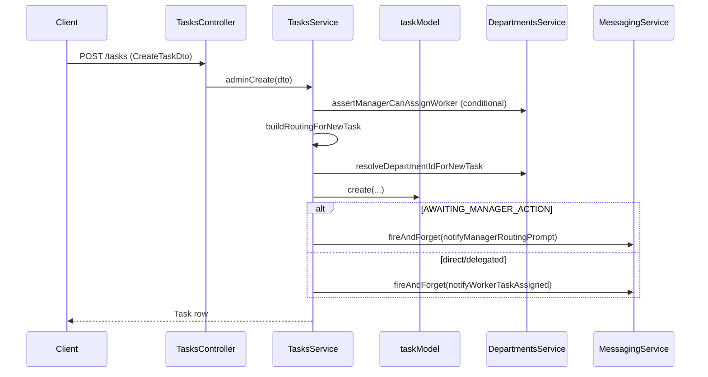
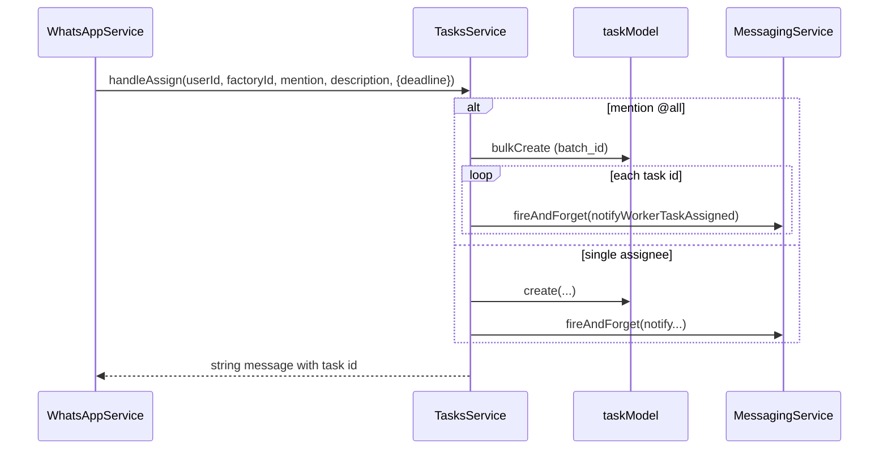
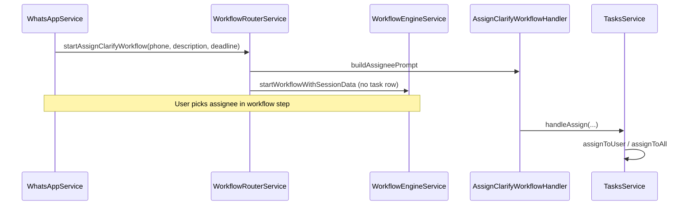
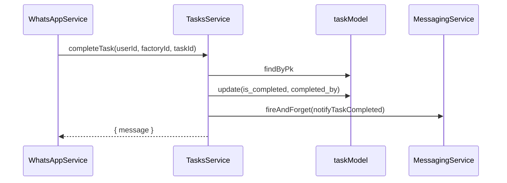

# Task Module Implementation Mapping (Phase 0)

**Generated:** documentation-only analysis.  
**Prerequisite reads:** `docs/p2-inventory-task-integrations.md`, `docs/docs_local/inventory/01-inventory-transaction-analysis.md`, `docs/docs_local/inventory/02-task-inventory-architecture-mapping.md`  
**Objective:** Exact map of how `task_inventory_lines` integrates into the existing **Tasks** module per verified codebase patterns.  
**Rules:** Observations from code only; unknowns marked `NOT VERIFIED IN CODEBASE`.

---

## 1. Executive Summary

Phase 0 (per `docs/p2-inventory-task-integrations.md`) adds `task_inventory_lines`, attaches lines at task creation, and hooks **`TasksService.completeTask()`** to **`InventoryTransactionService`** with `reference_type` / `reference_id` on ledger rows.

**Verified today:**

- All task **creates** funnel through **`taskModel.create`** or **`taskModel.bulkCreate`** inside `TasksService` (`assignToUser`, `assignToAll`, `adminCreate`).
- All WhatsApp/workflow **creates** eventually call those methods via `handleAssign` → `assignToUser` / `assignToAll`, or `tryClassifiedDepartmentAssign` → `assignToUser`.
- All user-facing **completions** funnel through **`completeTask`** (WhatsApp) or **`adminComplete` / `adminUpdate`** (REST).
- Tasks module uses **direct Sequelize models** (`taskModel`, `taskUpdateModel`) — **no** `TasksRepository`.
- Tasks service uses **no** `sequelize.transaction()` — **NOT VERIFIED IN CODEBASE** in `backend/src/services/tasks/`.
- Nested array DTO precedent for optional child rows exists in **`purchase-requests.dto.ts`** (`items?: PurchaseRequestItemDto[]`), not in `CreateTaskDto`.

**Architecture placement (from doc 02):** `task_inventory_lines` owned under **`services/tasks/`**; **`TasksModule` imports `InventoryModule`** (one-way, same as `PurchaseRequestModule`).

---

## 2. Task Creation Flow Mapping

### 2.1 Internal service methods that write `tasks` rows

| Method | File | Write operation | Notifications after create |
|--------|------|-----------------|---------------------------|
| `assignToUser` | `tasks.service.ts` | `taskModel.create({...})` | `fireAndForget(notifyManagerRoutingPrompt)` **or** `fireAndForget(notifyWorkerTaskAssigned)` |
| `assignToAll` | `tasks.service.ts` | `taskModel.bulkCreate(tasks)` then `findAll` by `batch_id` | Per created row: `fireAndForget(notifyWorkerTaskAssigned)` |
| `adminCreate` | `tasks.service.ts` | `taskModel.create({...})` | Same routing/assignee notification pattern as `assignToUser` |

**Shared pre-write logic (assignToUser / adminCreate):**

- `getFactoryRole`, optional `departmentsService.assertManagerCanAssignWorker`
- `buildRoutingForNewTask` → `routing_status`, `owner_id`
- `departmentsService.resolveDepartmentIdForNewTask` → `department_id`
- `normalizeDeadline` → optional `deadline`, `deadline_breach_reminded_at`

### 2.2 REST entrypoints

| HTTP | Controller method | Service | DTO |
|------|-------------------|---------|-----|
| `POST /tasks` | `TasksController.create` | `adminCreate(dto)` | `CreateTaskDto` |

**`CreateTaskDto` fields (verified):** `factory_id`, `assigned_to`, `assigned_by`, `description`, optional `deadline`. **No** nested inventory fields.

### 2.3 WhatsApp entrypoints (all via `WhatsAppService.processCommand` unless workflow intercepts)

| Trigger | Command / path | Service chain | DTO |
|---------|----------------|---------------|-----|
| Slash `/assign @mention desc` | `COMMANDS.ASSIGN` | `tasksService.handleAssign` → `assignToUser` or `assignToAll` | `WhatsAppIncomingServiceDto` (not task DTO); deadline via `classifyDeadlineRawInput(body)` |
| Slash `/assign` without mention (manager+) | `COMMANDS.ASSIGN` | `workflowRouter.startAssignClarifyWorkflow` — **no task row yet** | N/A at this step |
| ML `/assign` + `worker_slug`, no `@` in text | `COMMANDS.ASSIGN` | `handleAssign` → `assignToUser` / `assignToAll` | ML fields on `body` |
| ML `/depart_assign` or `/assign` + `depart_slug` (owner) | `tryClassifiedDepartmentAssign` | `tasksService.assignToUser(manager, ..., { slugDepartmentId, deadline })` | `depart_slug` on body |
| ML intent → workflow | `startWorkflowIfRegistered` with `/assign_clarify` | Session only until assignee picked | `taskDescription`, `deadline` in options |

**`handleAssign` signature:** `(user_id, factory_id, mention, description, options?: { slugDepartmentId?, deadline? })` — **no** inventory line parameter today.

### 2.4 Workflow entrypoints

| Workflow | Handler | Task create call |
|----------|---------|------------------|
| `ASSIGN_CLARIFY` | `AssignClarifyWorkflowHandler.handleStep` | `tasksService.handleAssign(context.userId, context.factoryId, mention, description, { deadline })` when assignee resolved |
| `ASSIGN_CLARIFY` start | `WorkflowRouterService.startAssignClarifyWorkflow` | **Does not create task** — stores `description`, `deadline`, `assignable_options` in `workflow_sessions.session_data` |

**Verified:** `AssignClarifyWorkflowHandler` does **not** import `InventoryModule` or inventory services.

### 2.5 Sequence diagram — REST create



### 2.6 Sequence diagram — WhatsApp assign (direct)



### 2.7 Sequence diagram — Assign clarify (deferred create)



### 2.8 Phase 0 attachment points (verified call sites only)

Per p2 §0.3, lines attach on task create. **Verified methods that must be considered** (any that insert `tasks`):

| Method | Single vs batch | Line attachment implication |
|--------|-------------------|----------------------------|
| `assignToUser` | Single `task.id` | One task → N lines |
| `assignToAll` | Many tasks, same `description`, shared `batch_id` | **NOT VERIFIED IN CODEBASE** how p2 assigns lines per worker task |
| `adminCreate` | Single | REST nested `inventory_lines[]` per p2 §0.3 |

---

## 3. Task Completion Flow Mapping

### 3.1 Verified completion paths

| Entry | Path | Service method | Sets `completed_by`? | Notification |
|-------|------|----------------|----------------------|--------------|
| WhatsApp `/complete [id]` | `WhatsAppService.processCommand` | `completeTask(user_id, factory_id, id)` | **Yes** (`completed_by: user_id`) | `fireAndForget(notifyTaskCompleted(task.id, user_id))` |
| REST `PATCH /tasks/:id/complete` | `TasksController.complete` | `adminComplete(id, true)` | **No** — only `is_completed: true` | `fireAndForget(notifyTaskCompleted(...))` if completing |
| REST `PATCH /tasks/:id` with `is_completed: true` | `TasksController.update` | `adminUpdate` | **No** unless already on row | `fireAndForget(notifyTaskCompleted)` when `becomesComplete` |

### 3.2 `completeTask` call chain (WhatsApp)

1. `WhatsAppService` — role/assignee checks implicit in service
2. `TasksService.completeTask`
   - `taskModel.findByPk(task_id)`
   - Validates factory, routing_status, assignee/manager rules
   - `task.update({ is_completed: true, completed_by: user_id })`
   - `messagingService.fireAndForget(notifyTaskCompleted(...))` — **after** update
   - Returns `{ message: ... }` to WhatsApp

**Transaction boundary:** Single `task.update` — **no** wrapping Sequelize transaction in tasks module.

**Side-effect timing:** Notifications are **async** (`fireAndForget`); not awaited before return.

### 3.3 `adminComplete` call chain (REST)

1. `taskModel.findByPk(id)`
2. `task.update({ is_completed })` — reopen clears `deadline_breach_reminded_at`
3. If completing: `fireAndForget(notifyTaskCompleted(task.id, completed_by ?? assigned_to))`

**Difference from `completeTask`:** Does not set `completed_by` on the row when completing via REST.

### 3.4 `adminUpdate` completion branch

When `dto.is_completed === true` and task was incomplete:

- `task.update(patch)` including `is_completed`
- `fireAndForget(notifyTaskCompleted(...))`

### 3.5 Non-completion paths (no stock hook today)

| Method | Effect |
|--------|--------|
| `addUpdate` | Creates `task_updates` row only; comment `// ✅ Auto-complete logic` has no complete branch in verified code |
| `applyManagerSelf` | Updates `routing_status` only |
| `applyManagerDelegateWorker` | Reassigns `assigned_to`; notifies worker |

### 3.6 Sequence diagram — WhatsApp complete (current)



### 3.7 Phase 0 completion hook location (p2 §0.4)

P2 specifies hook in **`tasks.service.ts` after mark complete**, calling **`InventoryTransactionService`**.

**Verified insertion surface:** Between `task.update(...)` and `fireAndForget(notifyTaskCompleted)` in `completeTask`.

**Also verified surfaces that mark complete without identical fields:**

- `adminComplete`
- `adminUpdate` (`becomesComplete` branch)

**Inventory transaction boundary:** `InventoryTransactionService.applyMovement` uses **`repository.sequelize.transaction()`** internally (`inventory-transaction.service.ts`). Task update and stock movement would be **separate transactions** unless explicitly wrapped — **NOT VERIFIED IN CODEBASE** as a single atomic unit today.

---

## 4. Task Data Access Pattern Analysis

### 4.1 How task data is accessed today

| Pattern | Evidence |
|---------|----------|
| **Direct model via `DbService`** | `TasksService` constructor binds `this.dbService.sqlService.Task`, `TaskUpdate`, `FactoryUser`, `User`, `DepartmentWorker` |
| **Repository** | **None** in `backend/src/services/tasks/` |
| **Helper / constants** | `tasks.routing.constants.ts` (`TASK_ROUTING_STATUS`); `normalizeDeadline` private method; `parseIndiaDefaultDeadline` from `core/time/india-defaults` |
| **Cross-module services** | `DepartmentsService`, `MessagingService`, `UserService` injected into `TasksService` |

### 4.2 Child entity precedent: `task_updates`

| Aspect | Implementation |
|--------|----------------|
| Model | `TaskUpdate` in `tasks.schema.ts` |
| Access | `this.taskUpdateModel.create/findAll/destroy` in `TasksService` |
| Delete on task remove | `adminRemove` → `taskUpdateModel.destroy({ where: { task_id: id } })` then `task.destroy()` |

### 4.3 Cross-module child precedent: `purchase_request_items`

| Aspect | Implementation |
|--------|----------------|
| Model | `PurchaseRequestItem` in `purchase-requests.schema.ts` |
| Access | `PurchaseRequestRepository.itemModel`, `replaceItems`, `createWithItems` |
| Parent service | `PurchaseRequestService` orchestrates repository + transaction |

### 4.4 Answer: where would `task_inventory_lines` fit?

Based on **tasks-module evidence only**:

| Option | Code evidence |
|--------|---------------|
| **Additional model accessed directly in `TasksService`** | **Matches `task_updates`** — same module, child of `Task`, no repository |
| **Repository-managed model** | **Matches `purchase_request_items`** pattern in the **repo overall**, but **not** current tasks module style |
| **Separate service-owned model** | **No precedent** in `services/tasks/` for a second service class |

**Verified conclusion for tasks folder consistency:** Direct model binding in `TasksService` (like `TaskUpdate`) is the **closest match to existing tasks code**. Repository methods (like purchase-requests) are the **closest match for parent+child transactional create** but would be **new** to the tasks module.

P2 §0.2 text says "Sequelize models + repository" — repository is **planned in p2**, **not present** in tasks today.

---

## 5. Schema Organization Analysis

### 5.1 Verified schema file layout

| File | Models in single file |
|------|----------------------|
| `tasks.schema.ts` | `Task`, `TaskUpdate` |
| `purchase-requests.schema.ts` | `PurchaseRequest`, `PurchaseRequestItem`, `PurchaseRequestAudit` |
| `documents.schema.ts` | `Document`, `DocumentProcessingJob`, `DocumentExtraction`, `DocumentSuggestion` |
| `inventory.schema.ts` | `InventoryCategory`, `InventoryLocation`, `InventoryItem`, `InventoryTransaction` |

**Separate schema files in repo (verified):** 17 `*.schema.ts` files under `backend/src/` — **one primary schema file per domain folder**; exception: `modules/onboarding/onboarding-otp.schema.ts`.

**NOT VERIFIED IN CODEBASE:** A domain using **two** schema files under the same `services/{domain}/` folder (except onboarding under `modules/`).

### 5.2 Child colocation rules (observed)

| Rule | Example |
|------|---------|
| Child table model in **same file** as parent | `TaskUpdate`, `PurchaseRequestItem`, `DocumentSuggestion` |
| `hasMany` on parent | `Task.hasMany(TaskUpdate)`; `PurchaseRequest.hasMany(PurchaseRequestItem)` |
| Optional `belongsTo` to external aggregate | `PurchaseRequestItem.belongsTo(InventoryItem)` |
| `onDelete: 'CASCADE'` | `TaskUpdate` → `Task` association only (verified in `tasks.schema.ts`) |

### 5.3 Model registration

All models registered in `backend/src/core/services/db-service/models.ts` → `SQL_MODELS` map.

**Verified:** `Task`, `TaskUpdate` imported from `tasks.schema.ts` and registered as `Task: Task.setup`, `TaskUpdate: TaskUpdate.setup`.

A new `TaskInventoryLine` would require an entry in `SQL_MODELS` and import — **same pattern as `PurchaseRequestItem`**.

### 5.4 Associations for `task_inventory_lines` (structural inference from precedents only)

Expected by analogy to `PurchaseRequestItem`:

- `Task.hasMany(TaskInventoryLine, { foreignKey: 'task_id' })`
- `TaskInventoryLine.belongsTo(Task)`
- `TaskInventoryLine.belongsTo(InventoryItem)` — mirror `PurchaseRequestItem.belongsTo(InventoryItem)`

**NOT VERIFIED IN CODEBASE** until model exists.

---

## 6. DTO Extension Analysis

### 6.1 Current task DTOs (`tasks.dto.ts`)

| DTO | Validators | Nested arrays |
|-----|------------|---------------|
| `CreateTaskDto` | `@IsNumber`, `@IsString`, `@IsOptional` on `deadline` | **None** |
| `UpdateTaskDto` | Optional fields for description, deadline, assigned_to, is_completed | **None** |
| `AddTaskUpdateDto` | `message`, `user_id` | **None** |

**Validation:** class-validator at DTO boundary; business rules (routing, department) in `TasksService`.

### 6.2 Nested array precedent — purchase requests

**File:** `purchase-requests.dto.ts`

```typescript
// Verified pattern:
@IsOptional()
@IsArray()
@ValidateNested({ each: true })
@Type(() => PurchaseRequestItemDto)
items?: PurchaseRequestItemDto[];
```

Child DTO `PurchaseRequestItemDto` includes optional `inventory_item_id`, quantity as **string**, optional `unit`, `notes`.

**Service consumption:** `PurchaseRequestService.createPurchaseRequest` → `normalizeItems(input.items)` → `purchaseRequestRepository.createWithItems` inside `sequelize.transaction`.

### 6.3 Documents module

**NOT VERIFIED IN CODEBASE:** `@ValidateNested` / `@IsArray` in `documents.dto.ts` (grep found no matches).

### 6.4 Phase 0 DTO impact (p2 §0.3)

P2 requires optional `inventory_lines[]` on task creation API.

**Verified extension target:** `CreateTaskDto` (used by `POST /tasks` → `adminCreate`).

**NOT VERIFIED IN CODEBASE:** Whether WhatsApp/internal `assignToUser` gains a parallel typed input — today uses positional `description` string only, not a DTO.

---

## 7. Module Wiring Analysis

### 7.1 Current `tasks.module.ts`

```typescript
imports: [MessagingModule, DepartmentsModule]
exports: [TasksService]
```

**Does not import:** `InventoryModule`, `UserModule` (UserService used — likely via global or transitive **NOT VERIFIED**), `WorkflowModule`.

### 7.2 Precedent — `purchase-requests.module.ts`

```typescript
imports: [VendorModule, InventoryModule]
```

`PurchaseRequestService` injects inventory services for reads; line items stored in purchase-requests repository.

### 7.3 Precedent — `documents.module.ts`

```typescript
imports: [InventoryModule, UserModule, MessagingModule, forwardRef(() => WorkflowModule), ...]
```

`SuggestionExecutionService` injects `InventoryTransactionService` for stock writes.

### 7.4 `inventory.module.ts` exports (verified)

- `InventoryService`
- `InventoryTransactionService`
- `InventoryRepository`

Phase 0 stock hook needs **`InventoryTransactionService`** (p2 §0.4). Line reads may need **`InventoryService`** or repository — **NOT VERIFIED IN CODEBASE** until validation rules defined.

### 7.5 Required wiring for Tasks → Inventory (pattern inference)

| Change | Precedent |
|--------|-----------|
| `TasksModule.imports` add `InventoryModule` | `PurchaseRequestModule` |
| `TasksService` constructor inject `InventoryTransactionService` | `SuggestionExecutionService` |

### 7.6 Circular dependency risk

**Verified today:**

- `InventoryModule` has **empty** `imports: []` — does not import `TasksModule`.
- `WorkflowModule` imports **both** `TasksModule` and `InventoryModule` — no cycle through tasks↔inventory.
- `WhatsAppModule` imports both — no tasks↔inventory cycle.

**TasksModule → InventoryModule** preserves acyclic graph (same as purchase-requests).

**NOT VERIFIED IN CODEBASE:** Need for `forwardRef` on Tasks–Inventory edge.

### 7.7 Consumers of `TasksService` (unchanged wiring unless they pass lines)

| Module | Usage |
|--------|-------|
| `WhatsAppModule` | assign, complete, manager ops |
| `WorkflowModule` | `AssignClarifyWorkflowHandler` |
| `AppModule` | registration |

---

## 8. Implementation Impact Matrix

Only files with verified relationship to Phase 0 flows. Confidence: **High** = directly on create/complete path per p2; **Medium** = registration/wiring/precedent; **Low** = p2 mentions but path not verified.

| File | Why it must change | Confidence |
|------|-------------------|------------|
| `backend/migrations/010_task_inventory_lines.sql` (new) | p2 §0.1 — table does not exist | High (p2 scope) |
| `backend/migrations/README.md` | p2 §0.1 AC — lists migrations | High (p2 scope) |
| `backend/src/services/tasks/tasks.schema.ts` | New `TaskInventoryLine` model + associations | High |
| `backend/src/core/services/db-service/models.ts` | Register new model in `SQL_MODELS` | High |
| `backend/src/services/tasks/tasks.module.ts` | Import `InventoryModule` for `InventoryTransactionService` | High |
| `backend/src/services/tasks/tasks.service.ts` | Create paths attach lines; `completeTask` (and possibly `adminComplete`/`adminUpdate`) call stock + notify | High |
| `backend/src/services/tasks/tasks.dto.ts` | p2 §0.3 optional nested `inventory_lines` on create | High (REST path) |
| `backend/src/services/inventory/inventory-transaction.service.ts` | Called by tasks on complete — **consumer only** | Medium (no edit required if API sufficient) |
| `backend/src/modules/whatsapp/whatsapp.service.ts` | p2 §0.7 WhatsApp assign with stock — assign/complete entrypoints | Medium |
| `backend/src/services/workflow/handlers/assign-clarify.handler.ts` | Calls `handleAssign` — only if lines passed through workflow | Low |
| `backend/src/services/workflow/workflow-engine.service.ts` | `startAssignClarifyWorkflow` session_data — only if lines stored pre-create | Low |

| File | Why it may change | Confidence |
|------|-------------------|------------|
| `backend/src/services/tasks/tasks.routing.constants.ts` | If `task_kind` or movement enums added to tasks module | Medium |
| `backend/src/services/tasks/task-deadline.cron.ts` | No create/complete hook today | Low — should not change |
| `backend/src/core/messaging/messaging.service.ts` | If `notifyTaskCompleted` text built here vs tasks service | Low |
| New `backend/src/services/tasks/tasks.repository.ts` | p2 §0.2 mentions repository; not present today | Medium |
| New `backend/src/services/tasks/*.spec.ts` | p2 AC unit/integration tests | High (p2 scope) |

| File | Why it should not change (verified) | Confidence |
|------|-------------------------------------|------------|
| `backend/src/services/inventory/inventory.schema.ts` | Ledger tables stay inventory-owned | High |
| `backend/src/services/inventory/inventory.module.ts` | No need to import tasks if one-way deps kept | High |
| `backend/src/services/purchase-requests/*` | Separate domain; precedent only | High |
| `backend/src/services/documents/suggestion-execution.service.ts` | Different reference_type writer | High |
| `backend/src/services/workflow/workflow.schema.ts` | Workflow session storage separate from persistent lines | High |

---

## 9. Risks & Unknowns

| Item | Detail |
|------|--------|
| **No tasks transactions** | `assignToUser` + line inserts + `completeTask` + stock are not in one DB transaction today. |
| **Split complete paths** | `completeTask` sets `completed_by`; `adminComplete` does not — stock hook must align per path. |
| **`assignToAll` + lines** | Bulk creates N tasks; p2 line attachment per task **NOT VERIFIED IN CODEBASE**. |
| **Repository vs direct model** | P2 §0.2 says repository; tasks module uses direct models for `task_updates`. |
| **`task_kind` column** | Proposed in p2 on `tasks` table — **NOT VERIFIED IN CODEBASE** on current schema. |
| **`TRANSFER` movement** | In p2 line schema — **not** in `INVENTORY_TRANSACTION_TYPE` constants. |
| **WhatsApp line capture** | p2 §0.7 UX TBD — no verified command/DTO path for SKU/qty at assign. |
| **`adminRemove` cascade** | Manually destroys `task_updates`; lines would need same pattern unless DB cascade added. |
| **Notification before stock** | `fireAndForget` after `task.update`; stock failure after complete would leave inconsistent state — p2 §0.5 says block completion (ordering matters). |
| **ML classify slots** | No verified inventory fields in WhatsApp ML body mapping (`parseMlClassifyResponse`). |

---

## IMPLEMENTATION READY CHECKLIST

*Based on verified analysis only. Not implementation steps.*

### Files that must change

| File | Reason |
|------|--------|
| `backend/migrations/010_task_inventory_lines.sql` (new) | Table `task_inventory_lines` does not exist |
| `backend/migrations/README.md` | Migration index per p2 §0.1 AC |
| `backend/src/services/tasks/tasks.schema.ts` | Model + associations for lines |
| `backend/src/core/services/db-service/models.ts` | Model registration |
| `backend/src/services/tasks/tasks.module.ts` | `InventoryModule` import |
| `backend/src/services/tasks/tasks.service.ts` | Create + complete paths per p2 §0.3–0.6 |
| `backend/src/services/tasks/tasks.dto.ts` | REST nested lines per p2 §0.3 |

### Files that may change

| File | Reason |
|------|--------|
| `backend/src/modules/whatsapp/whatsapp.service.ts` | p2 §0.7 assign-with-stock entrypoints |
| `backend/src/services/workflow/handlers/assign-clarify.handler.ts` | Indirect create via `handleAssign` |
| `backend/src/services/workflow/workflow.interfaces.ts` | Session data if lines staged before assign |
| `backend/src/services/tasks/tasks.routing.constants.ts` | Enums for movement/kind if placed in tasks module |
| New `backend/src/services/tasks/tasks.repository.ts` | If implementer follows purchase-request child pattern vs `task_updates` direct model |
| New `backend/src/services/tasks/*.spec.ts` | p2 acceptance tests |
| `backend/src/services/inventory/inventory.constants.ts` | Only if `reference_type: 'TASK'` constant added — **not present today** |

### Files that should not change

| File | Reason |
|------|--------|
| `backend/src/services/inventory/inventory-transaction.service.ts` | Existing `applyMovement` API sufficient as callee (verified caller pattern in documents) |
| `backend/src/services/inventory/inventory.schema.ts` | Inventory owns ledger, not task lines |
| `backend/src/services/inventory/inventory.module.ts` | Keep one-way dependency |
| `backend/src/services/purchase-requests/*` | Unrelated domain |
| `backend/src/services/documents/suggestion-execution.service.ts` | Existing `DOCUMENT_SUGGESTION` reference writer |
| `backend/src/services/tasks/task-deadline.cron.ts` | No create/complete/stock logic |
| `backend/src/services/workflow/workflow.schema.ts` | Workflow sessions ≠ persistent lines |

### Unresolved questions (from analysis)

1. Single `TasksRepository` vs direct `taskInventoryLineModel` in `TasksService`?
2. Which completion methods require stock hook: `completeTask` only, or also `adminComplete` / `adminUpdate`?
3. Should stock movement run **before** `is_completed` is set to satisfy p2 §0.5 rollback semantics?
4. How are lines attached for `assignToAll` (one line set per worker task vs shared intent)?
5. Is `task_kind` on `tasks` required for Phase 0 or derivable from line `movement_type` only?
6. Does `adminRemove` need `task_inventory_lines` destroy like `task_updates`?

---

*End of report.*
