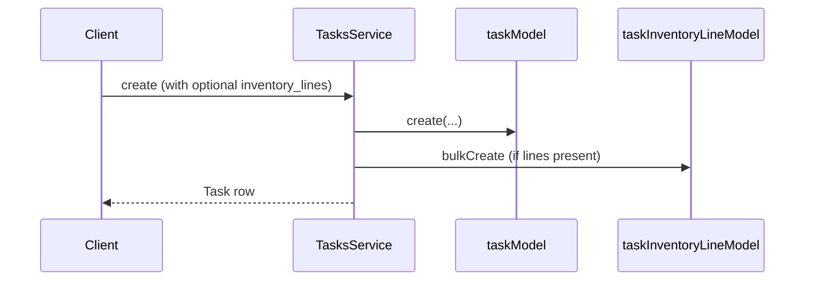

# Phase 0.2 — Task Inventory Persistence Integration — Implementation Report

## 1. Executive Summary

Phase 0.2 wires **DTO input**, **create-time persistence**, **read-time retrieval**, and **delete-time cleanup** for `task_inventory_lines` inside the Tasks domain. All changes are additive; no inventory transaction services, stock movement, or task completion logic was modified.

Inventory lines can be supplied on task creation (REST and internal service paths). Lines persist via `TaskInventoryLine.bulkCreate` and retrieve via `adminFindOne` (`GET /tasks/:id`). Deletion mirrors `TaskUpdate` explicit cleanup in `adminRemove`.

---

## 2. Files Changed

| File | Action |
|------|--------|
| `backend/src/services/tasks/task-inventory-line.dto.ts` | **Created** — nested line DTO |
| `backend/src/services/tasks/tasks.dto.ts` | **Updated** — optional `inventory_lines` on `CreateTaskDto` |
| `backend/src/services/tasks/tasks.service.ts` | **Updated** — persist, retrieve, delete helpers |
| `backend/src/services/tasks/tasks.module.ts` | **Unchanged** — no new providers or imports required |

Phase 0.1 files (`tasks.schema.ts`, migration, `models.ts`) were not modified in Phase 0.2.

---

## 3. Exact Changes Made

### `task-inventory-line.dto.ts` (new)

- `TaskInventoryLineDto` with `inventory_item_id`, `quantity_expected`, `movement_type`.
- Validators: `@IsNumber()`, `@IsString()` on each field.

### `tasks.dto.ts`

- Added imports: `Type`, `IsArray`, `ValidateNested`, `TaskInventoryLineDto`.
- Added optional `inventory_lines?: TaskInventoryLineDto[]` to `CreateTaskDto` with `@ValidateNested({ each: true })` and `@Type(() => TaskInventoryLineDto)`.

### `tasks.service.ts`

- Registered `taskInventoryLineModel` from `dbService.sqlService.TaskInventoryLine`.
- Added private `persistInventoryLines(taskId, factoryId, lines?)` — no-op when absent/empty; otherwise `bulkCreate` with `quantity_completed: '0'`.
- **`assignToUser`**: extended `options` with optional `inventory_lines`; calls `persistInventoryLines` after `taskModel.create`.
- **`assignToAll`**: extended `options` with optional `inventory_lines`; duplicates lines onto each task in batch after `bulkCreate`.
- **`adminCreate`**: calls `persistInventoryLines` from `dto.inventory_lines` after create.
- **`adminFindOne`**: includes `inventory_lines` with nested `inventory_item` (id, name, sku, unit).
- **`adminRemove`**: `taskInventoryLineModel.destroy({ where: { task_id: id } })` before `task.destroy()` — same pattern as `TaskUpdate`.

**Not modified:** `completeTask`, `adminComplete`, `adminUpdate` completion paths, `getTasks`, `adminList`, WhatsApp handlers.

---

## 4. DTO Changes

| DTO | Change |
|-----|--------|
| `CreateTaskDto` | Optional `inventory_lines[]` |
| `UpdateTaskDto` | Unchanged |
| `AddTaskUpdateDto` | Unchanged |
| `TaskInventoryLineDto` | New nested type |

**Pattern followed:** `purchase-requests.dto.ts` — `CreatePurchaseRequestDto.items` uses `@IsOptional()`, `@IsArray()`, `@ValidateNested({ each: true })`, `@Type(() => PurchaseRequestItemDto)`.

**Quantity type:** `IsString` for `quantity_expected` — matches `PurchaseRequestItemDto.requested_quantity` and `RecordInventoryTransactionDto.quantity`.

**Movement type:** `IsString` only — no `IsEnum` tied to inventory constants (Phase 0.2 forbids inventory validation).

---

## 5. Service Changes

| Method | Change |
|--------|--------|
| `persistInventoryLines` | New private helper |
| `assignToUser` | Optional lines in options + persist |
| `assignToAll` | Optional lines in options + persist per batch task |
| `adminCreate` | Persist from DTO |
| `adminFindOne` | Include `inventory_lines` |
| `adminRemove` | Destroy lines before task |

No new public endpoints. No repository layer (consistent with existing Tasks direct-model pattern).

---

## 6. Persistence Flow

### Supported creation paths

| Path | Entry | Lines source | Persisted? |
|------|-------|--------------|------------|
| REST | `POST /tasks` → `adminCreate` | `CreateTaskDto.inventory_lines` | Yes, when provided |
| WhatsApp / internal | `handleAssign` → `assignToUser` | `options.inventory_lines` (optional; not wired from WhatsApp yet) | Yes, when provided |
| WhatsApp / internal | `handleAssign` → `assignToAll` | `options.inventory_lines` (optional) | Yes — **same lines duplicated** per batch task |
| ML dept assign | `tryClassifiedDepartmentAssign` → `assignToUser` | None today | No lines (unchanged behavior) |
| Workflow | `AssignClarifyWorkflowHandler` → `handleAssign` | None today | No lines (unchanged behavior) |

**No** `InventoryTransactionService`, **no** `sequelize.transaction()` wrapper, **no** inventory item existence checks.

---

## 7. Retrieval Flow

| Path | Includes `inventory_lines`? | Notes |
|------|----------------------------|-------|
| `GET /tasks/:id` → `adminFindOne` | **Yes** | With nested `inventory_item` |
| `GET /tasks` → `adminList` | **No** | Matches `TaskUpdate` (updates not in list) |
| `getTasks` (WhatsApp role lists) | **No** | Unchanged response shape |
| `adminGetUpdates` | N/A | Updates only |

Retrieval follows **TaskUpdate precedent**: child rows on detail fetch, not list/WhatsApp flows.

---

## 8. Architectural Decisions

| Decision | Rationale |
|----------|-----------|
| Nested DTO in separate file | Keeps `tasks.dto.ts` lean; line type reusable from service `options` |
| `bulkCreate` not wrapped in DB transaction with task | Matches existing Tasks pattern (no transactions in tasks module today) |
| `quantity_completed` always `'0'` on create | Column not in create DTO; completion hook is future phase |
| Explicit destroy on delete | No DB FK; Sequelize `onDelete: CASCADE` not enforced at DB level — mirrors `TaskUpdate` in `adminRemove` |
| `assignToAll` duplicates lines | One set of lines per worker task in batch; documented for future WhatsApp bulk assign |
| No `tasks.module.ts` change | No new injectables; model via existing `DbService` |

---

## 9. Risks

| Risk | Severity | Notes |
|------|----------|-------|
| Orphan lines if task deleted outside `adminRemove` | Low | Same as `task_updates` today |
| Invalid `inventory_item_id` persisted | Medium | No validation in 0.2 by design; future phase adds checks |
| Invalid `movement_type` persisted | Low | String-only validation |
| `assignToAll` duplicates lines N times | Low | Expected for batch assign; document for API consumers |
| List endpoints omit lines | Low | Intentional; use `GET /tasks/:id` |

---

## 10. Remaining Work

- Wire `inventory_lines` from WhatsApp / ML / workflow into `assignToUser` options.
- Phase 0.3+: `completeTask` stock hook, `quantity_completed` updates.
- Optional `GET /tasks/:id/inventory-lines` if detail payload too heavy.
- Factory + item scoping validation on create.
- `movement_type` enum alignment (`TRANSFER` vs `ADJUSTMENT`).
- Sequelize transaction wrapping task + lines create (atomicity).

---

## NEXT IMPLEMENTATION TARGETS

1. **`completeTask()` / `adminComplete` inventory hook** — `InventoryTransactionService.applyMovement()`.
2. **WhatsApp task assign with stock lines** — parse ML output → `options.inventory_lines`.
3. **Inventory item validation** on line create (factory scope, item exists).
4. **`movement_type` constants** in `tasks.inventory.constants.ts` with `IsEnum` on DTO.
5. **Atomic create** — `sequelize.transaction()` for task + lines.
6. **Partial completion** — update `quantity_completed` without full task complete.
