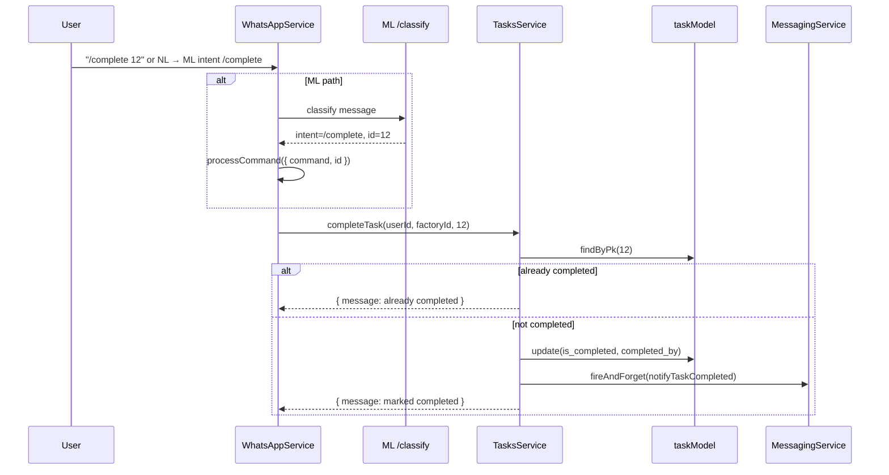
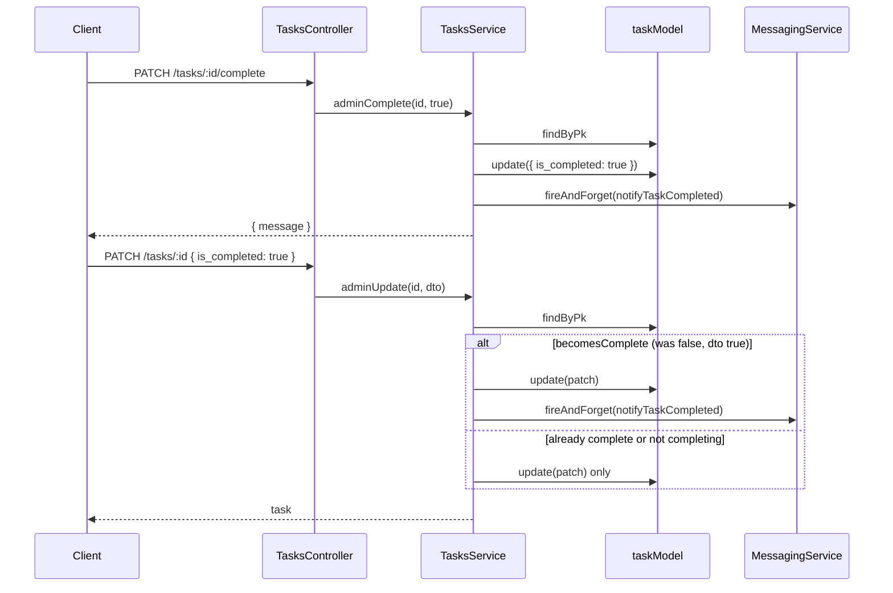

# Phase 0.3 Preparation — Completion Path & Inventory Movement Analysis

**Generated:** documentation-only analysis (no production code modified).  
**Prerequisite reads:** Phase 0.1/0.2 reports, `docs/p2-inventory-task-integrations.md`, inventory architecture docs.  
**Rule:** Observations from code and existing docs only; unknowns marked `NOT VERIFIED IN CODEBASE`.

---

## 1. Executive Summary

Phase 0.3 will connect **task completion** to **inventory ledger writes** via `InventoryTransactionService`. Today, **three verified service methods** can set `tasks.is_completed = true`: `completeTask`, `adminComplete`, and `adminUpdate`. Only **`completeTask`** is named in p2 planning as the stock hook surface.

**Critical findings:**

| Finding | Severity |
|---------|----------|
| **Three completion paths** with different idempotency and `completed_by` behavior | HIGH |
| **`assignToAll` duplicates `inventory_lines` to every batch task** — if each worker completes, stock could move N× per line | HIGH |
| **Task update and stock movement use separate DB transactions** today | HIGH |
| **`quantity_completed` is never updated** — no idempotency guard exists | HIGH |
| **No `reference_type: 'TASK'` writer** exists in production code yet | MEDIUM |
| **`movement_type: TRANSFER` on lines has no matching inventory service method** (`ADJUSTMENT` exists instead) | MEDIUM |
| **Reopen flows do not reverse stock** — no reversal API verified | MEDIUM |

P2 §0.4 specifies hooking **`completeTask()`** after mark-complete. **NOT VERIFIED IN CODEBASE** whether REST admin completion paths must also trigger movement.

---

## 2. Completion Path Mapping

### 2.1 Verified paths that set `is_completed = true`

| # | Service method | HTTP / entry | Caller (verified) | Auth model | DB writes | Notifications |
|---|----------------|--------------|-------------------|------------|-----------|---------------|
| 1 | `completeTask` | WhatsApp `/complete [id]`; ML intent `/complete` | `WhatsAppService.processCommand` | Assignee OR manager (`managerMayCompleteTask`); factory scope; routing guards | `task.update({ is_completed: true, completed_by: user_id })` | `fireAndForget(notifyTaskCompleted)` |
| 2 | `adminComplete(id, true)` | `PATCH /tasks/:id/complete` | `TasksController.complete` | **NOT VERIFIED IN CODEBASE** — no auth guard on controller in `tasks.service.ts` file | `task.update({ is_completed: true })` — **does not set `completed_by`** | `fireAndForget(notifyTaskCompleted)` if `is_completed` arg true |
| 3 | `adminUpdate` | `PATCH /tasks/:id` with `{ is_completed: true }` | `TasksController.update` | **NOT VERIFIED IN CODEBASE** | `task.update(patch)` when `becomesComplete` | `fireAndForget(notifyTaskCompleted)` when `becomesComplete` |

### 2.2 Verified paths that do **not** complete tasks

| Path | Method | Effect |
|------|--------|--------|
| WhatsApp `/update` | `addUpdate` | Creates `task_updates` row only |
| WhatsApp assign / workflow | `handleAssign`, `assignToUser`, `assignToAll` | Creates tasks only |
| Manager routing | `applyManagerSelf`, `applyManagerDelegateWorker`, `applyManagerTransferDepartment`, `applyManagerRejectTask` | Routing/reassign/reject — no `is_completed` |
| Cron | `processMissedDeadlineReminders` | Updates `deadline_breach_reminded_at` only |
| Reports | `reports.service.ts` | Reads `is_completed: true` — no writes |
| Workflow sessions | `workflow-session.service.completeSession` | Completes **workflow session**, not `tasks` row |

**`addUpdate` note:** Comment `// ✅ Auto-complete logic` exists but **no branch sets `is_completed`** — only `lower` variable assigned. **Verified dead comment.**

### 2.3 WhatsApp completion chain



**ML routing (verified):** `WhatsAppService` posts to `${ML_URL}/classify`, normalizes intent via `normalizeIntentCommand`, then calls `processCommand` with `command` and optional `id` from ML payload. Intent `/complete` is listed in `backend/contracts/intent-types.json`.

### 2.4 REST completion chains



### 2.5 State transitions (verified)

| Field | `completeTask` | `adminComplete(true)` | `adminUpdate(complete)` |
|-------|----------------|----------------------|-------------------------|
| `is_completed` | `false → true` | `→ true` (even if already true) | `false → true` when `becomesComplete` |
| `completed_by` | Set to `user_id` | **Unchanged** | **Unchanged** unless already on row |
| `deadline_breach_reminded_at` | Unchanged | Unchanged | May reset if deadline extended |
| Side effects on lines | **None today** | **None today** | **None today** |

### 2.6 Non-paths (explicitly not completion)

- **Workflow `ASSIGN_CLARIFY`:** Creates tasks via `handleAssign`; `completed: true` on workflow result means **session finished**, not task completed.
- **Task deadline cron:** Sends reminders; does not flip `is_completed`.
- **Domain events / document jobs:** Use `COMPLETED` status on other entities — not `tasks`.

---

## 3. Completion Ownership Analysis

**Question:** Which completion path should own inventory movement?

### 3.1 `completeTask`

| Option | Assessment | Evidence |
|--------|------------|----------|
| **A — Movement should occur here** | **Supported by p2 planning doc** | `docs/p2-inventory-task-integrations.md` §Layer 2: "On `completeTask()`" steps 1–3; Phase 0.4 AC: "Hook `completeTask()` → stock movement" |
| **B — Movement should NOT occur here** | **Not supported** | Primary WhatsApp worker/manager completion path |

**Code evidence:** Idempotent guard when `task.is_completed` already true (early return, no `update`). Sets `completed_by`. This is the **only path with verified duplicate-completion protection**.

### 3.2 `adminComplete`

| Option | Assessment | Evidence |
|--------|------------|----------|
| **A — Movement should occur here** | **Supported by code behavior** | REST `PATCH /tasks/:id/complete` marks task complete without calling `completeTask` |
| **B — Movement should NOT occur here** | **Supported by p2 doc scope** | P2 Phase 0.4 names `completeTask()` only — **admin path not mentioned** |

**Code evidence:** **No** check for already-completed before update. **No** `completed_by` assignment. **Will** call `notifyTaskCompleted` on every `adminComplete(id, true)` call.

**NOT VERIFIED IN CODEBASE:** Product decision for REST-only completion + stock.

### 3.3 `adminUpdate` (`becomesComplete` branch)

| Option | Assessment | Evidence |
|--------|------------|----------|
| **A — Movement should occur here** | **Supported by code** | `PATCH /tasks/:id` with `is_completed: true` can complete without `completeTask` |
| **B — Movement should NOT occur here** | **Supported by p2** | Not named in p2 hook list |

**Code evidence:** Guard `becomesComplete = dto.is_completed === true && !task.is_completed` — **idempotent for completion notification** (won't re-notify if already complete). **No** `completed_by` set on transition.

### 3.4 Consolidated ownership conclusion

| Source | Conclusion |
|--------|------------|
| **P2 planning doc** | Names **`completeTask()`** as hook surface |
| **Verified code** | **Three** methods can set `is_completed = true` |
| **Gap** | If movement is implemented **only** in `completeTask`, REST admin completion **will not move stock** unless those paths are also wired |

**NOT VERIFIED IN CODEBASE:** Whether Phase 0.3 should use a **shared private helper** invoked from all three paths. P2 does not document this pattern.

---

## 4. Duplicate Movement Risk Analysis

### 4.1 Idempotency by completion path

| Scenario | Task row re-updated? | Notification duplicate? | Stock duplicate risk (if hooked naively) |
|----------|---------------------|-------------------------|------------------------------------------|
| `completeTask` twice | **No** — early return | **No** | **Low** — second call never reaches hook |
| `adminComplete(true)` twice | **Yes** — always `update` | **Yes** — always `fireAndForget` | **HIGH** — no guard |
| `adminUpdate` complete twice | **No** — `becomesComplete` false second time | **No** | **Medium** — depends where hook placed |
| WhatsApp complete then REST `adminComplete` | **Yes** on REST | **Yes** on REST | **HIGH** if REST path hooks movement |
| WhatsApp complete then REST `adminUpdate` complete | **No** — already complete | **No** | **Low** if hook only in `becomesComplete` |
| REST complete then WhatsApp complete | **No** on WhatsApp | **No** on WhatsApp | **Low** on WhatsApp path |

### 4.2 Ledger-level duplicate risk

**Verified today:**

- `InventoryTransactionService.applyMovement` **always inserts** a new `inventory_transactions` row.
- Index on `(reference_type, reference_id)` exists in migration `001_traderos_foundation.sql` — **not UNIQUE**.
- Only verified production `reference_type` writer: `'DOCUMENT_SUGGESTION'` in `suggestion-execution.service.ts`.
- **`reference_type: 'TASK'` is not written anywhere yet.**

**No verified idempotency** preventing duplicate ledger rows for the same task completion.

### 4.3 `quantity_completed` as guard

**Verified:** Column exists on `task_inventory_lines` (migration + schema). Set to `'0'` on create in `persistInventoryLines`. **Never updated** anywhere in `backend/` (grep verified).

**NOT VERIFIED IN CODEBASE:** Whether Phase 0.3 will use `quantity_completed` for idempotency.

### 4.4 Concurrent requests

**NOT VERIFIED IN CODEBASE:** Row-level locking on `tasks` during completion. `completeTask` uses `findByPk` then `update` without transaction — race between two concurrent completers is possible.

**Inventory side:** `applyMovement` uses `repository.sequelize.transaction()` with item row lock (per `01-inventory-transaction-analysis.md`).

### 4.5 Notification retries

`fireAndForget` catches errors and logs — **does not retry** the promise (`messaging.service.ts`). Notification failure does not re-trigger completion.

### 4.6 REST + WhatsApp combination

**Verified risk:** User completes via WhatsApp (`completeTask`, idempotent) then admin hits `PATCH /tasks/:id/complete` (`adminComplete`, not idempotent). Task stays complete; notification fires again. **If stock hook only in `adminComplete` without guard → duplicate stock movement.**

---

## 5. assignToAll Risk Analysis

### 5.1 Current behavior (verified code)

**File:** `tasks.service.ts` — `assignToAll`

1. Loads all factory workers (or manager-scoped subset).
2. `taskModel.bulkCreate` — one task per worker, shared `batch_id`, same `description`.
3. `findAll({ where: { batch_id } })` → for **each** created task id:
   - `persistInventoryLines(row.id, factory_id, options?.inventory_lines)` — **same lines copied to every task**.
4. Per task: `fireAndForget(notifyWorkerTaskAssigned)`.

**WhatsApp path today:** `handleAssign` → `assignToAll` when mention is `@all`. **Does not pass `inventory_lines`** in options (verified: WhatsApp assign passes `{ deadline }` only).

**REST path:** `adminCreate` is single-task only — **does not use `assignToAll`**.

### 5.2 Future behavior if stock movement on complete

Example: Owner assigns `@all` with `inventory_lines: [{ item_id: 1, qty: 5, STOCK_OUT }]` to 3 workers.

| Task | Lines stored | If worker completes |
|------|--------------|---------------------|
| Task A (worker 1) | 5 × STOCK_OUT item 1 | −5 stock |
| Task B (worker 2) | 5 × STOCK_OUT item 1 | −5 stock |
| Task C (worker 3) | 5 × STOCK_OUT item 1 | −5 stock |

**Total potential movement:** **15** units for one logical "deliver 5" intent.

### 5.3 Intent vs safety (code-backed only)

| Question | Finding |
|----------|---------|
| **Intentional?** | **NOT VERIFIED IN CODEBASE** as product intent. Phase 0.2 implementation doc states lines are "duplicated per batch task." P2 north-star example is **single worker** delivery ("Ramesh ko 5 cement deliver karo"). P2 does **not** document `@all` + inventory lines. |
| **Safe for stock?** | **No** — verified duplication × N completions = N× consumption for identical lines. |
| **Matches p2 planning?** | **Partially** — p2 describes single-task delivery on complete; **does not** address batch assign. Doc 03 marks `assignToAll` line attachment as **NOT VERIFIED IN CODEBASE**. |
| **Over-consumption risk?** | **Yes** — **HIGH** if `inventory_lines` supplied on `assignToAll` and multiple workers complete. |

### 5.4 Mitigation status

**NOT VERIFIED IN CODEBASE:** Any guard preventing `inventory_lines` on `assignToAll`. Phase 0.2 allows it via `options.inventory_lines`.

---

## 6. Inventory Movement Integration Analysis

### 6.1 `InventoryTransactionService` public API (verified)

| Method | Input | Effect |
|--------|-------|--------|
| `recordStockIn(input: RecordStockMovementInput)` | See §6.2 | `STOCK_IN`, delta +qty |
| `recordStockOut(input: RecordStockMovementInput)` | See §6.2 | `STOCK_OUT`, delta −qty |
| `recordAdjustment(input: RecordStockMovementInput)` | Signed quantity | `ADJUSTMENT` |
| `calculateQuantityFromTransactions(itemId, factoryId)` | Read-only audit sum | No writes |

**Private:** `applyMovement` — all writes funnel here.

### 6.2 `RecordStockMovementInput` (verified)

```typescript
{
  factory_id: number;
  inventory_item_id: number;
  quantity: string | number;
  notes?: string | null;
  reference_type?: string | null;
  reference_id?: number | null;
  created_by?: number | null;
}
```

### 6.3 Transaction / rollback behavior (verified)

- Each `applyMovement` call runs inside **`repository.sequelize.transaction(async (transaction) => { ... })`**.
- Steps: lock/find item → validate active → compute next qty → reject if `next < 0` → insert ledger row → update `current_quantity`.
- **Rollback:** Sequelize transaction rolls back on thrown exception (e.g. `BadRequestException` insufficient stock, `NotFoundException` item missing).
- **Task completion is outside this transaction** — **NOT VERIFIED IN CODEBASE** as atomic with task update.

### 6.4 `reference_type` / `reference_id` (verified)

- Columns on `inventory_transactions` (migration `001`).
- Passed through to `repository.createTransaction`.
- P2 proposes: `reference_type: 'TASK'`, `reference_id: task.id`.
- **No unique constraint** on reference pair — duplicate TASK references allowed.

### 6.5 What Tasks must provide (verified requirements)

For each `task_inventory_lines` row at completion time:

| Task data | Maps to |
|-----------|---------|
| `task.factory_id` | `factory_id` |
| `line.inventory_item_id` | `inventory_item_id` |
| `line.quantity_expected` (or partial — **NOT VERIFIED IN CODEBASE**) | `quantity` |
| `line.movement_type` | Chooses `recordStockIn` / `recordStockOut` / **? for TRANSFER** |
| `task.id` | `reference_id` (per p2) |
| Literal `'TASK'` | `reference_type` (per p2) |
| `task.completed_by` or completer user id | `created_by` |

**Movement type mapping gap:**

| Line `movement_type` (p2) | Inventory service method |
|---------------------------|--------------------------|
| `STOCK_OUT` | `recordStockOut` — **verified** |
| `STOCK_IN` | `recordStockIn` — **verified** |
| `TRANSFER` | **NOT VERIFIED IN CODEBASE** — no `recordTransfer`; `recordAdjustment` exists |

### 6.6 Insufficient stock (verified)

`applyMovement` throws `BadRequestException` with message including current qty and requested change when `next < 0`.

P2 §Design decisions: block completion on insufficient stock (planning doc — **not implemented in tasks code**).

### 6.7 Module wiring (verified)

- `InventoryModule` exports `InventoryTransactionService` (`inventory.module.ts`).
- `TasksModule` **does not** import `InventoryModule` today.
- Precedent: `PurchaseRequestModule` imports `InventoryModule`.

---

## 7. Transaction Boundary Analysis

### 7.1 Task completion today

| Aspect | Verified behavior |
|--------|-------------------|
| Sequelize transaction in tasks module | **None** — grep `sequelize.transaction` under `tasks/` → no matches |
| `completeTask` | Single `task.update` |
| `adminComplete` / `adminUpdate` | Single `task.update` |
| Notifications | After update, async via `fireAndForget` |

### 7.2 Inventory movement today

| Aspect | Verified behavior |
|--------|-------------------|
| Transaction scope | One item movement per `applyMovement` call |
| Isolation | Item row locked within inventory transaction |
| Multi-line task | Would require **N separate** inventory transactions (one per line) — **NOT VERIFIED IN CODEBASE** as wrapped in outer transaction |

### 7.3 Atomicity gaps

| Gap | Risk |
|-----|------|
| Task marked complete, stock movement fails | Task complete, stock unchanged — **inconsistent state** |
| Stock moves, task update fails | **NOT VERIFIED IN CODEBASE** if hook order is movement-first |
| Partial line success (multi-line) | Some lines moved, others not — **NOT VERIFIED IN CODEBASE** rollback strategy |
| Task + lines in separate transactions from create (Phase 0.2) | Pre-existing; same pattern applies to complete |

**NOT VERIFIED IN CODEBASE:** Phase 0.3 atomicity requirements beyond p2 "block completion on insufficient stock."

---

## 8. Reopen Task Analysis

### 8.1 Verified reopen paths

| Path | Method | DB changes | Notifications |
|------|--------|------------|---------------|
| `PATCH /tasks/:id/reopen` | `adminComplete(id, false)` | `is_completed: false`, `deadline_breach_reminded_at: null` | **None** |
| `PATCH /tasks/:id` `{ is_completed: false }` | `adminUpdate` | Sets `is_completed: false` in patch | **None** on reopen |

**Verified:** `completeTask` has **no reopen** path.

### 8.2 Inventory impact today

**None** — no stock writes on complete or reopen.

### 8.3 If movement added without reversal

| Scenario | Effect |
|----------|--------|
| Complete → stock out | Stock reduced |
| Reopen task | Task incomplete; **stock stays reduced** |
| Complete again | **Potential second stock out** — **HIGH duplicate risk** unless idempotency guard |

### 8.4 Reversal behavior

**NOT VERIFIED IN CODEBASE:**

- No `recordStockIn` automatically on reopen.
- No task-linked reversal ledger pattern.
- No `quantity_completed` reset on reopen.

P2 partial delivery (`quantity_completed < expected`) is **Phase 2** in design decisions — not implemented.

---

## 9. Phase 0.3 Readiness Assessment

### 9.1 Files that must change (verified dependency analysis)

| File | Reason | Risk |
|------|--------|------|
| `backend/src/services/tasks/tasks.service.ts` | Completion hook surface; load lines; call transaction service | **HIGH** |
| `backend/src/services/tasks/tasks.module.ts` | Import `InventoryModule`; inject `InventoryTransactionService` | **HIGH** |

### 9.2 Files that may change

| File | Reason | Risk |
|------|--------|------|
| `backend/src/services/tasks/tasks.inventory.constants.ts` (new) | `movement_type` / `reference_type` literals | **LOW** |
| Helper under `tasks/` for line→movement mapping | Keep service readable | **LOW** |
| Tests under `tasks/` or integration | P2 AC mentions integration test | **MEDIUM** |

### 9.3 Files that should not change (Phase 0.3 scope per task constraints)

| File | Reason |
|------|--------|
| `backend/migrations/*` | Schema exists from 0.1 |
| `backend/src/modules/whatsapp/*` | Completion already delegates to `completeTask` |
| `backend/src/services/inventory/inventory-transaction.service.ts` | Use public API; avoid changing ledger core |
| `inventory.schema.ts` | No schema change required for basic hook |

**NOT VERIFIED IN CODEBASE:** Whether p2 Phase 0.5–0.7 (WhatsApp notifications, assign with stock) are in or out of 0.3 scope.

### 9.4 Pre-implementation decisions required

1. **Which completion paths invoke movement** (completeTask only vs all three).
2. **Idempotency strategy** (`quantity_completed`, ledger lookup, or completion guard on all paths).
3. **`assignToAll` + lines policy** (block, split qty, or document as unsupported).
4. **`TRANSFER` → `ADJUSTMENT` mapping** or reject at completion.
5. **Transaction wrapping** (task update + stock in one DB transaction or accept partial failure).
6. **Reopen behavior** (ignore, block reopen if lines moved, or reversal — **NOT VERIFIED IN CODEBASE**).

---

## 10. Risks & Unknowns

| Risk | Level | Status |
|------|-------|--------|
| Duplicate stock movement via admin paths | HIGH | Verified code gap |
| assignToAll N× consumption | HIGH | Verified Phase 0.2 behavior |
| Task complete / stock not atomic | HIGH | Verified separate transactions |
| TRANSFER movement type | MEDIUM | No inventory method verified |
| REST complete skips stock if hook only in completeTask | MEDIUM | P2 vs code gap |
| Concurrent double complete | MEDIUM | NOT VERIFIED locking |
| Reopen + re-complete double movement | HIGH | No reversal verified |
| Negative stock | LOW (blocked) | Verified in `applyMovement` |

---

## NEXT IMPLEMENTATION TARGETS

1. **Lock completion-path ownership decision** (p2 `completeTask` vs all paths).
2. **Define idempotency** using `quantity_completed` and/or ledger idempotency before first stock-affecting PR.
3. **Policy for `assignToAll` + `inventory_lines`** before WhatsApp stock assign (Phase 0.7).
4. **Map `TRANSFER` to `recordAdjustment`** or restrict allowed `movement_type` values — document in constants.
5. **Integration test design:** create item qty 10 → task with line qty 3 → complete → verify qty 7 and ledger row (`p2` §0.4 AC).
6. **Evaluate outer Sequelize transaction** spanning task update + all line movements.
7. **Reopen strategy** — explicit out-of-scope or reversal design for Phase 0.3.
