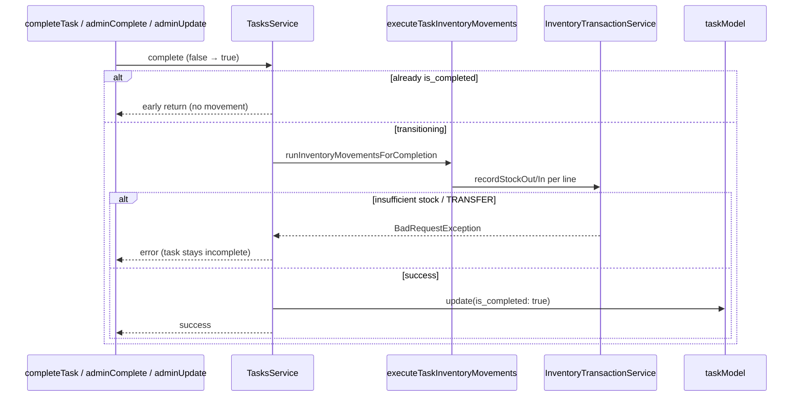

# Phase 0.3 — Task Completion → Inventory Movement — Implementation Report

## 1. Executive Summary

Phase 0.3 connects **task completion** (`is_completed: false → true`) to **`InventoryTransactionService`** for tasks with `task_inventory_lines`. A single shared helper executes all ledger writes; three completion paths call it before marking the task complete.

**Safety measures implemented:**

- Stock movement runs **before** `task.update({ is_completed: true })` — insufficient stock blocks completion.
- **Idempotency** via existing transition guards (no movement when task already complete).
- **`assignToAll` + `inventory_lines`** rejected with `BadRequestException`.
- **`TRANSFER`** lines rejected — no movement executed.
- **`reference_type: 'TASK'`** on every ledger row.

No migrations, inventory internals, WhatsApp, or notification changes.

---

## 2. Files Changed

| File | Action |
|------|--------|
| `backend/src/services/tasks/tasks.inventory.constants.ts` | **Created** |
| `backend/src/services/tasks/tasks.inventory.helper.ts` | **Created** |
| `backend/src/services/tasks/tasks.module.ts` | **Updated** — imports `InventoryModule` |
| `backend/src/services/tasks/tasks.service.ts` | **Updated** — wiring, shared caller, assignToAll guard |

---

## 3. Exact Changes Made

### `tasks.inventory.constants.ts`

- `TASK_INVENTORY_REFERENCE_TYPE = 'TASK'`
- `TASK_INVENTORY_MOVEMENT_TYPE`: `STOCK_IN`, `STOCK_OUT`, `TRANSFER`

### `tasks.inventory.helper.ts`

- `executeTaskInventoryMovements()` — loads lines by `task_id`, processes each line:
  - `STOCK_OUT` → `recordStockOut`
  - `STOCK_IN` → `recordStockIn`
  - `TRANSFER` → `BadRequestException`
  - Unknown → `BadRequestException`
- Passes `reference_type`, `reference_id`, `created_by`, `quantity` from `quantity_expected`

### `tasks.module.ts`

- `imports: [..., InventoryModule]` — one-way dependency Tasks → Inventory (same as `PurchaseRequestModule`)

### `tasks.service.ts`

- Injects `InventoryTransactionService`
- `resolveCompleterUserId(task, explicitUserId?)` — `explicitUserId` or `completed_by ?? assigned_to`
- `runInventoryMovementsForCompletion(task, completedByUserId)` — wraps helper
- **`completeTask`**: movement then `update({ is_completed, completed_by })`
- **`adminUpdate`**: when `becomesComplete`, movement then `update(patch)`
- **`adminComplete(true)`**: idempotent early return if already complete; else movement then update
- **`assignToAll`**: throws if `options.inventory_lines?.length`

---

## 4. Completion Integration Design



| Path | Caller | Completer (`created_by`) | Idempotency guard |
|------|--------|--------------------------|-------------------|
| `completeTask` | WhatsApp `/complete`, ML | `user_id` | `if (task.is_completed) return` |
| `adminComplete(true)` | `PATCH .../complete` | `completed_by ?? assigned_to` | `if (is_completed && task.is_completed) return` |
| `adminUpdate` | `PATCH ...` `{ is_completed: true }` | `completed_by ?? assigned_to` | `becomesComplete = dto true && !task.is_completed` |

**One implementation, three callers:** all invoke `runInventoryMovementsForCompletion` → `executeTaskInventoryMovements`.

---

## 5. Inventory Execution Design

| Line `movement_type` | Service call | Notes |
|--------------------|--------------|-------|
| `STOCK_OUT` | `recordStockOut` | Uses `quantity_expected` |
| `STOCK_IN` | `recordStockIn` | Uses `quantity_expected` |
| `TRANSFER` | **Rejected** | `BadRequestException` before any movement |
| (none) | No-op | Tasks without lines complete as before |

**Ledger fields (every movement):**

| Field | Value |
|-------|-------|
| `reference_type` | `'TASK'` |
| `reference_id` | `task.id` |
| `created_by` | Completer user id (see §4) |
| `factory_id` | `task.factory_id` |
| `inventory_item_id` | From line |
| `quantity` | `line.quantity_expected` |

**Insufficient stock:** `applyMovement` throws `BadRequestException`; thrown before task row is updated — **no completion, no partial task flag** (but see §8 for multi-line partial ledger risk).

---

## 6. Idempotency Strategy

**No schema changes.** Strategy uses verified **state transition guards**:

1. Movement runs only when transitioning **`is_completed: false → true`**.
2. **`completeTask`**: returns early when `task.is_completed` — no movement, no update.
3. **`adminComplete(true)`**: returns early when `task.is_completed` — no movement, no duplicate notification path on re-call.
4. **`adminUpdate`**: `becomesComplete` false when already complete — no movement.

**Result:** One logical completion → at most one execution of `executeTaskInventoryMovements` per task.

**Not implemented (out of scope):** `quantity_completed` tracking, ledger duplicate detection, outer DB transaction wrapping task + all lines.

---

## 7. assignToAll Protection

At start of `assignToAll`:

```text
BadRequestException: inventory_lines cannot be used with assign-to-all (@all).
Assign inventory tasks to one worker at a time to avoid duplicate stock movements.
```

**Rationale:** Phase 0.2 duplicated lines per batch task; N completions would consume N× stock. Phase 0.3 blocks the unsafe combination rather than splitting quantities.

---

## 8. Risks

| Risk | Severity | Mitigation / status |
|------|----------|---------------------|
| Multi-line partial success (line 1 moves, line 2 fails) | MEDIUM | Each line is separate inventory transaction; task stays incomplete; **documented** — no outer transaction |
| Task + stock not in single DB transaction | MEDIUM | Pre-existing; movement-first ordering prevents complete-without-stock on single-line failure |
| `adminComplete` does not set `completed_by` | LOW | `created_by` falls back to `assigned_to` |
| Reopen + re-complete | HIGH (future) | Out of scope — no reversal; second completion blocked if never reopened |
| Reopen then complete again | MEDIUM | Would move stock again — reopen out of scope |

---

## 9. Remaining Work

- Live integration test with Postgres (create item → task with line → complete → verify qty + ledger).
- Hindi insufficient-stock message for WhatsApp (p2 §0.5).
- Stock summary in `notifyTaskCompleted` (p2 §0.6).
- WhatsApp assign with inventory lines (p2 §0.7).
- Partial completion / `quantity_completed` updates.
- Reopen reversal policy.
- Optional outer Sequelize transaction for multi-line atomicity.

---

## NEXT IMPLEMENTATION TARGETS

1. Integration test: qty 10 → STOCK_OUT line 3 → complete → qty 7, `reference_type='TASK'`.
2. Phase 0.5 insufficient-stock Hindi UX on WhatsApp.
3. Phase 0.6 completion notification with stock summary.
4. Evaluate ledger idempotency query for defense-in-depth.
