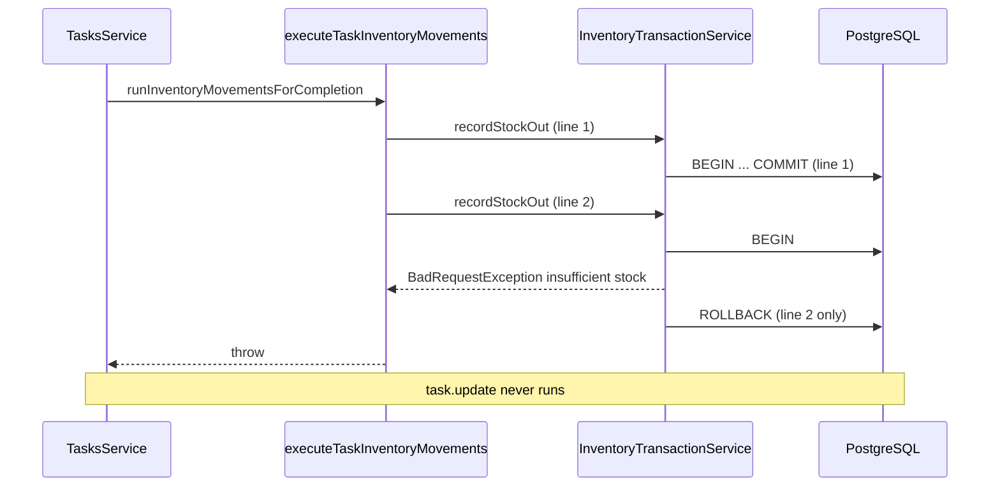

# Phase 0.4 Preparation — Inventory Safety Hardening Analysis

**Generated:** documentation-only analysis (no production code modified).  
**Prerequisite:** Phase 0.1–0.3 reports and current codebase inspection.  
**Rule:** Code-backed observations only; unknowns marked `NOT VERIFIED IN CODEBASE`.

---

## 1. Executive Summary

Phase 0.3 introduced task completion → inventory movement via a **sequential per-line loop** in `executeTaskInventoryMovements`, with each line invoking `InventoryTransactionService` methods that each open a **separate Sequelize transaction**. Task row update runs **after** all lines succeed.

**Verified safety gaps for Phase 0.4:**

| Gap | Severity |
|-----|----------|
| **Multi-line partial commit** — line 1 can commit before line 2 fails | HIGH |
| **Task update and stock not in one transaction** | HIGH |
| **`applyMovement` does not accept parent transaction** | HIGH (blocks shared atomicity without service extension) |
| **Reopen does not reverse stock**; re-complete can move stock again | HIGH |
| **No live DB integration tests** across Phases 0.1–0.3 | MEDIUM (validation gap) |

Phase 0.4 hardening scope should address **atomic multi-line completion** and **reopen policy** for inventory-linked tasks. Exact approach requires extending transaction propagation or alternative compensating patterns — **NOT VERIFIED IN CODEBASE** as chosen for 0.4 yet.

---

## 2. Multi-Line Atomicity Analysis

### 2.1 Current behavior (verified)

**File:** `tasks.inventory.helper.ts`

```typescript
for (const line of lines) {
  await params.inventoryTransactionService.recordStockOut(...) // or recordStockIn
}
```

- Lines loaded with `findAll({ where: { task_id } })` — **no explicit order** (database default).
- Each iteration awaits a **full** `recordStockOut` / `recordStockIn` call.
- Each public method calls private `applyMovement`, which runs **`repository.sequelize.transaction(...)`** — one independent transaction **per line**.

### 2.2 Transaction boundaries

| Layer | Transaction scope | Verified |
|-------|-------------------|----------|
| `TasksService.completeTask` / `adminComplete` / `adminUpdate` | **None** — grep `sequelize.transaction` under `tasks/` → no matches | Yes |
| `executeTaskInventoryMovements` | **None** — sequential awaits only | Yes |
| `InventoryTransactionService.applyMovement` | **One transaction per call** — item lock, ledger insert, quantity update | Yes |
| Task `update({ is_completed: true })` | **Separate** autocommit update after helper returns | Yes |

**Conclusion:** Multi-line completion is **not atomic**. Maximum observed boundary is **single line = single inventory transaction**.

### 2.3 Inventory service transaction propagation

**Verified:** Public methods `recordStockIn`, `recordStockOut`, `recordAdjustment` accept only `RecordStockMovementInput`. **No optional `Transaction` parameter.**

**Verified:** `InventoryRepository` methods used inside `applyMovement` **do** accept optional/required `transaction`:

- `findItemById(id, factoryId, transaction?)` — uses `lock: UPDATE` when transaction provided
- `createTransaction(data, transaction)` — requires transaction
- `updateItemQuantity(id, factoryId, qty, transaction)` — requires transaction

**Gap:** Repository supports participation in an outer transaction, but **`applyMovement` always creates its own root transaction** and does not expose propagation to callers.

### 2.4 Task + inventory in one transaction

**NOT VERIFIED IN CODEBASE** as possible today without modifying `InventoryTransactionService` (or bypassing it to call `InventoryRepository` directly from tasks — no precedent in tasks module).

**Shared Sequelize instance:** Tasks and inventory models register via same `DbService` / `SQL_MODELS` — **same database connection pool**. An outer `sequelize.transaction()` from tasks **could** wrap `task.update` and inventory writes **if** inventory layer accepted a passed transaction.

### 2.5 Nested transactions elsewhere in repository

| Location | Pattern | Inventory involved? |
|----------|---------|-------------------|
| `purchase-requests.service.ts` | `sequelize.transaction(async (t) => { ... repository ops with t })` | **No** — grep shows no `recordStock` in purchase-requests |
| `factories.service.ts` | `sequelize.transaction` | No |
| `users.service.ts` | `sequelize.transaction` | No |
| `suggestion-execution.service.ts` | Calls `recordStockIn` **without** outer transaction | Each stock in = separate inventory transaction |
| `inventory-transaction.service.ts` | Self-contained per movement | N/A |

**NOT VERIFIED IN CODEBASE:** Explicit Sequelize nested transaction / savepoint usage (passing parent `transaction` into a child `sequelize.transaction`).

**Precedent:** Parent+child atomic create uses **repository + single outer transaction** (purchase-requests), not nested service-level transactions.

---

## 3. Inventory Transaction Analysis

### 3.1 Public API

| Method | Validates qty | Calls `applyMovement` with |
|--------|---------------|----------------------------|
| `recordStockIn` | `parsePositiveQuantity` | `STOCK_IN`, `delta: +qty` |
| `recordStockOut` | `parsePositiveQuantity` | `STOCK_OUT`, `delta: -qty` |
| `recordAdjustment` | `parseSignedQuantity` | `ADJUSTMENT`, signed delta |
| `calculateQuantityFromTransactions` | N/A | Read-only sum |

### 3.2 `applyMovement` (private) — exact flow

1. **`repository.sequelize.transaction(async (transaction) => { ... })`** — creates and owns transaction.
2. `findItemById(inventory_item_id, factory_id, transaction)` with row lock.
3. Validate item exists, `is_active`.
4. Compute `next = current + delta`; throw `BadRequestException` if `next < 0`.
5. `createTransaction({ ... reference_type, reference_id, created_by ... }, transaction)`.
6. `updateItemQuantity(item.id, factory_id, formatQuantity(next), transaction)`.
7. Return mapped record; transaction commits on success.

### 3.3 Rollback behavior

- Any thrown exception inside the callback → Sequelize rolls back **that movement's** transaction.
- **Does not roll back** previously committed sibling movements from earlier loop iterations in `executeTaskInventoryMovements`.

### 3.4 Extension points (verified)

| Extension | Exists today? |
|-----------|---------------|
| Optional parent `Transaction` on public methods | **No** |
| Batch / multi-item API | **No** |
| Idempotency key / duplicate reference guard | **No** |
| `applyMovement` visibility | **Private** |

**Document execution path used by tasks:** `recordStockOut/In` → `applyMovement` → repository ops inside one transaction per line.

---

## 4. Partial Failure Analysis

### 4.1 Scenario: Line 1 success, Line 2 failure

Example: Task with two `STOCK_OUT` lines; line 2 requests more than remaining stock after line 1.



### 4.2 State after partial failure (verified logic)

| State | After line 1 OK, line 2 fails |
|-------|-------------------------------|
| **Inventory quantity** | Reduced for line 1 item only |
| **Inventory transactions** | One+ ledger row(s) for line 1 with `reference_type='TASK'`, `reference_id=task.id` |
| **Task `is_completed`** | **`false`** — `task.update` not reached |
| **Notifications** | **None** — `fireAndForget(notifyTaskCompleted)` after update only |
| **`quantity_completed` on lines** | **Unchanged** (`'0'` from create) — out of scope in 0.3 |
| **Audit trail** | Ledger rows for succeeded lines persist; task appears incomplete |

### 4.3 User-visible behavior

- **WhatsApp `completeTask`:** Exception propagates to caller — task not complete (verified order: movement before update).
- **REST `adminComplete` / `adminUpdate`:** Same — Nest HTTP error, task incomplete.

### 4.4 Retry behavior

User may retry completion. Idempotency guard requires `is_completed: false` → **movements run again** for **all** lines, including line 1 → **duplicate stock movement risk** for already-succeeded lines unless additional guards added.

**Verified:** No ledger duplicate check before movement in Phase 0.3 code.

---

## 5. Reopen Lifecycle Analysis

### 5.1 Verified reopen paths

| Entry | Service | Condition | DB writes | Notifications |
|-------|---------|-----------|-----------|---------------|
| `PATCH /tasks/:id/reopen` | `adminComplete(id, false)` | `TasksController.reopen` | `is_completed: false`, `deadline_breach_reminded_at: null` | **None** |
| `PATCH /tasks/:id` `{ is_completed: false }` | `adminUpdate` | `becomesComplete` false | `patch.is_completed = false` (+ other patch fields) | **None** on reopen |

**Verified absent:**

- WhatsApp reopen command — **NOT VERIFIED IN CODEBASE** (no `/reopen` in `intent-types.json`).
- `completeTask` reopen — method only sets complete, never false.

### 5.2 Authorization

**NOT VERIFIED IN CODEBASE:** Auth guards on `TasksController` (controller colocated in `tasks.service.ts` without `@UseGuards` in file).

### 5.3 Inventory side effects on reopen

**Verified:** `adminComplete(false)` and `adminUpdate` with `is_completed: false` **do not** call `runInventoryMovementsForCompletion` or any inventory service.

---

## 6. Reopen Risk Analysis

### 6.1 Current behavior chain (verified)

```text
Complete (false → true)
  → runInventoryMovementsForCompletion (STOCK_OUT / STOCK_IN per line)
  → task.update(is_completed: true)
  → notifyTaskCompleted (async)

Reopen (true → false)
  → task.update(is_completed: false) only
  → no inventory calls
  → no notifications
```

**Evidence:**

- `adminComplete`: movement block runs only when `is_completed` argument is **true** (`tasks.service.ts` ~1308–1310).
- Reopen branch sets `is_completed: false` only (~1313–1317).

### 6.2 Re-complete after reopen

When task reopened then completed again:

- Transition guards allow movement (`!task.is_completed` at start).
- **Full line loop runs again** — duplicate ledger entries and duplicate quantity change for same `reference_type='TASK'`, `reference_id=task.id`.

**Verified:** No reversal on reopen; no idempotency via ledger lookup.

### 6.3 Corruption scenario

```text
Complete → stock out 5
Reopen → stock still reduced by 5, task open
Complete again → stock out 5 again (total -10 for one task)
```

**Risk level:** HIGH for inventory-linked tasks.

---

## 7. Inventory-Linked Task Policy Evaluation

Evaluation uses **code evidence only** — not product preference.

### Option A — Inventory-linked tasks cannot be reopened

| Criterion | Evidence |
|-----------|----------|
| **Code complexity** | LOW–MEDIUM — add guard in `adminComplete(false)` and `adminUpdate` when `is_completed: false` and `task_inventory_lines` exist |
| **Existing patterns** | **No** task reopen restriction in codebase today |
| **Infrastructure** | Can query `taskInventoryLineModel.count({ task_id })` — model exists (Phase 0.1) |
| **Implementation impact** | Tasks service only; no inventory service change |
| **Gaps** | Does not fix partial multi-line state; prevents reopen corruption only |

### Option B — Reopen triggers reversal movement

| Criterion | Evidence |
|-----------|----------|
| **Code complexity** | MEDIUM–HIGH — new helper: inverse `STOCK_OUT`→`recordStockIn`, `STOCK_IN`→`recordStockOut`; same TASK reference or new reference **NOT VERIFIED IN CODEBASE** |
| **Existing patterns** | `recordStockIn`/`recordStockOut` public APIs exist; **no** reversal pattern in tasks or purchase-requests |
| **Infrastructure** | Same `InventoryTransactionService`; no migration required |
| **Implementation impact** | Tasks helper + reopen paths; multi-line atomicity still separate issue |
| **Gaps** | Double reopen / double reversal risks; partial completion not tracked (`quantity_completed` always 0) |

### Option C — Approval workflow required

| Criterion | Evidence |
|-----------|----------|
| **Code complexity** | HIGH |
| **Existing patterns** | `ApprovalRequest` used in purchase-requests module; **grep: zero** approval references under `tasks/` |
| **Infrastructure** | Workflow has `suggestion-approval.handler` for **documents**, not tasks |
| **Implementation impact** | New task↔approval integration, likely workflow + REST + WhatsApp |
| **Gaps** | Largest scope; no task approval precedent |

### Summary table

| Option | Complexity | Pattern match in repo | Files likely touched | Partial-failure fix? |
|--------|------------|----------------------|----------------------|----------------------|
| A — Block reopen | LOW–MEDIUM | No reopen guard precedent | `tasks.service.ts` | No |
| B — Reversal | MEDIUM–HIGH | Inventory APIs only | `tasks.service.ts`, helper | No |
| C — Approval | HIGH | PR approvals, not tasks | tasks + workflow + approvals | No |

**NOT VERIFIED IN CODEBASE:** Product selection among A/B/C. Multi-line atomicity is a **separate** hardening concern from reopen policy.

---

## 8. Live Validation Gap Analysis

Consolidated **NOT VERIFIED** items from Phases 0.1–0.3 reports (Postgres/runtime unavailable):

### Phase 0.1

| Item | Status |
|------|--------|
| Migration apply (`yarn migrate`) | NOT VERIFIED |
| Runtime boot with DB | NOT VERIFIED |
| `GET /health/migrations` | NOT VERIFIED |

### Phase 0.2

| Item | Status |
|------|--------|
| Live DB insert of `task_inventory_lines` | NOT VERIFIED |
| `POST /tasks` with lines → `GET /tasks/:id` | NOT VERIFIED |
| `adminRemove` deletes lines in DB | NOT VERIFIED |

### Phase 0.3

| Item | Status |
|------|--------|
| End-to-end complete → stock qty change | NOT VERIFIED |
| Insufficient stock leaves task incomplete in DB | NOT VERIFIED |
| Ledger `reference_type='TASK'` row | NOT VERIFIED |
| Duplicate completion → no duplicate movement (runtime) | NOT VERIFIED |
| `assignToAll` + lines rejection (runtime API) | NOT VERIFIED |
| TRANSFER rejection (runtime) | NOT VERIFIED |
| WhatsApp complete with stock error UX | NOT VERIFIED |

### Analysis / environment

| Item | Status |
|------|--------|
| REST task endpoint auth guards | NOT VERIFIED IN CODEBASE |
| Concurrent completion race | NOT VERIFIED |
| Multi-line partial failure (runtime) | NOT VERIFIED |

**Common cause:** `ECONNREFUSED :5432` documented in Phase 0.1/0.2 validation reports.

---

## 9. Phase 0.4 Readiness Assessment

### 9.1 Files that must change (expected)

| File | Reason | Risk |
|------|--------|------|
| `tasks.inventory.helper.ts` | Multi-line atomicity / failure handling | **HIGH** |
| `tasks.service.ts` | Reopen policy guards or reversal hooks; possibly outer transaction | **HIGH** |

### 9.2 Files that may change

| File | Reason | Risk |
|------|--------|------|
| `inventory-transaction.service.ts` | Optional `Transaction` param for propagation | **HIGH** — inventory internals |
| `inventory.repository.ts` | Already supports `transaction`; may need new batch helper | **MEDIUM** |
| `tasks.inventory.constants.ts` | Reopen / reversal reference types | **LOW** |
| Integration tests (new) | Close live validation gaps | **MEDIUM** |

### 9.3 Files that should not change (minimal hardening)

| File | Reason |
|------|--------|
| `backend/migrations/*` | No schema change required for atomicity/reopen policy if using transactions only |
| `backend/modules/whatsapp/*` | Behavior via `TasksService` |
| `inventory.schema.ts` | Unless unique constraint on TASK references desired — **NOT VERIFIED IN CODEBASE** as planned |

### 9.4 Suggested Phase 0.4 scope boundaries (evidence-based)

1. **Multi-line all-or-nothing** — requires transaction propagation or compensating rollback on failure.
2. **Reopen policy** — pick A, B, or C (product); code impact differs (§7).
3. **Live integration test suite** — resolve consolidated NOT VERIFIED list.
4. **Optional:** ledger idempotency check for `reference_type='TASK'` + `task.id` + line — **would need migration or query convention** — **NOT VERIFIED IN CODEBASE**.

---

## 10. Risks & Unknowns

| Risk | Level |
|------|-------|
| Partial multi-line commit | HIGH |
| Re-complete after partial failure duplicates movement | HIGH |
| Reopen + re-complete double consumption | HIGH |
| Extending inventory service for propagation | MEDIUM (coupling) |
| No runtime proof of 0.3 correctness | MEDIUM |

**Unknowns:** Product policy for reopen; whether 0.4 may modify `inventory-transaction.service.ts`; whether unique TASK reference constraint is desired.

---

## NEXT IMPLEMENTATION TARGETS

1. Decide reopen policy (A/B/C) before coding.
2. Spike: outer `sequelize.transaction` from tasks + optional `Transaction` on `recordStockOut/In`.
3. Integration test: multi-line task, fail line 2, assert line 1 rollback or task state.
4. Integration test: reopen + re-complete documents current duplicate risk.
5. Run full NOT VERIFIED checklist when Postgres available.
