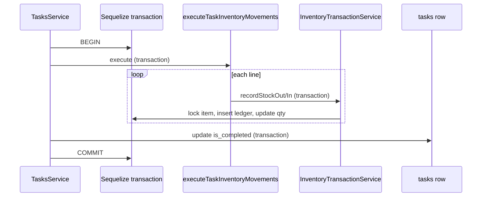

# Phase 0.4 — Inventory Safety Hardening — Implementation Report

## 1. Executive Summary

Phase 0.4 hardens inventory integrity for task completion:

1. **Atomic multi-line movement** — all `task_inventory_lines` share one Sequelize transaction.
2. **Atomic completion** — inventory movements and `tasks.is_completed` update commit or roll back together when lines exist.
3. **Reopen protection** — tasks with inventory lines cannot be reopened via REST.

Implementation extends `InventoryTransactionService` with optional parent `Transaction` propagation (minimal change). No migrations, schema, DTO, or notification changes.

---

## 2. Files Changed

| File | Action |
|------|--------|
| `backend/src/services/inventory/inventory-transaction.service.ts` | Optional `transaction` on public methods; `applyMovement` participates in parent tx |
| `backend/src/services/tasks/tasks.inventory.helper.ts` | Passes `transaction` to each movement; loads lines inside outer tx |
| `backend/src/services/tasks/tasks.service.ts` | `completeTaskWithAtomicInventory`, reopen guards |

**Not modified:** `inventory.repository.ts` (already supported `transaction` on repository ops).

---

## 3. Exact Changes Made

### `inventory-transaction.service.ts`

- `recordStockIn`, `recordStockOut`, `recordAdjustment` accept optional second arg `transaction?: Transaction`.
- `applyMovement(params, parentTransaction?)`:
  - If `parentTransaction` provided → run movement logic **inside parent** (no nested `sequelize.transaction`).
  - If omitted → existing behavior (`repository.sequelize.transaction(run)`).

### `tasks.inventory.helper.ts`

- `ExecuteTaskInventoryMovementsParams.transaction?: Transaction`.
- `findAll` uses `{ transaction }` when provided.
- Each `recordStockOut` / `recordStockIn` receives `params.transaction`.
- Lines ordered by `id ASC` for deterministic processing.

### `tasks.service.ts`

- **`taskHasInventoryLines(taskId)`** — count check.
- **`assertInventoryLinkedTaskCanReopen(task)`** — `BadRequestException` when lines exist.
- **`completeTaskWithAtomicInventory(task, completedByUserId, patch)`**:
  - No lines → `task.update({ ...patch, is_completed: true })` (unchanged path).
  - Has lines → `sequelize.transaction`: movements + `task.update(..., { transaction })`.
- **`completeTask`**, **`adminComplete(true)`**, **`adminUpdate` (`becomesComplete`)** → call `completeTaskWithAtomicInventory`.
- **Reopen:** `adminComplete(false)` when currently complete; `adminUpdate` when `becomesReopen` → `assertInventoryLinkedTaskCanReopen`.

Removed **`runInventoryMovementsForCompletion`** (replaced by atomic helper).

---

## 4. Completion Integration Design

All three completion paths converge on **`completeTaskWithAtomicInventory`**.

| Path | Reopen guard | Completion method |
|------|--------------|-------------------|
| `completeTask` | N/A | `completeTaskWithAtomicInventory` |
| `adminComplete(true)` | N/A | Same |
| `adminUpdate` `becomesComplete` | N/A | Same |
| `adminComplete(false)` | Yes | `task.update` only |
| `adminUpdate` `becomesReopen` | Yes | `task.update` only |

---

## 5. Inventory Execution Design

### Transaction boundaries (inventory-linked task)



### Success path

```text
BEGIN
  → movement line 1..N (shared transaction)
  → task.update(is_completed: true, ...)
COMMIT
→ notifyTaskCompleted (after commit, async)
```

### Failure path (e.g. insufficient stock on line 2)

```text
BEGIN
  → movement line 1 (uncommitted in outer tx)
  → movement line 2 throws BadRequestException
ROLLBACK (entire outer transaction)
  → line 1 ledger + qty changes undone
  → task remains is_completed = false
```

### Rollback path

Sequelize automatic rollback on any thrown error inside `sequelize.transaction` callback. No manual compensating transactions.

### Task without inventory lines

```text
task.update(is_completed: true)  // no outer transaction (unchanged)
```

---

## 6. Idempotency Strategy

Unchanged from Phase 0.3 — transition guards only:

- `completeTask`: early return if already complete.
- `adminComplete(true)`: early return if already complete.
- `adminUpdate`: `becomesComplete` only when `!task.is_completed`.

Atomic transaction does not change idempotency semantics.

---

## 7. assignToAll Protection

**Unchanged from Phase 0.3** — `assignToAll` rejects `inventory_lines` at method entry.

---

## 8. Risks

| Risk | Status |
|------|--------|
| Partial multi-line commit | **Mitigated** — single outer transaction |
| Task complete / stock split | **Mitigated** when lines exist |
| Reopen double-consumption | **Mitigated** — reopen blocked |
| Notification after failed tx | **Unchanged** — notify only after successful update |
| Tasks without lines | **Low risk** — no transaction wrapper (same as pre-0.4) |

---

## 9. Remaining Work

- Live Postgres integration tests (Phases 0.1–0.3 NOT VERIFIED items).
- Hindi insufficient-stock UX (p2 §0.5).
- Reversal policy if product changes from block-reopen.
- Optional ledger idempotency unique constraint (would need migration — out of scope).

---

## NEXT IMPLEMENTATION TARGETS

1. Integration test: 2-line task, fail line 2, assert zero net stock change and task incomplete.
2. Integration test: reopen inventory-linked task → 400.
3. Run consolidated NOT VERIFIED checklist with Docker Postgres.
