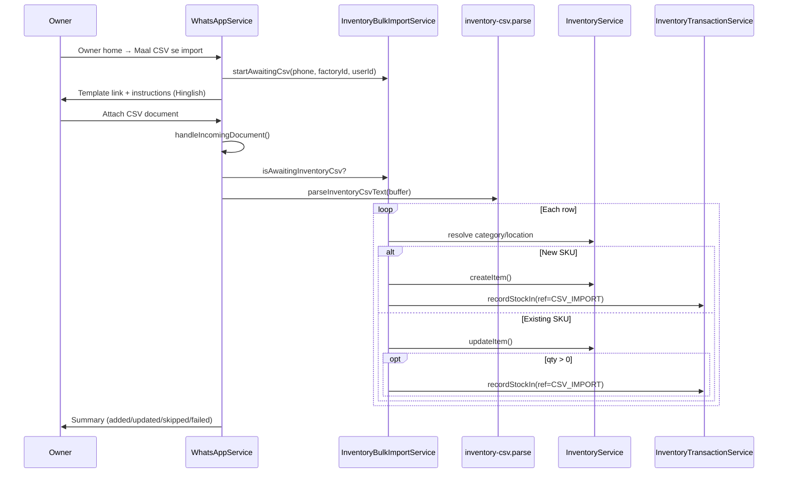
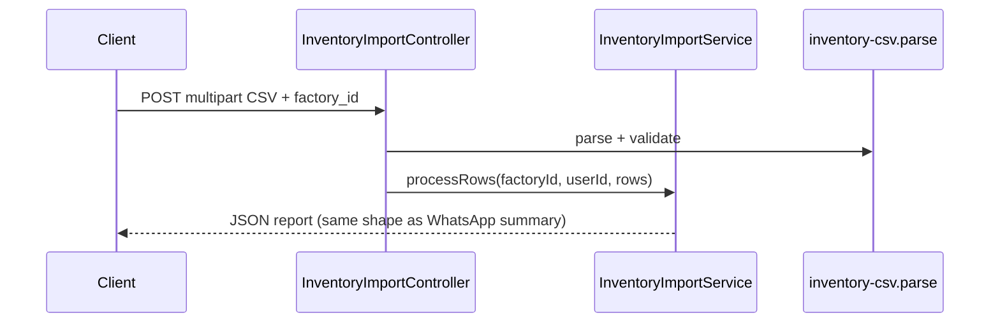

# Phase 1.0 — CSV Import Mapping

**Run date:** 2026-06-06  
**Scope:** Workflow and component mapping — no implementation

---

## 1. Import Workflow

### WhatsApp path (primary — P2)



### REST path (Phase 1.1 — admin / internal)



REST enables testing without OLLI; WhatsApp reuses same `processRows()` core.

---

## 2. Validation Workflow

```text
1. File gate
   ├─ Extension .csv (WhatsApp: .txt allowed like team)
   ├─ Size ≤ 2 MB
   └─ Row count ≤ 200

2. Parse gate
   ├─ UTF-8 + BOM strip
   ├─ Header row matches INVENTORY_CSV_HEADERS
   └─ ≥ 1 data row

3. Pre-scan gate
   └─ Duplicate SKU within file → fail affected rows at import time

4. Per-row gate
   ├─ sku, name, category, location, unit required (non-empty)
   ├─ quantity: parse as non-negative number (0 allowed = metadata-only update)
   ├─ reorder_threshold: optional, parseNonNegativeThreshold
   ├─ category: findCategoryByName OR create (policy TBD in 1.2)
   ├─ location: findLocationByName OR create
   └─ sku: normalizeSku

5. Persist gate
   ├─ New: createItem (ConflictException → treat as existing for upsert)
   └─ Stock: parsePositiveQuantity if qty > 0 for recordStockIn
```

**Reuse:**

- `parseTeamCsvText` pattern for CSV mechanics (`parseCsvLine`, header normalize)
- `inventory.validation.ts` for field rules
- `resolveNamedSelection` or repository `findCategoryByName` / `findLocationByName`

---

## 3. Data Flow

```text
CSV row
  sku ──────────────→ normalizeSku() ──→ upsert key
  name ─────────────→ normalizeInventoryName()
  unit ─────────────→ normalizeUnit()
  category ─────────→ category_id (lookup/create)
  location ─────────→ location_id (lookup/create)
  quantity ─────────→ recordStockIn (if > 0)
  reorder_threshold → item.reorder_threshold (optional)

                    inventory_items (metadata)
                           ↑
                    createItem / updateItem
                           ↑
                    current_quantity
                           ↑
              InventoryTransactionService.recordStockIn
              reference_type: CSV_IMPORT
              reference_id: importBatchId
              created_by: ownerUserId
```

**Not in CSV import path:**

- `task_inventory_lines` — only created via task assign/API
- `recordStockOut` / `recordAdjustment` — not used on import

**Downstream (Phase 0 — unchanged):**

```text
Imported item (SKU)
  → /assign_delivery
  → task_inventory_lines (STOCK_OUT)
  → completeTask
  → recordStockOut (reference_type: TASK)
```

---

## 4. Error Handling

| Stage | Error | User-facing (Hinglish) |
|-------|-------|------------------------|
| No pending session | Import without starting flow | Pehle *Maal CSV se import* chuno |
| Wrong file type | .xlsx uploaded | Sirf *.csv* — Excel se "Save as CSV" |
| File too large | > 2 MB | File bahut badi |
| Bad headers | Missing columns | Galat CSV format. Columns: sku, name, ... |
| Empty file | No rows | File khali hai |
| Row: missing SKU | Validation | Line N: SKU chahiye |
| Row: duplicate SKU in file | Pre-scan | Line N: SKU duplicate (pehle line X) |
| Row: category not found | Lookup | Line N: Category "X" nahi mila |
| Row: DB conflict | Rare race | Line N: SKU conflict — dubara try karein |
| OLLI send fail | DEF-ACC-001 | Import complete but summary send fail — log warn |

**Row result model** (extend team pattern):

```typescript
type InventoryImportRowResult = {
  line: number;
  sku: string;
  status: 'added' | 'updated' | 'skipped' | 'failed';
  detail: string;
};
```

---

## 5. Rollback Strategy

**Recommended: no cross-row rollback (partial success).**

| Scope | Behavior |
|-------|----------|
| Single row | Sequelize transaction wrapping createItem + recordStockIn for that row |
| Row failure | Roll back that row only; continue to next |
| Entire file | No global transaction |

**Rationale:** Matches `TeamBulkImportService.importOneRow()` try/catch per row. Owner gets usable partial import + error list.

**Audit:** Each successful `recordStockIn` retains `reference_type: CSV_IMPORT` and shared `reference_id` (batch) for traceability and optional future reversal (out of scope v1).

---

## 6. Required Components

| Component | Responsibility | New? |
|-----------|----------------|------|
| `inventory-csv.constants.ts` | Headers, limits, template URL | **New** |
| `inventory-csv.parse.ts` | Parse + validate structure | **New** |
| `inventory-csv.parse.spec.ts` | Parser unit tests | **New** |
| `inventory-bulk-import.service.ts` | Pending state, processRows, summary | **New** |
| `inventory-import.service.ts` | Shared import orchestration (REST + WA) | **New** (optional split) |
| `InventoryImportController` or extend `InventoryController` | REST upload endpoint | **New** |
| `whatsapp.service.ts` | Branch `handleIncomingDocument` for inventory CSV | **Modify** |
| `owner-home.service.ts` | New interactive action *Maal CSV se import* | **Modify** |
| `whatsapp-interactive.constants.ts` | `HOME_INVENTORY_CSV` id | **Modify** |
| `inventory.constants.ts` | `CSV_IMPORT` reference type | **Modify** |
| `web/public/inventory-import/munshi-inventory-template.csv` | Static template | **New** |
| `.env.example` | `MUNSHI_INVENTORY_CSV_TEMPLATE_URL` | **Modify** |

**Reuse unchanged:**

- `InventoryService.createItem`, `updateItem`
- `InventoryTransactionService.recordStockIn`
- `InventoryRepository.findCategoryByName`, `findLocationByName`, `findItemBySku`
- `OlliMediaService.downloadMedia`
- `inventory.validation.ts`

---

## 7. Expected Files To Change

### Backend — new files

```
backend/src/modules/whatsapp/inventory-csv.constants.ts
backend/src/modules/whatsapp/inventory-csv.parse.ts
backend/src/modules/whatsapp/inventory-csv.parse.spec.ts
backend/src/modules/whatsapp/inventory-bulk-import.service.ts
backend/src/services/inventory/inventory-import.service.ts   (optional)
backend/src/services/inventory/inventory-import.controller.ts (or endpoint on inventory.controller)
backend/test/integration/inventory-csv-import.integration.spec.ts  (Phase 1.5)
```

### Backend — modify

```
backend/src/modules/whatsapp/whatsapp.module.ts          (register provider)
backend/src/modules/whatsapp/whatsapp.service.ts         (document branch)
backend/src/modules/whatsapp/owner-home.service.ts       (menu action)
backend/src/core/messaging/whatsapp-interactive.constants.ts
backend/src/core/messaging/owner-home-outbound.ts        (button copy)
backend/src/services/inventory/inventory.constants.ts    (CSV_IMPORT)
backend/package.json                                     (test:integration script if new suite)
```

### Web — new

```
web/public/inventory-import/munshi-inventory-template.csv
```

### Docs / CI

```
docs/p2-inventory-task-integrations.md                   (checkboxes when done)
.github/workflows/inventory-integration.yml                (optional CSV tests)
```

### Explicitly out of scope (Phase 1.0 analysis)

- Migrations (none required — existing tables sufficient)
- `InventoryRepository` / `InventoryTransactionService` internals
- ML parser changes
- Zoho integration
- `task_inventory_lines` schema

---

## Cross-reference: existing import flows

| Flow | Create pattern | Qty pattern | Partial success |
|------|----------------|-------------|-----------------|
| Team CSV | `onboardWorker` / assign | N/A | Yes |
| Inventory workflow | `createItem` | Manual stock-in later | N/A (single item) |
| Document suggestion | `createItem` | `recordStockIn` | No (throws on row) |
| **Phase 1 CSV** | Upsert by SKU | `recordStockIn` CSV_IMPORT | **Yes** |

Phase 1 CSV should align closest to **Team CSV** (UX) + **Document suggestion** (inventory APIs).
