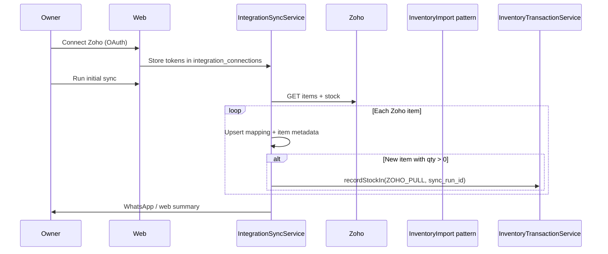
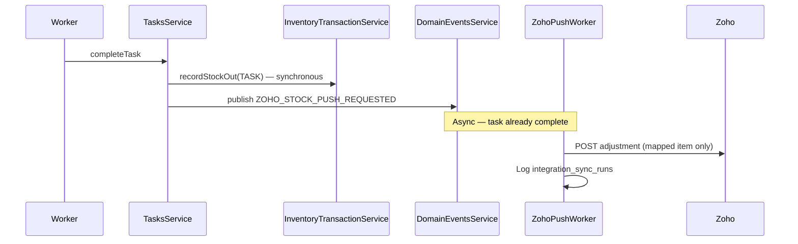

# Phase 2.0 — Zoho Entity Mapping & Data Flows

**Run date:** 2026-06-06  
**Scope:** Mapping document — no implementation

---

## 1. Entity Mapping

### 1.1 Zoho Inventory → Munshi

| Zoho field (typical) | Munshi entity | Mapping rule |
|---------------------|---------------|--------------|
| `item_id` | `integration_item_mappings.external_id` | Stable join key |
| `sku` / `item_name` | `inventory_items.sku` | `normalizeSku()`; conflict → mapping row + skip or merge policy |
| `name` | `inventory_items.name` | `normalizeInventoryName()` |
| `unit` | `inventory_items.unit` | `normalizeUnit()` |
| `category_name` | `inventory_categories.name` | Resolve via `findCategoryByName`; fail row or auto-create (policy TBD) |
| `warehouse / location` | `inventory_locations.name` | Resolve via `findLocationByName` |
| `available_stock` / `stock_on_hand` | Ledger | **Never SET** `current_quantity`; bootstrap via `recordStockIn(ZOHO_PULL)` |
| `reorder_level` | `inventory_items.reorder_threshold` | Optional metadata on upsert |

### 1.2 Munshi → Zoho (push)

| Munshi source | Zoho API (conceptual) | Trigger |
|---------------|----------------------|---------|
| `inventory_transactions` STOCK_OUT | Inventory adjustment / shipment API | Task complete |
| `inventory_transactions` STOCK_IN | Purchase / adjustment in | CSV import, Zoho pull bootstrap |
| `inventory_item_id` | Via `integration_item_mappings.external_id` | Required — skip push if unmapped |

### 1.3 Integration tables (P2 proposed)

#### `integration_connections`

| Column | Purpose |
|--------|---------|
| `id` | PK |
| `factory_id` | Tenant scope (FK, indexed) |
| `provider` | `zoho_inventory` \| `zoho_books` \| `csv` (legacy marker) |
| `status` | `active` \| `disconnected` \| `error` |
| `access_token` | Encrypted at rest (Phase 2.2) |
| `refresh_token` | Encrypted at rest |
| `expires_at` | Token refresh scheduling |
| `metadata` | JSONB — org_id, dc, account_email |
| `created_at`, `updated_at` | Audit |

**Indexes:** `(factory_id, provider)` unique where status=active.

#### `integration_item_mappings`

| Column | Purpose |
|--------|---------|
| `id` | PK |
| `connection_id` | FK → connections |
| `factory_id` | Denormalized scope for queries |
| `external_id` | Zoho item_id |
| `external_sku` | Zoho SKU snapshot |
| `inventory_item_id` | FK → inventory_items |
| `last_synced_at` | Pull metadata |
| `sync_status` | `ok` \| `conflict` \| `unmapped` |

**Indexes:** `(connection_id, external_id)` unique; `(factory_id, inventory_item_id)`.

#### `integration_sync_runs`

| Column | Purpose |
|--------|---------|
| `id` | PK |
| `connection_id` | FK |
| `factory_id` | Scope |
| `direction` | `pull` \| `push` |
| `trigger` | `manual` \| `cron` \| `task_complete` \| `csv_import` |
| `status` | `running` \| `completed` \| `failed` \| `partial` |
| `items_processed` | Count |
| `error_summary` | Text / JSONB |
| `started_at`, `finished_at` | Duration audit |

**Retention:** Keep 90 days online; archive older (ops policy).

---

## 2. Data Flows

### 2.A Initial sync (pull)



### 2.B Task completion → push



### 2.C CSV + Zoho coexistence

```text
CSV Import                    Zoho Pull (initial)
     │                              │
     ▼                              ▼
processImport(CSV_IMPORT)    ZohoSyncService.pull()
     │                              │
     ├─ Upsert by (factory_id, sku) ┤  ← SAME KEY
     │                              │
     ▼                              ▼
recordStockIn (additive)     recordStockIn (additive, ZOHO_PULL)
```

**Ownership rules:**

| Scenario | Rule |
|----------|------|
| SKU exists from CSV, Zoho pull same SKU | **Update metadata** via upsert; qty **additive** only with explicit sync_run reference |
| SKU only in Zoho | Create item + mapping + bootstrap STOCK_IN |
| SKU only in CSV | Unchanged; mapping row absent until Zoho item matched manually or by SKU |
| Task STOCK_OUT after Zoho bootstrap | Munshi ledger authoritative; async push to Zoho |
| Zoho pull after task moved stock | Pull must **not** reset Munshi qty to Zoho snapshot |

---

## 3. Ownership Boundaries

| Data | Owner (v1) | External mirror |
|------|------------|-----------------|
| On-hand qty (operations) | Munshi ledger | Zoho (eventual) |
| Item master (name, unit) | Munshi; refreshed from Zoho on pull | Zoho is catalog source for connected factories |
| Category/location names | Munshi masters | Zoho names mapped at import time |
| Task delivery movements | Munshi only | Push copy |
| CSV import batches | Munshi `CSV_IMPORT` refs | No auto Zoho push unless configured |

---

## 4. Sync Flows

| Flow | Direction | Frequency | Idempotency key |
|------|-----------|-----------|-----------------|
| Initial pull | Zoho → Munshi | Once per connect | `(connection_id, external_id)` |
| Nightly pull | Zoho → Munshi | Cron (2.4) | `sync_run_id` + item version |
| Task stock-out push | Munshi → Zoho | On complete | `(connection_id, inventory_transaction_id)` |
| CSV import | File → Munshi | User-triggered | `batchId` (existing) |
| Manual resync | Zoho → Munshi | Owner action | New `sync_run_id` |

---

## 5. Failure Scenarios

| Scenario | Expected behavior |
|----------|-------------------|
| OAuth token expired mid-pull | Refresh token; retry run; mark sync_run failed if refresh fails |
| Zoho item deleted | Mapping → `unmapped`; skip push; optional WhatsApp alert |
| Unmapped Munshi item task complete | Ledger write succeeds; push skipped (log warning) |
| Zoho API 429 rate limit | Backoff + retry via domain event attempts |
| Pull qty >> Munshi after ops | **Do not overwrite** — log divergence; owner dashboard later |
| Duplicate SKU in Zoho | Fail row; report in sync_run summary |
| Factory has no categories | Pull rows fail until masters seeded (same as CSV) |
| Connection disconnected | Cron skips; push queue drains with failed status |
| Push succeeds, Munshi already rolled back | Impossible if push is post-commit only |

---

## 6. Security & audit

- Tokens: encrypt before DB write; never log raw tokens.
- OAuth callback: validate `state` param binds to `factory_id` + user session.
- All sync runs logged with `factory_id`, `connection_id`, counts, errors.
- Owner-only connect/disconnect; workers never see tokens.
