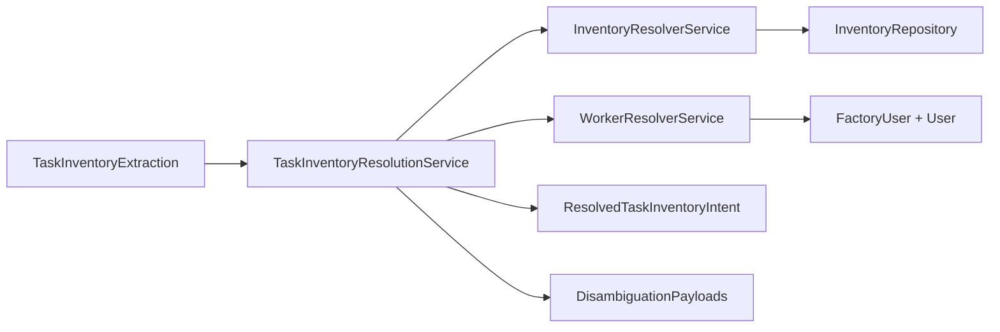

# Phase 4.2 — Resolver Design

**Version:** 1.0  
**Run date:** 2026-06-06

---

## Architecture



---

## Inventory Resolver

**Service:** `InventoryResolverService`  
**Input:** `factory_id`, `item_name_or_sku` hint  
**Output:** `InventoryMatchResult`

### Resolution order

1. Exact SKU (case-sensitive)
2. Case-insensitive SKU (`Op.iLike`)
3. Exact name (`findItemByName` / iLike)
4. Partial substring match on name or SKU (all active items)
5. Fuzzy match (Levenshtein ratio ≥ 0.72)

### Status rules

| Status | Condition |
|--------|-----------|
| `resolved` | Single confident match |
| `ambiguous` | Multiple partial matches, or fuzzy top scores too close |
| `not_found` | Null/empty hint or no match |

### Fuzzy tie-break

Auto-resolve fuzzy only when `top.score - second.score >= 0.08`.

---

## Worker Resolver

**Service:** `WorkerResolverService`  
**Input:** `factory_id`, `assignee_hint`  
**Output:** `WorkerMatchResult`

### Scope

Factory members with role **WORKER** or **MANAGER** (assignable for delivery/issue tasks).

### Resolution order

1. Exact full name (case-insensitive)
2. Exact first/last token match (`Ram` in `Ram Kumar`)
3. Partial substring / token prefix (hint length ≥ 2)
4. Fuzzy full name + fuzzy token match

---

## Aggregator

**Service:** `TaskInventoryResolutionService`

```typescript
interface ResolvedTaskInventoryIntent {
  task_kind: TaskKind | null;
  quantity: number | null;
  inventory: InventoryMatchResult;
  worker: WorkerMatchResult;
  disambiguation: DisambiguationPayload[];
}
```

Passes through `task_kind` and `quantity` from extraction unchanged. Does **not** create tasks.

---

## Disambiguation Payloads (Models Only)

### Inventory ambiguity

```json
{
  "type": "inventory_disambiguation",
  "candidates": ["Cement 50kg", "Cement Premium", "White Cement"]
}
```

### Worker ambiguity

```json
{
  "type": "worker_disambiguation",
  "candidates": ["Ram Kumar", "Ram Singh"]
}
```

Generated by `disambiguation.util.ts` when resolver status is `ambiguous`.

---

## API Endpoint (Testing)

```
POST /resolve/task-inventory
```

**Request:**

```json
{
  "factory_id": 1,
  "extraction": {
    "item_name_or_sku": "cement",
    "quantity": 20,
    "assignee_hint": "Ram",
    "task_kind": "delivery"
  }
}
```

**Response:** `ResolvedTaskInventoryIntent`

No WhatsApp or workflow integration.

---

## Module Layout

```
backend/src/services/task-inventory-resolution/
  inventory-resolver.service.ts
  worker-resolver.service.ts
  task-inventory-resolution.service.ts
  task-inventory-resolution.controller.ts
  task-inventory-resolution.module.ts
  disambiguation.util.ts
  fuzzy-match.util.ts
  task-inventory-resolution.interfaces.ts
```

---

*End of design.*
