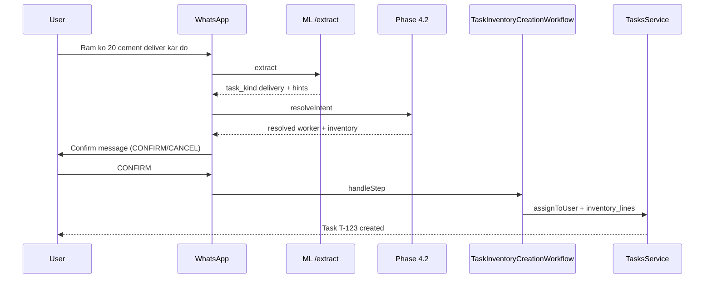

# Phase 4.3 — Workflow Design

**Run date:** 2026-06-07

---

## End-to-End Flow



---

## Workflow States

| Step | Meaning |
|------|---------|
| `WAITING_INVENTORY_SELECTION` | User picks from numbered inventory list |
| `WAITING_WORKER_SELECTION` | User picks from numbered worker list |
| `WAITING_CONFIRMATION` | User must CONFIRM before task create |
| `COMPLETED` / `CANCELLED` | Terminal (session completed/cancelled) |

---

## Confirmation Replies

| Action | Accepted inputs |
|--------|-----------------|
| Confirm | `CONFIRM`, `YES`, `1`, `haan`, `ok`, … |
| Cancel | `CANCEL`, `NO`, `2`, `nahi`, … |

---

## Disambiguation Payloads (UI text)

**Inventory:**

```
I found multiple inventory items:
1. Cement 50kg
2. Cement Premium
Reply with a number.
```

**Worker:**

```
I found multiple workers:
1. Ram Kumar
2. Ram Singh
Reply with a number.
```

---

## Task Creation (Phase 0 path)

On CONFIRM, `TaskInventoryCreationService` calls `TasksService.assignToUser` with:

- Same `[DELIVERY]` / `[ISSUE]` description format as `/assign_delivery`
- `inventory_lines` with `STOCK_OUT` movement type
- Standard assignee notifications

`inventory_count` tasks use generic description (no inventory lines); default assignee is requester when no worker hint.

---

## Module Layout

| Component | Location |
|-----------|----------|
| NL orchestrator | `task-inventory-nl.orchestrator.ts` |
| Confirmation builder | `task-inventory-confirmation.service.ts` |
| Task create adapter | `task-inventory-creation.service.ts` |
| Workflow handler | `workflow/handlers/task-inventory-creation.handler.ts` |
| WhatsApp entry | `whatsapp.service.ts` (non-slash path) |

---

*End of design.*
