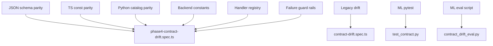

# Phase 4.4 — Test Design

**Run date:** 2026-06-07

---

## Test Layers



---

## Backend — `phase4-contract-drift.spec.ts`

| Suite | Tests | Purpose |
|-------|-------|---------|
| TaskInventoryExtraction — JSON | 4 | Backend/ML schema identity, required fields, enum vs catalog |
| TaskInventoryExtraction — TS | 3 | `TASK_KINDS` parity across repos and JSON |
| TaskInventoryExtraction — Python | 3 | models.py identity, Literal vs catalog, `TASK_KINDS` loader |
| TaskInventoryResolution | 6 | Request/response schema vs DTOs and interfaces |
| Task kinds governance | 3 | Catalog parity, version, orchestrator import |
| Workflow types | 6 | JSON parity, constants, handlers, TASK_INVENTORY_CREATION |
| Failure simulation | 7 | Guard rails for field removal, enum drift, workflow drift |

**Total new tests:** 32

---

## Backend — `contract-drift.spec.ts` (extended)

| Test | Purpose |
|------|---------|
| Existing 7 tests | Document, suggestion, workflow, intent, extraction schemas |
| **Added:** `TASK_INVENTORY_CREATION` start command | Workflow command registration |

---

## Helpers — `contract-drift.helpers.ts`

| Function | Purpose |
|----------|---------|
| `readContractJson` | Load backend or ML contract file |
| `schemaRequiredFields` | Extract sorted required keys |
| `enumValuesWithoutNull` | Compare task_kind enums |
| `extractTsConstArray` | Parse `as const` arrays from TS source |
| `extractPythonLiteralEnum` | Parse Pydantic Literal values |

---

## ML — `tests/test_contract.py`

| Test | Purpose |
|------|---------|
| `test_task_kinds_loaded_from_catalog` | Python `TASK_KINDS` matches JSON |
| `test_task_inventory_task_kind_values_in_catalog` | All Literal values in catalog |

---

## ML — `eval/contract_drift_eval.py`

| Section | Purpose |
|---------|---------|
| `_check_task_inventory_contracts` | Schema enum vs `task-kinds.json` |
| `_check_suggestion_and_workflow_enums` | Now requires `TASK_INVENTORY_CREATION` |

---

## Failure Simulation Design

Guard-rail tests assert **current canonical values**. Any contract change that removes/renames fields or enums will fail the suite without needing mock corruption:

| Simulated failure | Detected by |
|-------------------|-------------|
| Field removed from extraction schema | `schemaRequiredFields` assertion |
| `task_kind` enum shrink | Enum vs catalog test |
| Workflow type removed | `workflow-types.json` contains check |
| Start command drift | `start_commands.TASK_INVENTORY_CREATION` |
| Resolution shape change | Response required fields test |
| Backend/ML catalog split | Deep equality on `task-kinds.json` |
| ML TS workflow drift | `WORKFLOW_TYPES` contains check |

---

## Execution Commands

```bash
# Backend Phase 4 drift + legacy
cd backend
npm test -- --testPathPattern="contract-drift|phase4-contract" --runInBand

# Full Phase 4 suite
npm test -- --testPathPattern="contract-drift|phase4-contract|task-inventory" --runInBand

# ML contract tests
cd ml
python -m pytest tests/test_contract.py -q

# ML drift eval (requires PYTHONPATH=.)
cd ml
python -m eval.contract_drift_eval
```

---

*End of test design.*
