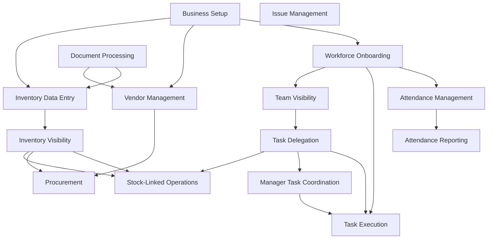

# Phase 1 — Capability Dependencies

Which capabilities require others to function in a real business.

---

## Dependency graph (text)

```
Business Setup
    ├── Workforce Onboarding ──► Attendance Management
    │                         └── Task Visibility / Execution
    ├── Vendor Management ──► Procurement
    └── (profile context for ML routing)

Inventory Data Entry
    └── Inventory Visibility
            ├── Stock-Linked Operations
            └── Procurement & Reordering

Team Visibility
    ├── Task Delegation (who to assign)
    └── Manager Task Coordination (dept structure)

Task Delegation
    ├── Task Visibility
    ├── Task Execution
    └── (optional) Stock-Linked Operations

Issue Management
    └── (optional) Task Delegation (fix-it tasks)

Document Processing
    └── Inventory Data Entry | Vendor Management (by suggestion type)

Platform Guidance
    └── (enables discovery of all capabilities)
```

---

## Dependency table

| Capability | Depends on | Enables |
|------------|------------|---------|
| Business Setup | — | All operational capabilities |
| Workforce Onboarding | Business Setup (tenant exists) | Attendance, Tasks, Updates |
| Vendor Management | Business Setup | Procurement |
| Inventory Data Entry | Business Setup | Inventory Visibility |
| Inventory Visibility | Inventory Data Entry (data exists) | Procurement, Stock-Linked Ops |
| Procurement | Inventory Visibility, Vendor (optional) | Stock replenishment |
| Team Visibility | Workforce Onboarding | Delegation, Manager Routing |
| Task Delegation | Team Visibility (implicit) | Task Execution |
| Manager Task Coordination | Task Delegation model, Departments | Task Execution |
| Stock-Linked Operations | Inventory Visibility, Task Delegation | Accurate stock movements |
| Task Execution | Task Visibility | Attendance Reporting (indirect) |
| Issue Management | Workforce Onboarding | Resolution workflows |
| Document Processing | Upload pipeline | Inventory / Vendor actions |
| Attendance Reporting | Attendance Management | Payroll decisions |
| Platform Guidance | — | Adoption of all capabilities |

---

## Critical path for new tenant

```
1. Business Setup
2. Workforce Onboarding (+ Team Visibility via /members)
3. Attendance Management (workers live)
4. Task Delegation + Execution (core value)
5. Inventory Data Entry → Visibility (if stock matters)
6. Procurement (when low-stock alerts fire)
```

---

## Mermaid diagram



---

## Soft dependencies (business, not technical)

| Relationship | Note |
|--------------|------|
| Procurement → Vendor Management | PR can start without vendor; fulfillment needs vendor |
| Stock-Linked Ops → Task Execution | Completion triggers stock movement |
| Issue Management → Task Delegation | Common pattern: issue → repair task |
| Platform Guidance → All | Adoption gate for WhatsApp-first users |
