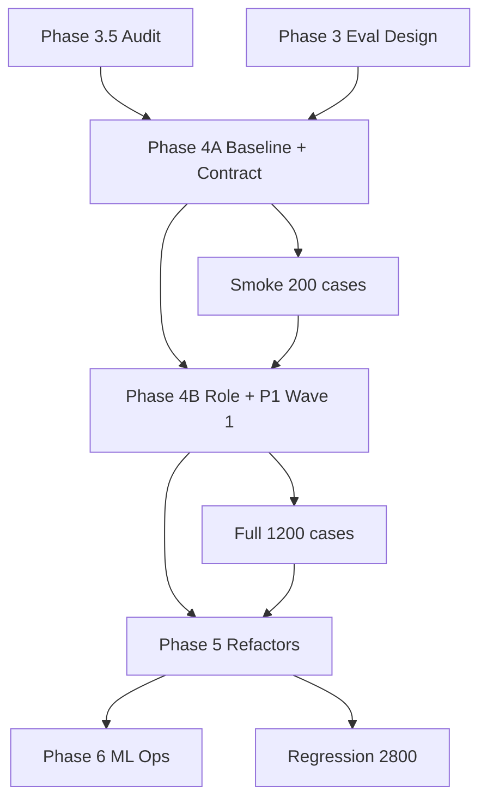

# Phase 4 — ML Hardening Roadmap (Master Plan)

---

## Roadmap overview

```
Phase 4A: Baseline & Contract     (measure + quick wins)
    ↓
Phase 4B: P1 Hardening Wave 1     (role + anti-sink + prompt)
    ↓
Phase 5: Architecture Refactors   (stock unify + confidence + hierarchy)
    ↓
Phase 6: Production ML Ops        (CI gates + monitoring + optional grounding)
```

---

## Phase 4A — Baseline & Contract Foundation

**Duration (relative):** Short  
**Dependencies:** Phases 0–3.5 complete ✅

| Milestone | Deliverables |
|-----------|--------------|
| M4A-1 | Baseline benchmark report (regex + LLM sample) |
| M4A-2 | Contract v1.1: 30 intents, discovery phrase fix |
| M4A-3 | VALID_INTENTS loaded from JSON |
| M4A-4 | CommandParser parity |
| M4A-5 | Smoke eval JSONL (~200 cases) + harness run |
| M4A-6 | Re-benchmark post-contract |

**Exit criteria:** Contract 30/30; import boundary smoke pass; baseline documented.

---

## Phase 4B — P1 Hardening Wave 1

**Duration (relative):** Medium  
**Dependencies:** 4A exit

| Milestone | Deliverables |
|-----------|--------------|
| M4B-1 | Classify request v2 schema (role, optional session_context) |
| M4B-2 | Backend passes role to ML |
| M4B-3 | Role validity filter in classifier |
| M4B-4 | P1 anti-general_chat rules |
| M4B-5 | Prompt/regex updates for P1 boundaries (doc 21) |
| M4B-6 | Eval suite expansion (~600 cases) |
| M4B-7 | Re-benchmark; boundary + role metrics |

**Exit criteria:** Role invalid ≥92%; P1 boundary smoke ≥88%; no import→discovery failures.

---

## Phase 5 — Architecture Refactors

**Duration (relative):** Long  
**Dependencies:** 4B exit + stock eval cases authored

| Milestone | Deliverables |
|-----------|--------------|
| M5-1 | Stock-linked routing design doc (implementation spec) |
| M5-2 | Unified stock cluster (extractor → slots) |
| M5-3 | confidence_tier + clarify in ClassifyResponse v2 |
| M5-4 | Clarify policy for P1 clusters |
| M5-5 | Intent hierarchy (cluster router or staged prompt) |
| M5-6 | Full eval suite (~1,200 cases) |
| M5-7 | Re-benchmark full P1 |

**Exit criteria:** Stock-linked eval ≥85%; ambiguity ≥85%; P1 intent ≥90% (doc 37 gates).

---

## Phase 6 — Production ML Operations

**Duration (relative):** Ongoing  
**Dependencies:** Phase 5 core complete

| Milestone | Deliverables |
|-----------|--------------|
| M6-1 | CI: regex eval on PR; LLM eval nightly |
| M6-2 | Regression suite (~2,800) |
| M6-3 | Classify latency/cost monitoring |
| M6-4 | Confusion matrix dashboard per release |
| M6-5 | Optional: factory worker/SKU candidates in context |
| M6-6 | Quarterly eval review + phrase mining from logs |

**Exit criteria:** No P1 regression on release; documented on-call for ML drift.

---

## Dependency graph



---

## What is NOT in this roadmap

- Model fine-tuning / custom embeddings (out of scope unless Phase 5 fails)
- Training dataset generation for fine-tuning
- Non-WhatsApp channels
- Auto-learning from production logs (Phase 6+ research)
