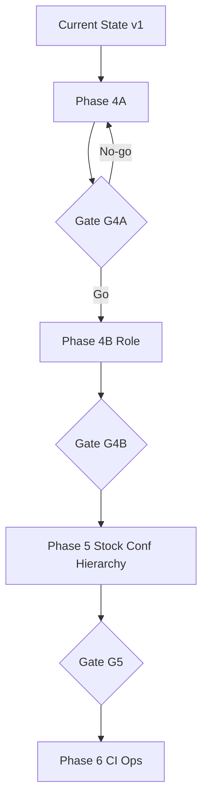

# Phase 4A — Execution Roadmap

---

## Roadmap overview

```
Current State (Blueprint complete, v1 contract, 5-intent gap)
        ↓
Phase 4A — Baseline + Contract v1.1 + Smoke ~200 + Re-benchmark
        ↓ [Gate G4A]
Phase 4B — Role-aware classify + P1 intent wave
        ↓ [Gate G4B]
Phase 5 — Stock unify + Confidence + Hierarchy
        ↓ [Gate G5]
Phase 6 — CI gates, ops, full benchmark (~1200+)
```

---

## Current state

| Dimension | Status |
|-----------|--------|
| Discovery | 30 commands documented (Phase 0) |
| Capabilities | 17 mapped (Phase 1) |
| Boundaries | 12 pairs + role matrix (Phase 2) |
| Eval design | ~2800 benchmark spec (Phase 3) |
| Architecture | Hybrid regex→LLM; readiness 2.45/5 (Phase 3.5) |
| Blueprint | 4A→6 roadmap (Phase 4) |
| Contract | v1, 25 slash + general_chat |
| Implementation | **Not started** |

---

## Phase 4A (this execution plan)

### Milestones

| # | Milestone | PR | Duration (est.) |
|---|-----------|-----|-----------------|
| M1 | Harness + schema | PR-1 | 2–3 days |
| M2 | Contract v1.1 live | PR-2 | 3–5 days |
| M3 | Smoke 200 authored | PR-3 | 3–4 days |
| M4 | Baseline + post reports | PR-4 | 1–2 days |

**Total 4A:** ~2 weeks engineering

### Dependencies

```
M1 ──→ M3 (harness before full eval)
M2 ──→ M3 (labels need v1.1 intents)
M2 + M3 ──→ M4
```

### Decision gates (4A)

| Gate | When | Outcome |
|------|------|---------|
| D1 | After M1 | Harness API frozen |
| D2 | After M2 | Import collision verified |
| D3 | After M4 | Go/No-go 4B per doc 65 |

---

## Phase 4B

| Focus | Deliverables |
|-------|--------------|
| `/classify?role=` | backend + ml |
| Role in prompt | OWNER/MANAGER/WORKER |
| P1 wave | assign, mgr*, onboard hardening |
| Eval | Role-conditioned smoke extension |

**Depends on:** G4A-1..7, G4B-R1–R4

**Est.:** 3–4 weeks

---

## Phase 5

| Track | Items |
|-------|-------|
| Stock | Single path for task inventory NL |
| Confidence | `confidence_tier`, clarify routing |
| Hierarchy | Parent intents, prompt structure |
| Eval | Expand toward Phase 3 full benchmark |

**Depends on:** 4B role stable, G5 gates

**Est.:** 4–6 weeks

---

## Phase 6

| Focus | Items |
|-------|-------|
| CI | Smoke on PR, LLM nightly |
| Ops | Model pin, rollback, metrics dashboard |
| Benchmark | 1200+ case suite, regression budget |
| Docs | Runbooks, on-call |

**Depends on:** Phase 5 schema v2 stable

**Est.:** 2–3 weeks

---

## Dependency diagram



---

## Parallel work (allowed)

| Work | Parallel with 4A? | Note |
|------|-------------------|------|
| Inventory idempotency merge | Yes | Separate track |
| Doc updates | Yes | No code |
| Phase 3 full dataset authoring | After 4A smoke | Use smoke as template |
| 4B API design doc | Yes | No impl until gate |

---

## Critical path

**PR-1 → PR-2 → PR-3 → PR-4 → 4B**

Any slip in PR-2 blocks accurate smoke labels and benchmark comparison.
