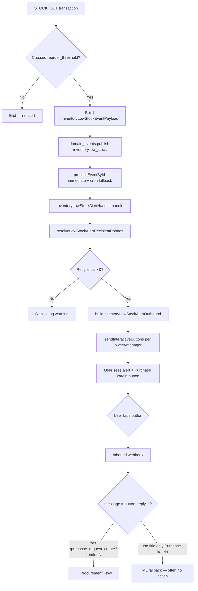
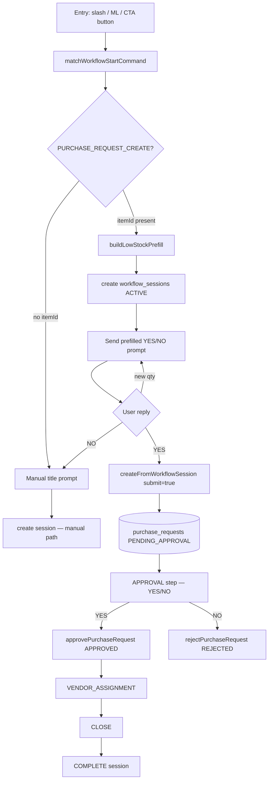
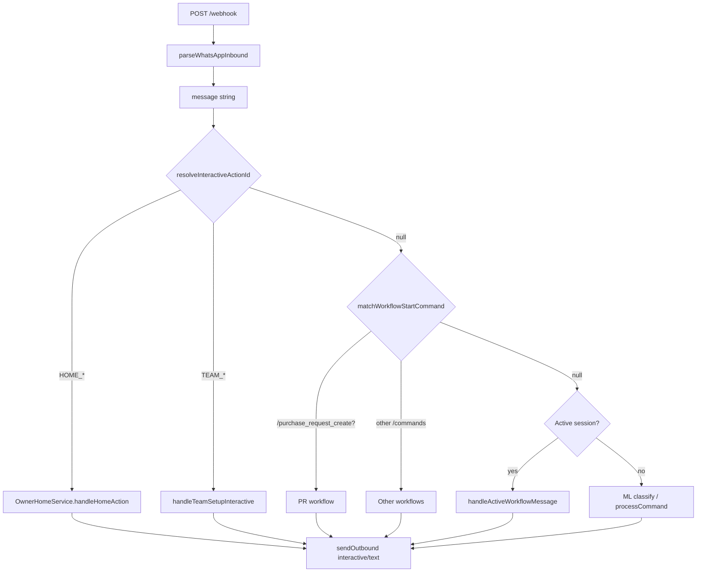
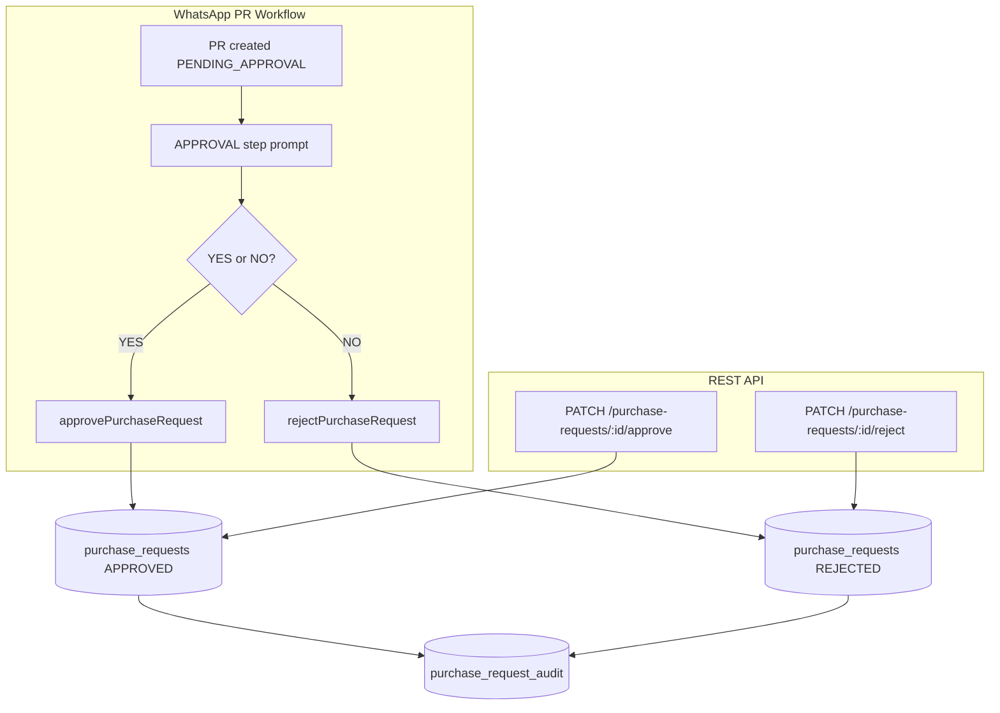
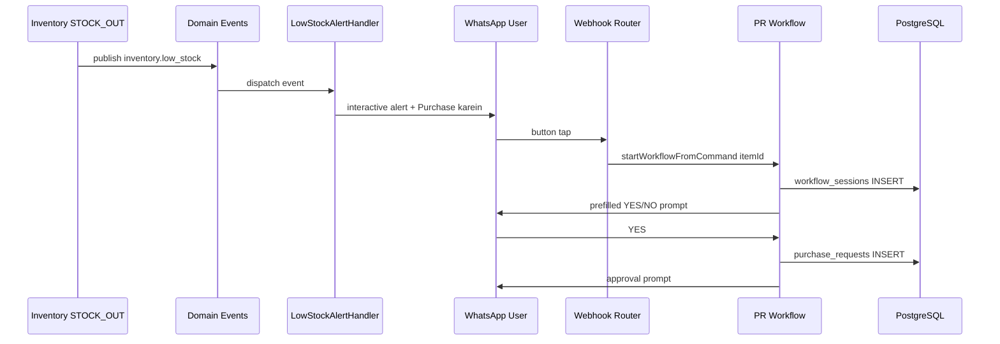

# Phase 6 — Flow Mapping

**Date:** 2026-06-07  
**Scope:** Architecture diagrams for current flows

---

## 1. Current Low Stock Flow



### Decision points

| Point | Condition | Outcome |
|-------|-----------|---------|
| Threshold cross | `didCrossLowStockThreshold` | Event published or skipped |
| Recipients | owners + managers phones exist | Alert sent or skipped |
| Inbound routing | `button_reply.id` vs title echo | Workflow starts or fails |

### Database writes

| Step | Table | Operation |
|------|-------|-----------|
| Stock movement | `inventory_transactions`, `inventory_items` | INSERT + UPDATE qty |
| Event | `domain_events` | INSERT PENDING → COMPLETED |

### WhatsApp messages

| Step | Message |
|------|---------|
| Alert | Interactive: body + "Purchase karein" button |
| Failed routing | None or unrelated ML reply |

---

## 2. Current Procurement Flow (WhatsApp)



### Entry points (Start)

| Source | Message |
|--------|---------|
| Low-stock CTA | `/purchase_request_create?itemId=N` |
| Manual slash | `/purchase_request_create` |
| ML intent | `/purchase_request_create` |
| REST | `POST /purchase-requests` (no WhatsApp) |

### Services touched

| Step | Service |
|------|---------|
| Route | `WorkflowRouterService` |
| Prefill | `PurchaseRequestPrefillService` |
| Steps | `PurchaseRequestCreateWorkflowHandler` |
| Persist | `PurchaseRequestService` |
| Audit | `PurchaseRequestRepository` |

### Database writes

| Step | Tables |
|------|--------|
| Session create | `workflow_sessions` INSERT |
| PR create | `purchase_requests`, `purchase_request_items`, `purchase_request_audit` |
| Approve/reject | `purchase_requests` UPDATE + audit |
| Vendor assign | `purchase_requests` UPDATE + audit |
| Session complete | `workflow_sessions` UPDATE status |

### WhatsApp messages

| Step | Content |
|------|---------|
| Prefill prompt | Title, item, qty, current, threshold, YES/NO instructions |
| After YES | PR created confirmation + approval prompt |
| Approval | Approve/reject result message |
| Vendor step | Vendor list + SKIP |
| Close | Close confirmation |

---

## 3. Current CTA Flow (All Interactive Buttons)



### CTA categories

| Category | Routing mechanism | State |
|----------|-------------------|-------|
| Owner home | `WA_INTERACTIVE_ID` + title map | Stateless / spawns workflow |
| Team setup | `WA_INTERACTIVE_ID` + title map | Stateless / spawns workflow |
| Low-stock purchase | Workflow command in `button_reply.id` | Creates `workflow_sessions` |
| CTA URL (CSV template) | URL open (no inbound) | N/A |

---

## 4. Current Approval Flow



### Decision points

| Point | Gate |
|-------|------|
| Who can approve | `canApprovePurchaseRequests()` — OWNER or MANAGER |
| Valid transition | `assertStatusTransition()` |
| Terminal | REJECTED, CLOSED — no further WA steps |

---

## 5. Cross-Flow Sequence (Desired Future — Already Partially Built)



---

## 6. ASCII Summary — Low Stock → Procurement

```
[STOCK_OUT] → [threshold cross] → [domain_event]
     → [alert to owners/managers]
     → [WhatsApp: Purchase karein button]
     → [tap → /purchase_request_create?itemId=X]  ← must survive inbound
     → [workflow session + prefill prompt]
     → [YES → PR PENDING_APPROVAL]
     → [approval → vendor → close]
```
