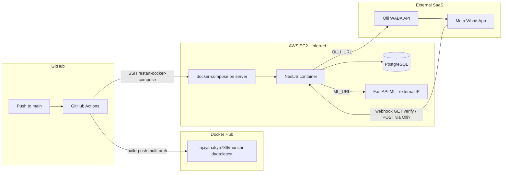

# Munshi OIL — Infrastructure Dependency Audit (Phase 1, Prompt 1.5)

**Audit date:** 2026-05-28  
**Scope:** NestJS backend repository only (`munshi-dada-AS-sructure`)  
**Method:** Static analysis of CI/CD, env config, code references, and deployment artifacts. No infrastructure was modified, no secrets were rotated, and no values are reproduced below.

---

## Executive summary

The codebase is **operationally coupled to infrastructure owned or configured by a third party** (evidenced by hardcoded Docker Hub username `ajayshakya786`, EC2 deploy path `/home/ubuntu/munshi-dada`, and environment samples pointing at public IPs and external SaaS). The Git repository remote is now under `ShantanuGarg2004/Munshi_Updated`, but **CI/CD still publishes images and deploys to resources that appear tied to another developer’s accounts**.

Before feature work (TraderOS / Finance / Inventory), you should plan an **ownership cutover** for: Docker registry, GitHub Actions secrets, EC2 host, PostgreSQL, FastAPI ML host, Olli WABA gateway, and Meta WhatsApp Business assets.

---

## 1. External Services Inventory

| Service | Role | Evidence in repo | Likely owner today | Replacement required? |
|--------|------|------------------|-------------------|------------------------|
| **GitHub** | Source control + CI | `.github/workflows/cicd.yml`, `origin` → `ShantanuGarg2004/Munshi_Updated` | Mixed (repo new; workflow legacy) | Partial — update workflow + secrets |
| **GitHub Actions** | Build/deploy automation | `cicd.yml` | Repo admin | Reconfigure secrets |
| **Docker Hub** | Container registry | `DOCKER_USERNAME: ajayshakya786`, image `ajayshakya786/munshi-dada:latest` | **External account** (`ajayshakya786`) | **Yes** — new registry or account |
| **AWS EC2** | Production host (inferred) | Deploy job `deploy-on-ec2`, secrets `EC2_*` | Whoever holds EC2 + SSH key | **Yes** if not owned by Munshi team |
| **PostgreSQL** | Primary datastore | `POSTGRES_CONNECTION_STRING`, `pg` driver | Host at connection target (see §5) | **Yes** for clean ownership |
| **Neon** (Postgres SaaS) | Alternate DB (commented in local env) | Commented `neon.tech` connection in `.env.local` | Neon project owner | Optional — only if adopted |
| **FastAPI / ML service** | Intent classification | `ML_URL` → `POST /classify` | Whoever runs ML host | **Yes** — not in this repo |
| **Olli (getolliai.com)** | WhatsApp send + likely inbound relay | `OLLI_URL`, `OLLI_KEY`, webhook `body.data` shape | Olli account holder | **Yes** for WABA control |
| **Meta WhatsApp Cloud** | Verification + templates (indirect) | `WHATSAPP_VERIFY_TOKEN`, template names, unused `WHATSAPP_*` vars | Meta Business / WABA owner | **Yes** — templates + verify token |
| **Node.js runtime** | App execution | `Dockerfile` `node:20-alpine` | N/A (public images) | No |
| **Redis** | Caching/queues | Not present | N/A | No (not used) |
| **OpenAI / other LLM APIs** | Direct inference | Not in this repo | N/A in backend | Audit ML service separately |
| **AWS S3 / other AWS SDK** | Storage | Not in codebase | N/A | No |

**Not in this repository (cannot audit here):** FastAPI service source, `docker-compose.yml` on server, `restart-docker-compose` shell helper, reverse proxy (NGINX), TLS certificates, DNS records.

---

## 2. Current Deployment Architecture

### High-level flow

### CI/CD pipeline (`.github/workflows/cicd.yml`)

| Aspect | Current behavior |
|--------|------------------|
| **Trigger** | `push` to branch `main` only |
| **Build** | Docker Buildx, platforms `linux/amd64` + `linux/arm64` |
| **Registry** | Docker Hub login with `secrets.DOCKER_PASSWORD` |
| **Image tag** | `ajayshakya786/munshi-dada:latest` (always `latest`, no SHA tag) |
| **Deploy** | SSH to `secrets.EC2_HOST` as user `ubuntu` with `secrets.EC2_SSH_KEY` |
| **Remote command** | `cd /home/ubuntu/munshi-dada && restart-docker-compose` |
| **Staging** | None defined |
| **Approval gates** | None |
| **Env injection at deploy** | Not in workflow — env assumed on server (`docker-compose` not in repo) |

### Docker image (`Dockerfile`)

- Multi-stage build: `yarn install` + `yarn build` → production image with `dist/`.
- **CMD:** `yarn start` (runs `nest start`, not `node dist/main` via `start:prod`).
- **EXPOSE:** `4000`; app default `PORT` is `3000` unless set on server.
- **`.dockerignore`** excludes `docker-compose.yml` from build context (compose file expected **on server**, not in git).

### Server-side assumptions (not versioned)

- Path: `/home/ubuntu/munshi-dada`
- Custom command: `restart-docker-compose` (global alias or script on EC2 — **not in repository**)
- `docker-compose.yml` likely pulls `ajayshakya786/munshi-dada:latest` and sets env vars — **must be obtained from server** before migration

---

## 3. Current Secret Dependencies

### GitHub Actions secrets (repository settings)

| Secret name | Used in | Purpose | Replacement requirement |
|-------------|---------|---------|-------------------------|
| `DOCKER_PASSWORD` | `cicd.yml` → Docker Hub login | Push images to Docker Hub as `ajayshakya786` | **Required** — new Docker Hub account token OR change `DOCKER_USERNAME` |
| `EC2_HOST` | `appleboy/ssh-action` | Target server IP/hostname for deploy | **Required** — new EC2 or stop auto-deploy until cutover |
| `EC2_SSH_KEY` | `appleboy/ssh-action` | Private key for `ubuntu@EC2_HOST` | **Required** — new keypair tied to new instance |

### GitHub Actions env (hardcoded in workflow — not secrets)

| Variable | Value in repo | Ownership issue |
|----------|---------------|-----------------|
| `DOCKER_USERNAME` | `ajayshakya786` | **Tied to external Docker Hub user** — change to your org’s username |
| `DOCKERHUB_REPO` | `munshi-dada` | May conflict on Docker Hub under new account |
| `PROJECT_PATH` | `/home/ubuntu/munshi-dada` | Tied to existing server layout |

### Application runtime secrets (from code + `.env.local` sample)

Documented **by name only**. Values must be supplied per environment; do not commit.

| Variable | Read in code | Purpose | Replacement requirement |
|----------|--------------|---------|-------------------------|
| `POSTGRES_CONNECTION_STRING` | `db.service.ts` | Postgres connection URI | **Required** for new DB ownership |
| `MONGO_CONNECTION_STRING` | Commented in `db.service.ts` | Mongo (unused) | Optional |
| `ML_URL` | `whatsapp.service.ts` | FastAPI classifier base URL | **Required** if ML host not owned |
| `OLLI_URL` | `messaging.service.ts` | Olli API base | **Required** for new WABA gateway |
| `OLLI_KEY` | `messaging.service.ts` | Olli API authentication | **Required** |
| `WHATSAPP_VERIFY_TOKEN` | `whatsapp.controller.ts` | Meta webhook subscription verification | **Required** — must match Meta app config |
| `WHATSAPP_TOKEN` | Declared in `whatsapp.service.ts` | Meta Cloud API token | **Likely obsolete** — not used in send path |
| `WHATSAPP_PHONE_NUMBER_ID` | Declared in `whatsapp.service.ts` | Meta phone number ID | **Likely obsolete** — not used in send path |
| `WHATSAPP_ONBOARDING_TEMPLATE` | `factories.service.ts` | Template name override (default `onboarding_message`) | **Required** in approved Meta templates |
| `X_SECRET` | `guards.ts` | Header `x-secret` for `InternalCallGuard` | **Required** if guard is enabled on routes |
| `PORT` | `main.ts` | HTTP listen port | Set per deploy |
| `CORS_ORIGIN` | `main.ts` | Allowed browser origins (comma-separated) | Update when frontend URL changes |

### Local env files in repository

| File | In git? | Notes |
|------|---------|-------|
| `.env` | Ignored | Not present in tree |
| `.env.local` | Ignored (exists locally) | Used by `yarn dev` via `env-cmd` — **must not be committed** |
| `.env.production` | Ignored | Not present — production env lives on server |

### Provider hints from local sample (no values)

The checked-in-local `.env.local` (gitignored) indicates these **dependency types** were used in development:

- Postgres: **public IPv4 host** on non-standard port (suggests self-managed Postgres, possibly same EC2/VPC as app).
- Postgres (commented): **Neon** serverless Postgres (`*.neon.tech`).
- ML: **public IPv4** on port `8000` (separate VM/service).
- Olli: **`https://api.getolliai.com`** SaaS.
- CORS: **`http://localhost:3001`** (local frontend assumption).

---

## 4. WhatsApp / Meta Ownership Dependencies

### Architecture today

| Direction | Mechanism | Owner dependency |
|-----------|-----------|------------------|
| **Outbound messages** | `MessagingService` → `POST {OLLI_URL}/external/waba/send` with `X-API-Key: OLLI_KEY` | **Olli account** + underlying Meta WABA |
| **Inbound messages (POST)** | `POST /webhook` expects `{ data: { type, from, text } }` | **Olli (or custom gateway)** must forward to your API — not raw Meta payload |
| **Inbound verification (GET)** | Meta-style `hub.mode`, `hub.verify_token`, `hub.challenge` | **Meta app** verify token must equal `WHATSAPP_VERIFY_TOKEN` |

### What belongs to the existing owner (likely must transfer or recreate)

- **Olli organization / API key** (`OLLI_KEY`) — controls send path and possibly inbound routing.
- **Meta WhatsApp Business Account (WABA)** — phone numbers, approved templates.
- **Approved message templates** referenced in code:
  - `factory_attendance_reminder` (attendance cron)
  - `onboarding_message` (default onboarding; overridable via `WHATSAPP_ONBOARDING_TEMPLATE`)
- **Webhook callback URL** registered in Meta/Olli — must point to public `https://<your-api>/webhook`.
- **`WHATSAPP_VERIFY_TOKEN`** — shared secret between Meta and your app for GET verification.

### What can be reused (with reconfiguration)

- **Application webhook handlers** (`WhatsAppController`, `WhatsAppService`) — logic is reusable; only URLs/tokens/gateway change.
- **Message copy / templates in code** (`MessagingService` builders) — content reusable; Meta template definitions must be recreated in new WABA.

### What appears redundant / legacy

- `WHATSAPP_TOKEN` and `WHATSAPP_PHONE_NUMBER_ID` are loaded in `WhatsAppService` but **never referenced** elsewhere in that file — outbound path is 100% Olli. These may be leftover from a direct Meta Cloud API integration.

### Webhook migration risks (CRITICAL)

| Risk | Impact | Mitigation |
|------|--------|------------|
| **Dual webhook endpoints** | Messages delivered to old URL during cutover | Coordinate single cutover window; pause old subscription |
| **Verify token mismatch** | Meta subscription fails | Set identical token in new app + env before switching |
| **Olli payload shape** | Inbound breaks if gateway changes | Contract-test `body.data.from` / `body.data.text` with new provider |
| **Template missing in new WABA** | Cron/onboarding sends fail silently (logged) | Pre-approve templates in new Meta Business Manager |
| **Phone number change** | Users message old number | Communicate number migration; update `from` mapping in DB if numbers change |
| **Rate limits** | Broadcast loops use 250–300ms delays | Monitor limits on new WABA tier |

---

## 5. Database Ownership Dependencies

### Current providers (inferred)

| Provider | Status | Evidence |
|----------|--------|----------|
| **PostgreSQL (self-hosted / VM IP)** | Active in local env sample | `POSTGRES_CONNECTION_STRING` host is public IPv4, port `5431` |
| **Neon (managed Postgres)** | Commented alternate | Comment in `.env.local` references `*.aws.neon.tech` |
| **MongoDB** | Disabled | `MongoService` commented out; `MONGOOSE_MODELS` empty |

### Ownership risks

- **No migrations in repo** — schema lifecycle is external (manual SQL or `sequelize.sync` on server). Migrating DB without schema docs increases risk.
- **Single connection string** — no built-in read replica or per-env switching in code.
- **Hard fail on DB init** — `DbService` calls `process.exit(1)` if Postgres auth fails (app won’t start without DB).
- **Data residency** — if Postgres and EC2 are on another party’s AWS account, **data export and legal access** require their cooperation.

### Migration complexity

| Factor | Assessment |
|--------|------------|
| Schema export | Medium — need `pg_dump` from current host |
| Downtime | Medium–High — app is tightly coupled to live DB |
| Connection string swap | Low — env-only change |
| **User phone / factory data** | Must preserve — core to WhatsApp auth |
| Environment separation | **Weak** — only `.env.local` vs server; no staging DB in repo |

### Backup risks

- No backup automation in this repository.
- Assume backups are configured on EC2/Postgres host — **verify with current infra owner** before cutover.

---

## 6. Cloud Dependencies

### AWS usage

| AWS service | In codebase? | How referenced |
|-------------|--------------|----------------|
| **EC2** | Indirect | CI deploy job name + SSH |
| **RDS** | No | — |
| **S3** | No | No SDK, no bucket names |
| **Secrets Manager / SSM** | No | — |
| **IAM** | No | — |

### Storage

- No object storage SDK or file upload pipeline in backend.
- User `profile_picture` is a string field (URL stored, not managed upload in this repo).

### Cloud SDK usage

- **None** — no `@aws-sdk/*` dependencies in `package.json`.

### Hardcoded cloud / network endpoints in repo

- **None in committed source** (IPs appear only in gitignored `.env.local`).
- CI does not embed host IPs; `EC2_HOST` is a secret.

---

## 7. Required Ownership Transfers

### MUST move or recreate (blocking independent operation)

1. **Docker Hub** account `ajayshakya786` and repository `munshi-dada` — CI pushes here today.
2. **GitHub Actions secrets** — `DOCKER_PASSWORD`, `EC2_HOST`, `EC2_SSH_KEY`.
3. **EC2 instance** (or replacement) + `/home/ubuntu/munshi-dada` compose stack + `restart-docker-compose`.
4. **PostgreSQL** instance holding production data (current connection target in dev sample).
5. **FastAPI ML service** at `ML_URL` (separate deployment; not in repo).
6. **Olli** API credentials and WABA linkage.
7. **Meta WhatsApp Business** — phone number, templates, webhook app, verify token.

### CAN stay (reusable as patterns)

- Dockerfile multi-stage pattern (adjust CMD/port later).
- GitHub Actions two-job pattern (build → deploy).
- NestJS application code and module structure.
- Webhook routing and Olli client abstraction in `MessagingService`.
- Cron-based reminders (after templates exist on new WABA).

### SHOULD be recreated (recommended for clean ownership)

- New Docker Hub org/user under Munshi team.
- New EC2 (or ECS/EKS later) with fresh SSH keys.
- New Postgres (managed RDS/Neon) with documented migrations.
- New Meta app + Olli project (or direct Meta Cloud API with code changes).
- New `WHATSAPP_VERIFY_TOKEN`, `OLLI_KEY`, `X_SECRET`, DB credentials.
- Staging environment (currently absent).

### Repository vs infrastructure mismatch

| Asset | Current state |
|-------|----------------|
| Git remote | `github.com/ShantanuGarg2004/Munshi_Updated` |
| CI Docker user | `ajayshakya786` (**different identity**) |

**Risk:** Pushes to `main` may still deploy to and publish artifacts under **another developer’s infrastructure** if GitHub secrets remain unchanged.

---

## 8. Recommended Migration Plan

### Phase 0 — Discovery (no production changes)

1. Inventory live server: SSH to current EC2 (with owner permission), copy `docker-compose.yml`, env files, and `restart-docker-compose` definition.
2. Export Postgres schema + data (`pg_dump`).
3. Document Meta/Olli dashboard: WABA ID, phone numbers, template list, webhook URL.
4. Locate FastAPI ML repo and deployment for `ML_URL`.
5. **Disable or pause** GitHub Actions deploy job until new secrets are ready (manual workflow_dispatch only).

### Phase 1 — Parallel infrastructure (new ownership)

1. Create team Docker Hub (or GHCR) and update `DOCKER_USERNAME` / `DOCKER_PASSWORD`.
2. Provision new EC2 (or container platform) + Postgres (RDS/Neon/self-hosted).
3. Deploy ML service to infrastructure you control; set new `ML_URL`.
4. Create Olli/Meta setup; approve templates `factory_attendance_reminder`, `onboarding_message`.
5. Configure new env on server: all variables from §3.

### Phase 2 — Data migration

1. Restore Postgres dump to new database.
2. Run smoke tests: health `/health`, user lookup by phone, task create.
3. Point staging webhook to new API (`/webhook/test` for internal NL tests).

### Phase 3 — WhatsApp cutover

1. Register webhook URL to new public API (HTTPS required).
2. Verify GET challenge with new `WHATSAPP_VERIFY_TOKEN`.
3. Send test inbound via Olli; confirm `body.data` shape.
4. Switch production webhook (short maintenance window).
5. Send test template messages.

### Phase 4 — CI/CD cutover

1. Update `cicd.yml`: Docker username, optional image tags (`:sha`, `:latest`).
2. Set new `EC2_HOST`, `EC2_SSH_KEY`, `DOCKER_PASSWORD` in GitHub secrets.
3. Deploy once manually; verify `restart-docker-compose` equivalent on new host.
4. Re-enable push-to-main deploy.

### Phase 5 — Decommission old infra

1. Revoke old Docker Hub tokens, Olli keys, Meta app access for previous owner.
2. Snapshot and terminate old EC2/DB after retention period.
3. Remove old GitHub secrets.

---

## 9. Migration Risks

| Category | Risk | Severity |
|----------|------|----------|
| **Downtime** | DB or API unavailable during cutover | High |
| **Webhook** | Messages lost if old URL disabled before new works | Critical |
| **CI/CD** | Auto-deploy to wrong server on every `main` push | Critical (until secrets updated) |
| **Docker image** | Pulling `latest` without version pin causes surprise deploys | Medium |
| **Secrets in .env.local** | Local file contained production-class credentials (gitignored but on disk) | High — rotate after audit |
| **No staging** | Production-only validation | High |
| **ML dependency** | WhatsApp NL broken if `ML_URL` down | High |
| **Template approval** | Meta rejects or delays template creation | Medium |
| **Cron duplication** | Two instances running crons if old + new both up | Medium |
| **Schema drift** | No migrations — new DB may miss manual columns | Medium |
| **PORT mismatch** | Container EXPOSE 4000 vs default 3000 | Low (if env sets PORT) |

---

## 10. Safe Components That Can Be Retained

| Component | Why safe to keep |
|-----------|------------------|
| **NestJS application source** | No hard dependency on external account IDs in committed code |
| **Sequelize model definitions** | Portable to any Postgres |
| **WhatsApp business logic** | Gateway-agnostic except Olli payload + env |
| **`MessagingService` abstraction** | Swap URL/key/provider behind same interface |
| **GitHub Actions workflow structure** | Update names/secrets only |
| **Dockerfile** | Standard Node build; no private base images |
| **Health check module** | `/health` for load balancer checks |
| **Department/task routing logic** | Pure application layer |
| **`.gitignore` for env files** | Correct pattern — keep enforcing |
| **Architecture documentation** | `docs/architecture-analysis.md` remains valid |

---

## Appendix A — Domain & URL dependencies

| URL type | Where configured | In committed code? |
|----------|------------------|-------------------|
| Public API base (webhook) | Meta/Olli dashboard + reverse proxy on EC2 | No hardcoded production domain |
| `CORS_ORIGIN` | Env | Example: local frontend only in `.env.local` |
| `ML_URL` | Env | Defaults to `http://localhost:8000` if unset |
| `OLLI_URL` | Env | Required for outbound WhatsApp |
| Swagger | `main.ts` | `/api/docs` on same host as API |

**Migration action:** DNS/TLS for new API hostname must be provisioned before webhook cutover.

---

## Appendix B — Files inspected

| Path | Relevance |
|------|-----------|
| `.github/workflows/cicd.yml` | CI/CD, Docker Hub, EC2 deploy |
| `Dockerfile`, `.dockerignore` | Image build, compose exclusion |
| `package.json` | Scripts (`env-cmd`, `dev`), dependencies |
| `.gitignore` | Env file exclusions |
| `.env.local` (local only) | Env variable inventory (not committed) |
| `src/main.ts` | PORT, CORS |
| `src/core/services/db-service/db.service.ts` | Postgres/Mongo env |
| `src/core/messaging/messaging.service.ts` | Olli integration |
| `src/modules/whatsapp/whatsapp.controller.ts` | Webhook verify + inbound |
| `src/modules/whatsapp/whatsapp.service.ts` | ML_URL, cron templates |
| `src/core/guards/guards.ts` | X_SECRET |
| `src/services/factories/factories.service.ts` | Onboarding template |
| `docs/architecture-analysis.md` | Prior architecture baseline |

---

## Appendix C — Redis / AI / OpenAI

| Technology | Status in this repo |
|------------|---------------------|
| **Redis** | Not used |
| **OpenAI SDK** | Not used |
| **Direct LLM calls** | Not used — delegated to `ML_URL` FastAPI service |
| **FastAPI** | External dependency only |

**Action:** Perform a separate audit on the ML/FastAPI repository for model provider keys (OpenAI, etc.).

---

*End of infrastructure dependency audit.*
