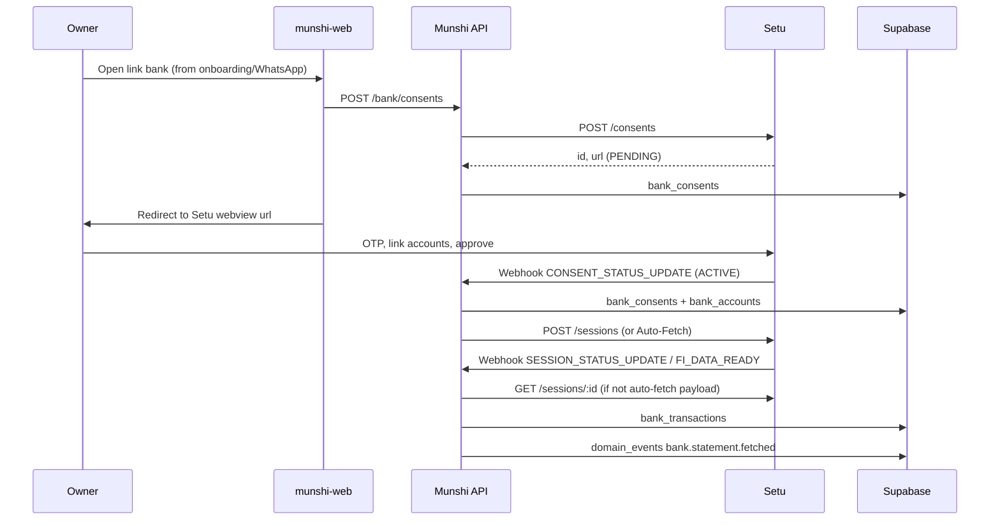

# P1 Research — Setu Account Aggregator (bank linking & statements)

**Date:** 2026-06-01  
**Decision:** Use **Setu** as AA partner (path B) — sandbox first, production via Setu Bridge + Sahamati FIU onboarding (not direct ReBIT FIU registration for seed).

Official docs: [Setu AA Quickstart](https://docs.setu.co/data/account-aggregator/quickstart) · [Consent flow](https://docs.setu.co/data/account-aggregator/api-integration/consent-flow) · [Data APIs](https://docs.setu.co/data/account-aggregator/api-integration/data-apis) · [Notifications](https://docs.setu.co/data/account-aggregator/api-integration/notifications)

**Sandbox reference (validated payloads + fixtures):** [setu-sandbox-fi-data.md](./setu-sandbox-fi-data.md)

---

## 1. Do you need your own FIU licence?

| Path | Munshi effort | Timeline |
|------|----------------|----------|
| **A — Direct FIU (ReBIT)** | Register as FIU, Sahamati membership, compliance | Months, high cost |
| **B — Setu (recommended)** | Configure product on **Setu Bridge**; Setu runs AA gateway + prod FIU infra | Days (sandbox), weeks (prod after KYC) |

Setu production go-live ([quickstart](https://docs.setu.co/data/account-aggregator/quickstart)):

1. Finish sandbox testing on Bridge  
2. Submit product: prod **callback URL**, **KYC (Step 4)**, review (Step 5)  
3. Setu runs **Sahamati FIU onboarding** and deploys your FIU config  
4. You receive prod `x-client_id`, `x-client-secret`, `x-product-instance-id`

You are still the **FIU** from a product/regulatory perspective, but Setu is the integration layer — aligned with your spec’s “partner (B) first”.

**Product constraint (unchanged):** Only the **business owner’s** accounts (`DEPOSIT` / current & savings). No vendor/client AA.

---

## 2. Environments & credentials

| | Sandbox | Production |
|---|---------|------------|
| **Base URL** | `https://fiu-sandbox.setu.co` | `https://fiu.setu.co` |
| **Console** | [Setu Bridge](https://bridge.setu.co) (register → create FIU → AA Data product) | Same, submit for prod |
| **Auth headers** | `Authorization: Bearer <access_token>` | Same |
| | `x-client-id`, `x-client-secret` | From Bridge → API credentials |
| | `x-product-instance-id` | Product / instance ID from Bridge |

Obtain credentials after Bridge setup (Step 2 in quickstart). Use Setu’s **Postman collection** for sandbox exploration before coding.

**Munshi `.env` (planned):**

```env
SETU_FIU_BASE_URL=https://fiu-sandbox.setu.co
SETU_CLIENT_ID=
SETU_CLIENT_SECRET=
SETU_PRODUCT_INSTANCE_ID=
SETU_REDIRECT_URL=https://www.munshidada.com/bank/complete
SETU_WEBHOOK_SECRET=   # if Setu provides signature verification
```

---

## 3. End-to-end flow (maps to your spec)



### 3.1 Consent creation

- **API:** `POST /consents` (docs also show v2 paths like `/v2/consents/collection` for multi-consent; single consent uses create consent API on sandbox host).
- **Body highlights:**
  - `vua`: owner mobile as `91XXXXXXXXXX@setu` or `@onemoney` (AA handle) — use **same 91… number** as Munshi `users.phone_number`.
  - `fiTypes`: `["DEPOSIT"]` for bank accounts.
  - `consentTypes`: `["TRANSACTIONS", "PROFILE", "SUMMARY"]` for statements + balances.
  - `dataRange.from` / `to`: up to **2 years** history (per your spec); must stay within range on each data session.
  - `fetchType`: `PERIODIC` if you want recurring statement pulls; `ONETIME` for one-shot.
  - `redirectUrl`: `https://www.munshidada.com/bank/complete?...` (mobile-friendly page, then deep link back to WhatsApp).
  - `context`: `accounttype` = `CURRENT` and/or `SAVINGS` for SME accounts.

**Purpose code (Sahamati / ReBIT):** For owner bookkeeping and cashflow reporting, closest fit:

| Code | Use |
|------|-----|
| **102** | Spending patterns, budget, reporting (best fit for Munshi books) |
| **104** | Continuous account monitoring (if recurring fetch / “live” balance) |

Use purpose **102** in consent `context` / `purpose.code` with clear `purpose.text` (“Business bookkeeping and cashflow for {factory name}”). Legal review before prod.

Response: `id` (store as `bank_consents.aa_consent_id`), `url` (redirect owner), `status: PENDING`.

### 3.2 Consent UI

- Cannot run full AA OAuth inside WhatsApp → **hosted web page** (`munshi-web`) opens Setu `url` (webview or browser).
- Setu handles: mobile OTP, FIP discovery, account linking, approve/reject.

### 3.3 Consent status

- Poll: `GET /consents/:id` → `ACTIVE` when approved (linked accounts in `accountsLinked` / notification `detail.accounts`).
- Webhook: `type: CONSENT_STATUS_UPDATE`, `data.status`: `ACTIVE` | `REJECTED` | `REVOKED` | `PAUSED` | `EXPIRED`.

Map to `bank_consents.status`: `PENDING` → `ACTIVE` / `REJECTED` / `REVOKED` / `EXPIRED`.

On `ACTIVE`, insert/update `bank_accounts` from notification accounts (`maskedAccNumber`, `linkRefNumber`, `fipId`, `accType`).

### 3.4 Fetch statements (data session)

After **ACTIVE** consent:

1. **Manual:** `POST /sessions` with `consentId`, `dataRange`, `format: "json"`.
2. Wait for webhook `SESSION_STATUS_UPDATE` with `status` `PARTIAL` or `COMPLETED`.
3. **Fetch:** `GET /sessions/:dataSessionId` → `fips[].accounts[].data.account.transactions.transaction[]`.

**Auto-Fetch (recommended for P1):** Enable on Bridge — Setu creates sessions and can send **`FI_DATA_READY`** webhook with **`fiData`** inline (less polling). **Costs per successful fetch** — matches your ~₹50/customer/month model; monitor volume.

Transaction fields to map into `bank_transactions`:

| Setu field | Our column |
|------------|------------|
| `txnId` / `reference` | `external_txn_id` |
| `transactionTimestamp` | `txn_date` |
| `valueDate` | `value_date` |
| `amount` | `amount` |
| `type` CREDIT/DEBIT | `direction` |
| `narration` | `narration` |
| `currentBalance` (optional) | `balance_after` |
| `maskedAccNumber` | via `bank_account_id` |
| Full node | `raw_payload` |
| Session id | `fetch_batch_id` |

### 3.5 Webhooks (required)

Implement on API (public HTTPS; tunnel in dev):

| Webhook `type` | Action |
|----------------|--------|
| `CONSENT_STATUS_UPDATE` | Update `bank_consents`, upsert `bank_accounts`, publish `bank.consent.active` |
| `SESSION_STATUS_UPDATE` | Trigger fetch when COMPLETED/PARTIAL |
| `FI_DATA_READY` (auto-fetch) | Parse `fiData`, bulk insert transactions, publish `bank.statement.fetched` |

Configure URL on **Setu Bridge** (sandbox: Beeceptor first, then EC2/ngrok, then prod API).

**Note:** Setu docs say webhook retries are planned — design **idempotent** handlers (`aa_consent_id`, `external_txn_id` unique keys already in P0 schema).

---

## 4. Sandbox testing tips

| Topic | Detail |
|-------|--------|
| **Mock FIPs** | Use **Setu FIP** / **Setu FIP-2** in sandbox for fake bank data |
| **OTP** | Setu FIP: OTP to consent mobile; **Setu FIP-2: static `123456`** |
| **Onemoney AA** | New UAT mobiles may need **whitelist** (1–2 days) — email support@setu.co |
| **Sample app** | Setu provides sandbox sample app (linked from quickstart) |

---

## 5. Production checklist (before real customers)

- [ ] Bridge: KYC + product approval  
- [ ] Sahamati FIU onboarding (via Setu)  
- [ ] Prod webhook URL on API (`POST /webhooks/setu` or `/bank/webhooks/setu`)  
- [ ] Prod `SETU_*` env on EC2 only; Supabase for data  
- [ ] Consent renewal UX (~2 year expiry) — cron on `consent_end_at`  
- [ ] Privacy policy / consent purpose text matches purpose code **102**  
- [ ] Rate limits & cost alerts on fetch frequency  

---

## 6. Mapping to Munshi P0 schema

| P0 table | Setu / P1 usage |
|----------|------------------|
| `bank_consents` | `aa_consent_id` = Setu `consentId`; `raw_consent` = create/get response; `status`; `consent_end_at` |
| `bank_accounts` | From consent notification `detail.accounts`; `account_ref` = `linkRefNumber` |
| `bank_transactions` | From FI `transaction` array; `fetch_batch_id` = session id |
| `domain_events` | `bank.consent.active`, `bank.statement.fetched` |
| `match_suggestions` | P2 — after ingest |
| `journal_*` | P2 — after owner confirms match |

**Small migration 008 (P1):** Consider adding `consent_url TEXT`, `data_session_id`, `provider VARCHAR DEFAULT 'SETU'` on `bank_consents` / fetch metadata — optional, can also use `raw_consent` JSONB initially.

---

## 7. Recommended P1 build order (2–3 weeks)

### Week 1 — Setu + consent path
1. Setu Bridge sandbox product + env vars  
2. `SetuClient` (auth token cache, HTTP wrapper)  
3. `BankConsentService.createConsent(factoryId, userId)`  
4. `POST /bank/consents` + `GET /bank/consents/:id`  
5. `munshi-web` `/bank/link` → redirect; `/bank/complete` → WhatsApp deep link  
6. `POST /webhooks/setu` — handle `CONSENT_STATUS_UPDATE` only  

### Week 2 — Statements ingest
7. Data session create OR rely on **Auto-Fetch** + `FI_DATA_READY`  
8. `BankIngestService` → normalize → `bank_transactions` (bulk, idempotent)  
9. Webhook `SESSION_STATUS_UPDATE` / `FI_DATA_READY`  
10. `domain_events` handler stub → future matching worker  
11. WhatsApp: owner message “Bank linked” / “X new transactions”  

### Week 3 — Hardening
12. Retry failed fetches; degraded WhatsApp message  
13. Manual “Refresh statements” (`POST /bank/fetch`)  
14. E2E sandbox test script + EC2 webhook URL  

**Defer to P2:** `match_suggestions`, journal posting, narration learning, renewal campaign.

---

## 8. Risks & mitigations

| Risk | Mitigation |
|------|------------|
| Webhook delivery failures | Poll `GET /consents/:id` + `GET /consents/:id/fetch/status` as backup |
| AA mobile ≠ Munshi phone | Pass `vua` from verified `users.phone_number`; show hint on web |
| Purpose code mismatch | Use 102 + legal review; consistent copy on consent UI |
| Cost creep (auto-fetch) | Configurable fetch frequency on Bridge; daily not hourly for v1 |
| SSL / Windows dev | Already solved for Supabase; webhooks need public HTTPS (ngrok/EC2) |

---

## 9. Decision summary

**Setu is a good P1 choice:** sandbox with mock FIPs, documented webhooks, hosted consent UI, and a clear prod path without building FIU infrastructure yourself.

**Next engineering step:** Scaffold `src/modules/bank/` (or `src/services/bank/`) with `SetuClient`, webhook controller, and consent APIs — after you create the Bridge sandbox product and share sandbox credentials into `.env` (do not commit secrets).
