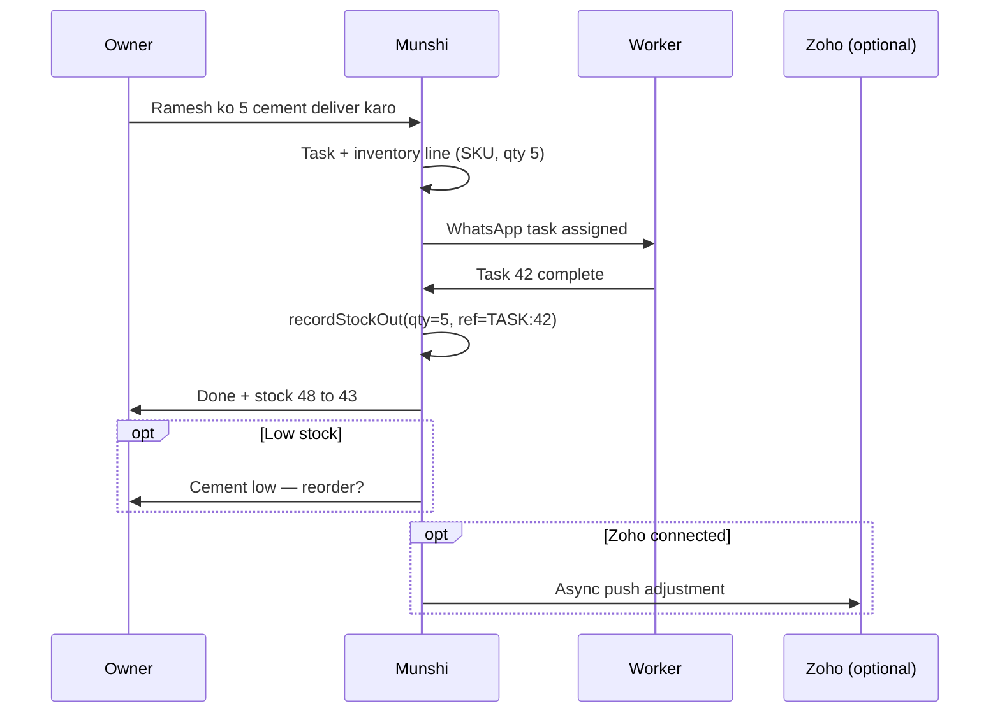

# P2 — Inventory, task-linked stock, and external integrations (Zoho)

**Audience:** Junior devs and teammates implementing in **Cursor Agent mode**.  
**Repo:** [Munshi_Updated](https://github.com/ShantanuGarg2004/Munshi_Updated) monorepo — work in `backend/` unless noted.  
**Principle:** **Connect stock to tasks first, Zoho second.**

---

## Goal

Allow MSME owners/managers to:

1. **Import or sync inventory** (CSV → Zoho OAuth later).
2. **Assign tasks tied to stock** (e.g. “deliver 5 cement bags”).
3. **Auto-update inventory** when a worker marks the task complete.
4. **Notify owner/manager** on completion and stock change.
5. **Alert on low stock** and eventually send **simple stats** (fast vs slow movers).

All flows should work **WhatsApp-first** with Hindi/Hinglish copy where user-facing.

---

## What already exists (do not rebuild)

| Area | Location | Notes |
|------|----------|--------|
| Inventory CRUD + ledger | `backend/src/services/inventory/` | Items, categories, locations |
| Stock movements | `inventory-transaction.service.ts` | `STOCK_IN`, `STOCK_OUT`, `ADJUSTMENT` |
| Transaction references | `inventory_transactions.reference_type`, `reference_id` | **Use for task linkage** — currently unused from tasks |
| Low stock | `inventory.service.ts` → `listLowStockItems`, `isLowStock` | WhatsApp `/inventory_status` in `whatsapp.service.ts` |
| Inventory WhatsApp workflow | `workflow/handlers/inventory-create.handler.ts` | `/inventory_create` |
| Purchase requests | `backend/src/services/purchase-requests/` | Already has `inventory_item_id` on line items |
| Tasks assign/complete | `backend/src/services/tasks/tasks.service.ts` | `completeTask()` notifies assigner; **no inventory link** |
| Task schema | `tasks.schema.ts` | Free-text `description` only — **needs structured stock lines** |
| Domain events (outbox) | `backend/src/services/domain-events/` | Table + cron; **`dispatch()` is no-op** — wire handlers here |
| ML / contracts | `backend/contracts/` | `STOCK_IN`, `STOCK_OUT`, `INVENTORY_IMPORT` intent types |
| Owner home readiness | `business-readiness.service.ts` | Shows `stockItemCount` on owner menu |

**There is no Zoho/Tally integration yet.**

---

## North-star user flow



---

## Architecture (four layers)

### Layer 1 — Integration (Zoho & similar)

**Purpose:** Bootstrap and keep Munshi’s ledger aligned with external systems.

Proposed tables (new migration, e.g. `010_integration_foundation.sql`):

```sql
-- integration_connections: OAuth / API keys per factory
--   provider: csv | zoho_inventory | zoho_books
--   access_token, refresh_token, expires_at, metadata jsonb

-- integration_item_mappings: external_id ↔ inventory_item_id
--   connection_id, external_sku, external_name, inventory_item_id, last_synced_at

-- integration_sync_runs: audit log
--   connection_id, direction (pull|push), status, error, started_at, finished_at
```

**Source-of-truth (v1 decision):** **Munshi wins for task-driven movements.** Zoho/CSV is bootstrap + periodic pull; outbound push is async with retry.

**Provider priority:**

| Provider | MVP | Full |
|----------|-----|------|
| CSV export | Upload via WhatsApp doc or web | Same |
| Zoho Inventory | OAuth + nightly pull | Webhooks if available |
| Zoho Books | Items from inventory module | Same |
| Tally / Busy | CSV/XML upload | Later |

### Layer 2 — Task ↔ inventory

Proposed table:

```sql
-- task_inventory_lines
--   task_id, inventory_item_id, quantity_expected, quantity_completed,
--   movement_type: STOCK_OUT | STOCK_IN | TRANSFER,
--   created_at, updated_at
```

Extend task creation (REST + WhatsApp + ML) to attach lines. On `completeTask()`:

1. Load `task_inventory_lines` for `STOCK_OUT` / `STOCK_IN`.
2. Call `InventoryTransactionService.recordStockOut` / `recordStockIn` with:
   - `reference_type: 'TASK'`
   - `reference_id: task.id`
   - `created_by: completed_by user id`
3. If insufficient stock → **block completion** (or manager override — see decisions below).
4. Notify owner/manager with before/after quantities (Hindi copy).

**Task types (enum or `tasks.task_kind`):**

- `GENERIC` — current behavior (default).
- `DELIVERY` — stock out on complete.
- `RESTOCK` — stock in on complete.

### Layer 3 — Events & notifications

Register handlers in `DomainEventsService.dispatch()` (or a dedicated `DomainEventHandlers` registry).

| Event type | When | Handler |
|------------|------|---------|
| `INVENTORY_LOW_STOCK` | After STOCK_OUT, qty &lt; reorder_threshold | WhatsApp to owner + dept manager |
| `TASK_COMPLETED_WITH_STOCK` | Task with lines completed | WhatsApp summary to assigner/owner |
| `INTEGRATION_SYNC_FAILED` | Zoho pull/push error | WhatsApp to owner (once per run) |

Publish events from `InventoryTransactionService.applyMovement()` and `TasksService.completeTask()`.

**Low-stock message example:**

```text
⚠️ *Cement 50kg* kam ho gaya — ab sirf *8* bache (limit: 10).
Purchase request banayein? Reply */purchase_request_create*
```

### Layer 4 — Insights (later)

Compute from `inventory_transactions` only (no new tables for v1):

- **Fast movers:** top N by STOCK_OUT qty (7 days).
- **Dead stock:** no movement in 30 days.
- **Weekly digest:** WhatsApp to owner every Monday.

---

## Design decisions (lock before coding)

| # | Question | Recommended v1 |
|---|----------|----------------|
| 1 | Source of truth | Munshi ledger for ops; Zoho async mirror |
| 2 | Negative stock on task complete | Block; manager can adjust stock then re-complete |
| 3 | Partial delivery | Phase 2 — `quantity_completed` &lt; expected |
| 4 | NL task creation | ML parse + **confirmation step** with SKU/qty |
| 5 | Attendance gate | Optional later: require check-in before stock-out task |

---

## Phased rollout & agent tasks

Use **one phase per PR**. Each task has **acceptance criteria** and **key files**.

### Phase 0 — Task-linked stock (highest priority)

- [ ] **0.1 Migration `010_task_inventory_lines.sql`**
  - Add `task_inventory_lines` table + indexes on `task_id`, `inventory_item_id`.
  - Optional: add `task_kind` column on `tasks` (`GENERIC` | `DELIVERY` | `RESTOCK`).
  - **AC:** `yarn migrate` clean on fresh DB; migration listed in `migrations/README.md`.

- [ ] **0.2 Sequelize models + repository**
  - Schema under `backend/src/services/tasks/` or new `task-inventory/` module.
  - **AC:** Unit test create/list lines for a task.

- [ ] **0.3 Service: attach lines on task create**
  - Extend task creation DTO/API to accept optional `inventory_lines[]`.
  - **AC:** REST or internal API can create task with `{ inventory_item_id, quantity_expected, movement_type }`.

- [ ] **0.4 Hook `completeTask()` → stock movement**
  - In `tasks.service.ts` after mark complete, call `InventoryTransactionService`.
  - Set `reference_type='TASK'`, `reference_id=task.id`.
  - **AC:** Integration test: create item qty 10 → task DELIVERY qty 3 → complete → qty 7; transaction row exists.

- [ ] **0.5 Insufficient stock handling**
  - Catch `BadRequestException` from transaction service; return Hindi error to user.
  - **AC:** Complete fails when qty &gt; available; task stays incomplete.

- [ ] **0.6 WhatsApp notifications**
  - Extend `notifyTaskCompleted` (or new helper) with stock summary.
  - **AC:** Owner receives message with item name, qty moved, new balance.

- [ ] **0.7 WhatsApp assign with stock (minimal)**
  - Slash command or structured flow: `/assign_delivery @worker SKU qty` (exact UX TBD).
  - **AC:** End-to-end via webhook test or manual `POST /webhook/test`.

**Agent prompt (Phase 0):**

```text
Implement Phase 0 from docs/p2-inventory-task-integrations.md:
migration 010_task_inventory_lines, models, hook completeTask() to
InventoryTransactionService with reference_type TASK, tests, Hindi WhatsApp
notification on completion. Match existing Nest/Sequelize patterns in
tasks.service.ts and inventory-transaction.service.ts.
```

---

### Phase 1 — CSV inventory import

- [ ] **1.1 CSV template + parser**
  - Columns: `sku`, `name`, `unit`, `quantity`, `category`, `location`, `reorder_threshold` (optional).
  - Reuse patterns from `team-csv.parse.ts` / `team-bulk-import.service.ts`.
  - **AC:** Parser unit tests with valid/invalid rows.

- [ ] **1.2 Import service**
  - Upsert items by SKU per factory; initial qty via `recordStockIn` with `reference_type='CSV_IMPORT'`.
  - **AC:** Import 10 rows → 10 items + 10 STOCK_IN transactions.

- [ ] **1.3 WhatsApp flow**
  - Owner menu: *Maal CSV se import* → await file → summary (added/skipped/failed).
  - **AC:** Same pattern as team CSV bulk import (`team-bulk-import.service.ts`).

- [ ] **1.4 Static template on web**
  - `web/public/inventory-import/munshi-inventory-template.csv`
  - **AC:** URL documented in `.env.example` (`MUNSHI_WEB_URL`).

**Agent prompt (Phase 1):**

```text
Implement Phase 1 CSV inventory import per docs/p2-inventory-task-integrations.md.
Mirror team-bulk-import patterns. Do not add Zoho yet.
```

---

### Phase 2 — Zoho Inventory OAuth

- [ ] **2.1 Migration `011_integration_connections.sql`** (if not in 010).
- [ ] **2.2 OAuth flow on web** — connect/disconnect; store tokens encrypted or in DB.
- [ ] **2.3 Zoho client** — pull items + stock on hand; map to `integration_item_mappings`.
- [ ] **2.4 Scheduled sync** — cron or domain event worker; log to `integration_sync_runs`.
- [ ] **2.5 Push stock-out to Zoho** — async job on TASK completion when connection active.
- [ ] **2.6 Env vars** — `ZOHO_CLIENT_ID`, `ZOHO_CLIENT_SECRET`, redirect URL in `backend/.env.example`.

**Agent prompt (Phase 2):**

```text
Implement Zoho Inventory OAuth pull sync only (Phase 2.1–2.4 in
docs/p2-inventory-task-integrations.md). Push to Zoho is Phase 2.5 — separate PR.
```

---

### Phase 3 — Domain events & alerts

- [ ] **3.1 Implement `DomainEventsService.dispatch()` registry**
- [ ] **3.2 Publish `INVENTORY_LOW_STOCK` from `applyMovement`**
- [ ] **3.3 Handler → WhatsApp to owner/manager**
- [ ] **3.4 Optional: pre-fill purchase request from low-stock alert**

**Agent prompt (Phase 3):**

```text
Wire domain event handlers per docs/p2-inventory-task-integrations.md Phase 3.
Replace no-op dispatch with a handler registry. Add tests for low-stock event.
```

---

### Phase 4 — ML + natural language assign

- [ ] **4.1 ML extraction schema** — `{ item_name_or_sku, quantity, assignee_hint, task_kind }`
- [ ] **4.2 Backend resolver** — fuzzy match inventory item; disambiguation list on WhatsApp.
- [ ] **4.3 Confirmation message** before creating task.
- [ ] **4.4 Update `backend/contracts/` + ML `contracts/` drift test.

**Agent prompt (Phase 4):**

```text
Add NL delivery task parsing per docs/p2-inventory-task-integrations.md Phase 4.
Always confirm SKU and qty on WhatsApp before createTask.
```

---

### Phase 5 — Weekly stats digest

- [ ] **5.1 `InventoryInsightsService`** — query transactions for velocity / dead stock.
- [ ] **5.2 Cron** — Monday 9 AM factory timezone (or IST default).
- [ ] **5.3 WhatsApp digest** to owner.

---

## Key code references

```typescript
// Stock out with task reference (target pattern)
await this.transactionService.recordStockOut({
  factory_id: factoryId,
  inventory_item_id: line.inventory_item_id,
  quantity: line.quantity_expected,
  reference_type: 'TASK',
  reference_id: taskId,
  created_by: userId,
  notes: `Task #${taskId} completion`,
});
```

| File | Why read it |
|------|-------------|
| `inventory-transaction.service.ts` | All quantity changes go here |
| `tasks.service.ts` → `completeTask()` | Hook point for Phase 0 |
| `team-bulk-import.service.ts` | CSV await/import pattern |
| `domain-events.service.ts` | Outbox for alerts |
| `whatsapp.service.ts` | Command routing |
| `contracts/intent-types.json` | ML intent additions |

---

## Testing checklist (every PR)

```bash
cd backend
yarn test -- --testPathPattern="inventory|tasks|domain-events"
yarn build
yarn migrate          # local Supabase or docker postgres
```

- [ ] New migration applies on empty DB (CI migration job).
- [ ] No secrets in committed files.
- [ ] Hindi user strings in `whatsapp.templates.ts` or dedicated template files.
- [ ] `factory_id` scoping on all queries (multi-tenant safety).

---

## WhatsApp copy guidelines

- Use *bold* for item names and numbers.
- Always show **pehle → ab** quantity on stock change.
- Errors in Hindi: “Stock kam hai — pehle manager se confirm karein.”
- Owner-only: integration connect/sync; workers only see their tasks.

---

## Out of scope for P2 v1

- Tally live API connector
- Multi-warehouse transfer workflows
- Barcode scanning
- Web dashboard for inventory analytics (WhatsApp digest only)
- Bidirectional real-time Zoho sync

---

## Questions / ownership

| Topic | Contact |
|-------|---------|
| Product / UX Hindi copy | Team lead |
| Zoho developer account & OAuth app | DevOps / owner |
| ML contract changes | Backend + `ml/` contract sync |

---

## Related docs

- [backend/README.md](../backend/README.md) — inventory workflows today
- [backend/migrations/README.md](../backend/migrations/README.md) — migration numbering (next: `010_…`)
- [p0-production-database.md](./p0-production-database.md) — Supabase production

---

*Last updated: 2026-06-04 — P2 planning doc for task-linked inventory and Zoho path.*
