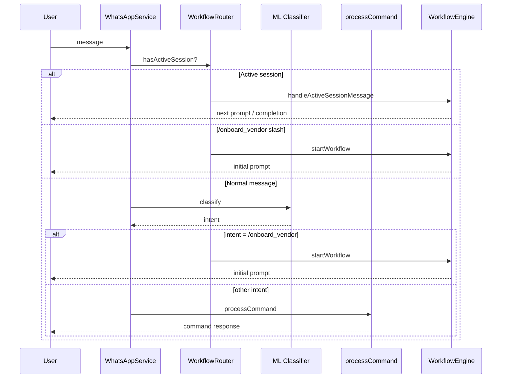

# Prompt 4 — Routing Analysis

**Date:** 2026-05-29  
**Purpose:** Document how the Workflow Engine integrates into WhatsApp message routing without breaking existing Munshi commands.

---

## 1. Routing decision tree (post–Prompt 4)

```text
Incoming WhatsApp message
        │
        ▼
Has ACTIVE workflow session? ──YES──► WorkflowRouter.handleActiveWorkflowMessage
        │                                      (NO ML, NO processCommand)
        NO
        │
        ▼
Manager slash bypass?
(/mgrself|mgrassign|mgrtransfer|mgrreject)
        │
        YES ──► processCommand (unchanged, skip ML)
        │
        NO
        │
        ▼
Workflow start command? (/onboard_vendor)
        │
        YES ──► WorkflowRouter.startWorkflowFromCommand (skip ML)
        │
        NO
        │
        ▼
POST ML_URL/classify (unchanged contract)
        │
        ▼
ML intent is workflow start command?
        │
        YES ──► WorkflowRouter.startWorkflowFromMlCommand
        │
        NO ──► processCommand (unchanged — /assign, /present, /report, etc.)
```

---

## 2. Active workflow rule

When a user has an `ACTIVE` session in `workflow_sessions`:

- **Do NOT** call ML classification
- **Do NOT** run `processCommand`
- **Do NOT** interpret message as a new intent

Every message is passed to the active workflow handler as step input.

Example: user in `ONBOARD_VENDOR` at step `VENDOR_NAME` sends `"ABC Steel"` — treated as vendor name, not a new command.

---

## 3. Integration points in `WhatsAppService`

### `handleIncomingMessage()` — lines ~90–169

1. **First check:** `workflowRouter.hasActiveSession(from)` → early return via workflow handler
2. **Existing bypass preserved:** manager slash commands still skip ML
3. **New bypass:** `matchWorkflowStartCommand(msgTrim)` for `/onboard_vendor`
4. **ML path unchanged:** same axios POST to `${ML_URL}/classify`
5. **New ML branch:** before `processCommand`, check `startWorkflowFromMlCommand`
6. **Fallback:** existing `processCommand` for all other intents

### `processCommand()` — `/onboard_vendor` fallback

If ML returns `/onboard_vendor` through a code path that reaches `processCommand` directly:

```typescript
if (cmdLc === COMMANDS.ONBOARD_VENDOR) {
  return this.workflowRouter.startWorkflowFromCommand(phone, cmdLc);
}
```

This ensures both ML and explicit command paths converge on the same workflow router.

---

## 4. What remains unchanged

| Feature | Status |
|---------|--------|
| ML URL / classify endpoint | Unchanged |
| `parseMlClassifyResponse()` | Unchanged |
| Manager slash bypass (`/mgrself` etc.) | Unchanged |
| `/assign`, `/depart_assign`, `/present`, `/absent` | Unchanged via processCommand |
| `/report`, `/help`, task flows | Unchanged |
| Attendance flows | Unchanged |
| Department flows | Unchanged |
| Vendor REST CRUD | Unchanged |
| Existing ML intent model | Not touched |

**Note:** Most slash commands (e.g. `/present`) still go through ML first — this was pre-existing behavior and is preserved intentionally.

---

## 5. Command architecture alignment

Both interaction methods remain first-class:

| Method | Example | Resolution |
|--------|---------|------------|
| Natural language | "Add a vendor" | ML → `/onboard_vendor` → Workflow Engine |
| Direct slash | `/onboard_vendor` | Workflow Engine (no ML) |
| Direct slash (legacy) | `/present` | ML → processCommand |
| Direct slash (mgr) | `/mgrassign @worker` | processCommand (bypass ML) |

The Workflow Engine is **command-driven** — it receives canonical commands regardless of origin.

---

## 6. Module wiring

```text
WhatsAppModule
  └── imports WorkflowModule
        └── imports VendorModule, UserModule
              └── VendorOnboardingWorkflowHandler → VendorService
```

Workflow logic is **not** embedded in `WhatsAppService` — only routing hooks.

---

## 7. Regression verification

| Check | Result |
|-------|--------|
| Full Jest suite | 42 tests passed |
| Workflow routing tests | 4 tests — active interception, ML entry, slash entry, completion |
| Vendor tests (Prompt 3) | 19 tests — unchanged |
| TypeScript build | `yarn build` succeeded |

No existing test files were modified except new workflow specs.

---

## 8. Risks

| Risk | Detail | Recommendation |
|------|--------|----------------|
| ML must return `/onboard_vendor` for NL path | Backend cannot force ML intent | Ensure ML team maps "add vendor" → `/onboard_vendor` |
| Stuck ACTIVE session | Blocks all normal routing for that phone | Prompt 5: `/cancel` command + session TTL |
| Worker sends `/onboard_vendor` | Gets forbidden message | Expected; document for factory admins |

---

## 9. Sequence diagram



---

*See also: [prompt-4-pre-implementation-analysis.md](./prompt-4-pre-implementation-analysis.md)*
