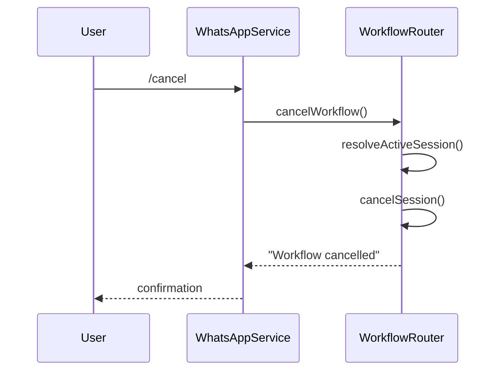
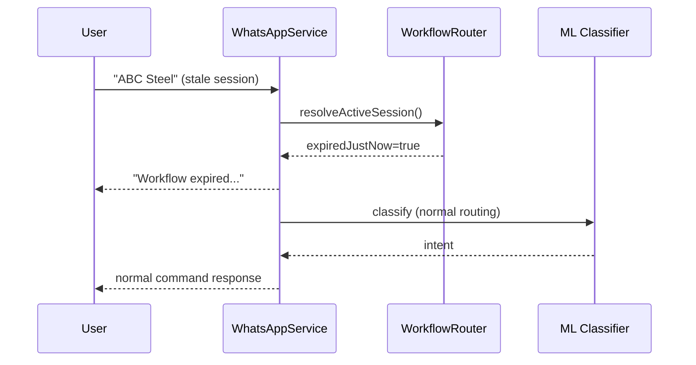

# Prompt 5 — Routing Validation Report

**Date:** 2026-05-29  
**Purpose:** Confirm WhatsApp routing after workflow hardening + worker onboarding preserves all existing flows.

---

## 1. Updated routing decision tree

```text
Incoming message
        │
        ▼
/cancel ? ──YES──► cancelWorkflow() → reply → return
        │
        NO
        ▼
resolveActiveSession(phone)
        │
        ├── expiredJustNow → send expiry message → fall through
        └── session active → handleActiveWorkflowMessage() → return
        │
        NO (no active session)
        ▼
Manager slash bypass? → processCommand (unchanged)
        │
        NO
        ▼
Workflow start? (/onboard_vendor | /onboard_worker)
        → WorkflowEngine (skip ML)
        │
        NO
        ▼
ML classify → workflow intent? → WorkflowEngine
              → else → processCommand (unchanged)
```

---

## 2. What changed vs Prompt 4

| Change | Impact on existing flows |
|--------|--------------------------|
| `/cancel` handled first | No impact on `/present`, `/assign`, etc. |
| `resolveActiveSession` replaces `hasActiveSession` | Expired sessions no longer block routing silently |
| `/onboard_worker` in registry | New path only; vendor path unchanged |
| Expiry message then fall-through | User message after expiry goes to ML/commands normally |

---

## 3. Regression validation

| Flow | Status |
|------|--------|
| `/present`, `/absent` | Unchanged (ML → processCommand) |
| `/assign`, tasks, issues | Unchanged |
| Manager slash bypass | Unchanged (still skips ML) |
| `/onboard_vendor` | Unchanged (registry + tests pass) |
| `/report`, `/help` | Unchanged |
| ML contract | Unchanged |
| Vendor onboarding handler tests | 8 tests pass |
| Full Jest suite | 67 tests pass |

---

## 4. Active workflow rules (updated)

| Rule | Behavior |
|------|----------|
| Active session exists | All messages → workflow (except `/cancel`) |
| Session expired on access | Expire row, notify user, continue normal routing |
| `/cancel` during workflow | Cancel session, no ML |
| Worker role | Cannot start workflows; can use normal commands |

---

## 5. Entry paths for worker onboarding

| Path | Flow |
|------|------|
| Direct slash | `/onboard_worker` → WorkflowEngine |
| ML (when mapped) | NL → ML → `/onboard_worker` → WorkflowEngine |
| processCommand fallback | Same router delegation as vendor |

---

## 6. Sequence — cancel during active workflow



---

## 7. Sequence — expired session recovery



---

*See also: [prompt-4-routing-analysis.md](./prompt-4-routing-analysis.md)*
