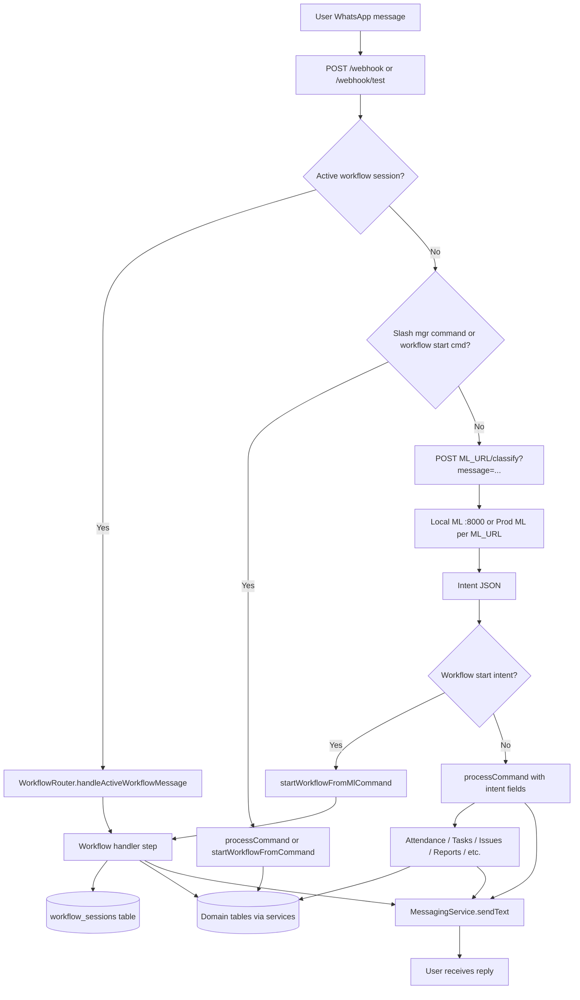

# Runtime Flow Diagram

**Date:** 2026-06-01  
**Environment:** Local backend + local ML + remote Postgres (factory 3)

---

## End-to-end message path



---

## Intent classification detail

```
Message (Hindi/Hinglish text)
        │
        ▼
POST /webhook/test  { from, message }
        │
        ▼
WhatsAppService.handleIncomingMessage()
        │
        ├─ /cancel ─────────────────────► cancelWorkflow()
        │
        ├─ active session exists ───────► handler.handleStep()  [NO ML CALL]
        │
        └─ new message
                │
                ▼
        ml_url = process.env.ML_URL || http://localhost:8000
                │
                ▼
        POST {ml_url}/classify?message={urlencoded text}
                │
                ▼
        ML Service (bot_engine.py)
          1. CommandParser.parse()
          2. workflow_pre_classify()
          3. classifier.classify() [LLM if needed]
                │
                ▼
        { intent, worker_slug, depart_slug, ... }
                │
                ▼
        WorkflowRegistry.getHandlerByCommand(intent)
                │
                ├─ handler found ──► startWorkflow() ──► workflow_sessions INSERT
                │
                └─ no handler ─────► processCommand(intent) ──► domain services
```

---

## Configuration injection points

| Stage | Variable | Local dev value (after fix) |
|-------|----------|----------------------------|
| Backend bind | `PORT` | `4001` |
| ML classify + parse | `ML_URL` | `http://127.0.0.1:8000` |
| Database | `POSTGRES_CONNECTION_STRING` | `65.1.128.181:5431/munshi_data` |
| Dev loader | `yarn dev` | `env-cmd -f .env.local` |

---

## Document processing path (same ML_URL)

```
POST /documents/upload
        │
        ▼
DocumentProcessingOrchestrator
        │
        ▼
MlParserAdapter.parse()
        │
        ▼
POST {ML_URL}/parse
        │
        ▼
Suggestions → approval workflow → inventory/vendor updates
        │
        ▼
BusinessDiscoveryDocumentService.contributeFromDocument()
        │
        ▼
business_discovery_profiles (readiness boost)
```

---

## Production vs local ML branch

```
                    ML_URL
                      │
         ┌────────────┴────────────┐
         ▼                         ▼
http://127.0.0.1:8000      http://13.126.57.78:8000
   Local uvicorn               Deployed EC2 ML
   Latest bot_engine.py        May lag behind repo
         │                         │
         └────────────┬────────────┘
                      ▼
              Same /classify contract
              Different intent results if versions differ
```

---

## Verified local path (post-fix)

```
POST /webhook/test
  "mera business Sharma Packaging Industries hai Faridabad mein"
        │
        ▼
POST http://127.0.0.1:8000/classify  (via ML_URL)
        │
        ▼
intent: /business_discovery
        │
        ▼
INSERT workflow_sessions (BUSINESS_DISCOVERY, MENU)
        │
        ▼
Reply: Business discovery menu (4 buckets)
```

**Evidence:** Backend terminal log `ml-classify { intent: '/business_discovery' }` + `INSERT INTO workflow_sessions` after `.env.local` fix.
